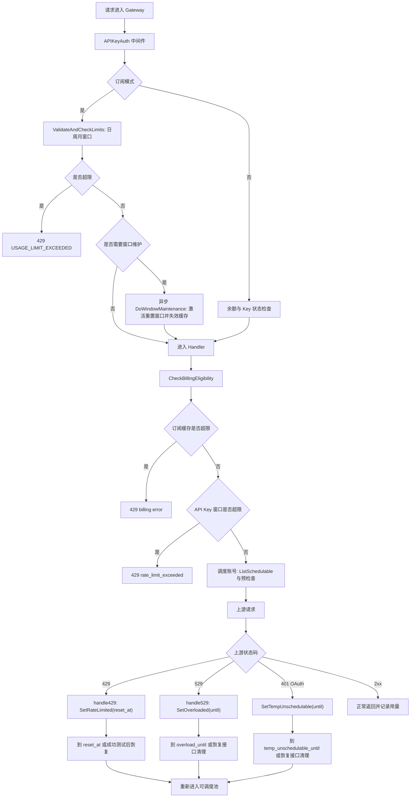
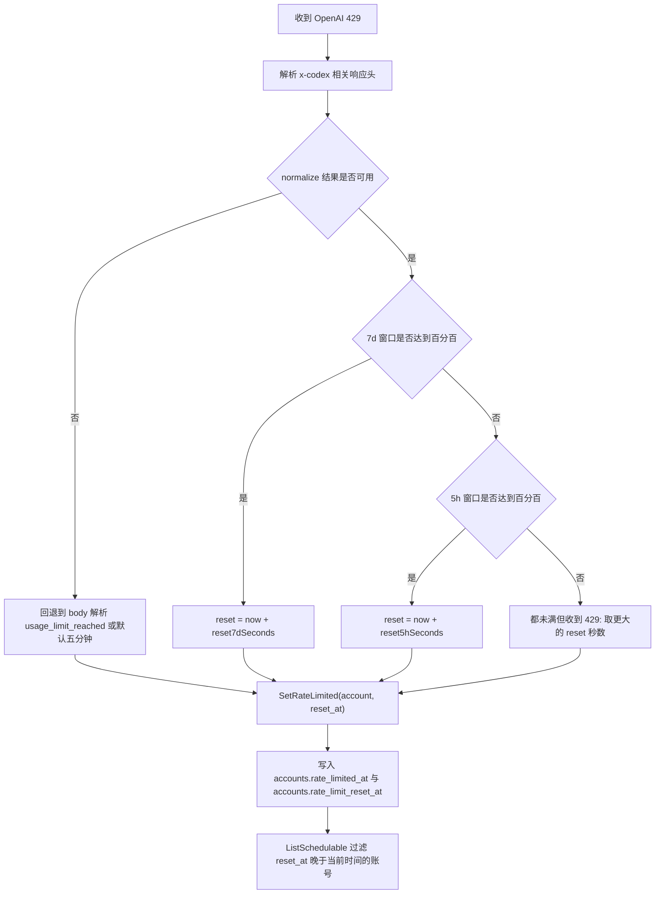
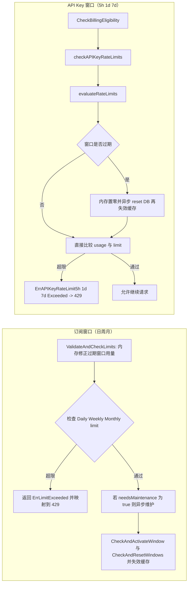
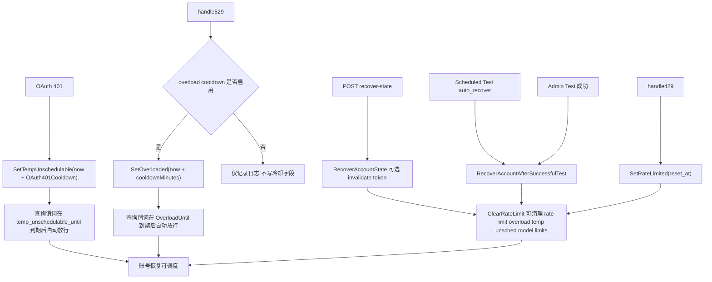

# 账号用量窗口/冷却/恢复全链路（OpenAI 5h 重点）

> 背景：`PR #25` 提到 OpenAI 存在 5 小时用量窗口。本文件基于当前仓库代码扫描，梳理“限量判定 → cooldown → 恢复”全流程。

## 1. 总览流程图（请求入口到恢复）

## 2. OpenAI 5h/7d 429 决策流程（PR #25 关联）

说明：

- OpenAI 分支优先用 `x-codex-*` 头判断哪个窗口被打满（5h 或 7d）。
- 如果头不可用，才降级用响应体 `usage_limit_reached/rate_limit_exceeded` 的 `resets_at/resets_in_seconds`。
- 若仍拿不到 reset，使用默认 5 分钟冷却。

## 3. 订阅窗口（日/周/月）与 API Key 窗口（5h/1d/7d）

## 4. 冷却与恢复流程（429/529/401 + 管理端/定时任务）

## 5. 关键状态字段与查询门槛

`accounts` 表（及扩展字段）中与本流程直接相关的状态：

- `rate_limited_at` / `rate_limit_reset_at`：429 冷却窗口。
- `overload_until`：529 过载冷却窗口。
- `temp_unschedulable_until` / `temp_unschedulable_reason`：OAuth 401 等临时不可调度窗口。
- `session_window_start` / `session_window_end` / `session_window_status`：Anthropic 5h 会话窗口状态。
- `extra.model_rate_limits`：模型级限流（Antigravity/策略分支）。

调度层的“可调度”核心谓词：

- `OverloadUntil IS NULL OR OverloadUntil <= now`
- `RateLimitResetAt IS NULL OR RateLimitResetAt <= now`
- `temp_unschedulable_until IS NULL OR temp_unschedulable_until <= NOW()`
- 以及 `status=active`、`schedulable=true`、未过期等基础条件

## 6. 代码入口索引（按职责）

- **请求前限量判定**
  - `backend/internal/server/middleware/api_key_auth.go`
  - `backend/internal/service/subscription_service.go`
  - `backend/internal/service/billing_cache_service.go`
  - `backend/internal/handler/gateway_handler.go`（429 映射）
- **429/529/401 冷却写入**
  - `backend/internal/service/ratelimit_service.go`
  - `backend/internal/repository/account_repo.go`
- **恢复入口**
  - `backend/internal/handler/admin/account_handler.go`（`/test`、`/recover-state`、`/clear-rate-limit`）
  - `backend/internal/service/scheduled_test_runner_service.go`（`auto_recover`）
- **529 冷却配置**
  - `backend/internal/service/setting_service.go`
  - `backend/internal/handler/admin/setting_handler.go`
  - `frontend/src/api/admin/settings.ts`
  - `frontend/src/views/admin/SettingsView.vue`

## 7. 扫描结论（可直接用于排障）

- OpenAI 429 已存在 5h/7d 窗口分流逻辑，优先依赖 `x-codex-`* 响应头判定具体 reset 时间。
- 订阅（日/周/月）与 API Key（5h/1d/7d）是两套并行窗口：前者偏用户订阅配额，后者偏 key 级限量。
- 冷却“恢复”有两类机制：  
  - **时间驱动自动恢复**（查询谓词到点放行）  
  - **主动恢复**（管理端测试成功、recover-state、定时测试 auto_recover）
- 529 冷却支持开关和分钟数配置，可在 Admin 设置页调整。

