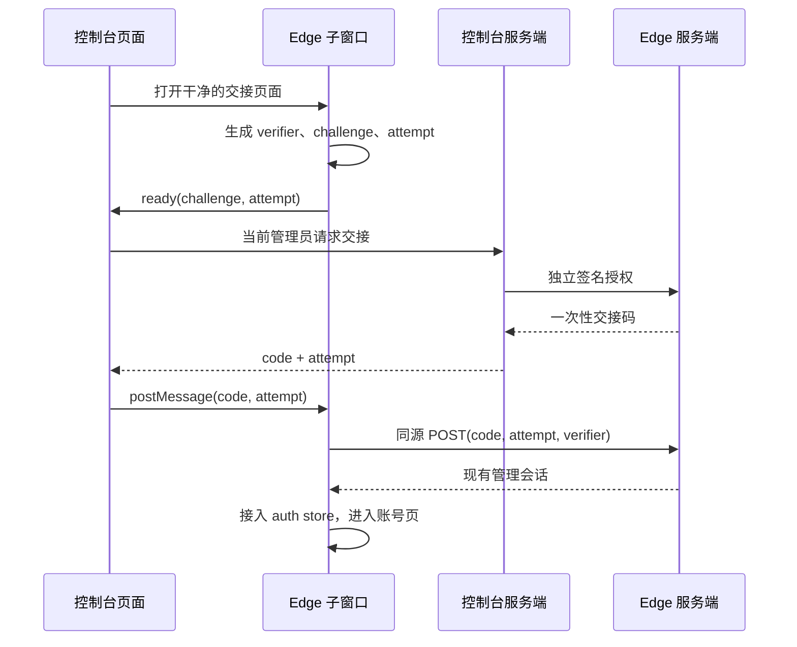

# Edge admin handoff

## Decision to review

用户已同意独立推进 Edge 安全交接，并保持管理员一键进入。本文将方向具体化为
**每个 Edge 独立的签名信任关系 + 子窗口持有 PKCE 证明 + 一次性兑换**，待确认后进入生产实现。

当前 `EdgeAdminSessionHandler.Mint` 接受管理员拥有的镜像 Key，返回普通 access/refresh
会话；控制台把二者放入 URL fragment。fragment 不随 HTTP/Referer 发送，但父页面和
浏览器 URL 表面仍经过凭据。这是代码风险，不是已发生线上泄露的结论。

## User experience

管理员点击现有“进入 Edge”，同步打开干净的 `/admin/edge-handoff` 窗口。
成功后直接进入该 Edge 的账号页；父页面保留原位置。
弹窗被拦截、Edge 不可达、授权过期时展示一个重试动作和直接登录入口。
失败回退始终走现有登录页，不恢复 token URL 或镜像 Key 签发能力。

## Trust and API contract (proposed)

- 每个 Edge 使用独立 Ed25519 key pair。控制台仅在服务端持有该 Edge 私钥；Edge
  仅持有公钥。不能复用 JWT 签名密钥、镜像读取 Key 或供应商凭据。
- 控制台签发入口仍须通过当前管理员 JWT 校验，并由已有 Edge registry 解析固定
  audience/base URL；浏览器不能指定任意目标主机。HTTP client 禁止跟随重定向。
- 签名授权包含 `kid`, `iss`, `aud`, `purpose=edge-handoff`, 当前控制台管理员标识、
  子窗口随机 attempt、S256 challenge、iat/exp。签名覆盖原始编码字节；Edge 严格验证
  key ID、issuer、audience、purpose、时钟有效性和 proof 格式。
- 每个 Edge 明确配置一个可交接的管理员主体；该主体必须仍为 active admin，不能由浏览器
  或授权中的任意 user ID 选择。控制台 initiator 与 Edge subject 分别审计，不能混为同一 ID。
- 初始建议授权/code 有效期为 60 秒。`POST /api/v1/edge/admin-handoff/mint` 只接受签名
  授权，返回 `{code, attempt}`；镜像 Key 单独不能调用。授权 attempt 也只能 mint 一次。
- `POST /api/v1/edge/admin-handoff/exchange` 接受 `{code, attempt, verifier}`，在 Edge
  同源窗口内调用，验证实际 Origin 与内容类型，不开启跨域凭据交换。
  通过校验后仅向该窗口返回现有 token pair 格式。响应 `Cache-Control: no-store`。
- code、verifier、access/refresh 都不进入 URL、日志或测试保留工件。code 随 POST /
  精确目标的 postMessage 交接；verifier 始终只在 Edge 子窗口内存。

签名私钥的存储与分发接入现有部署 secret owner；新增每 Edge 配置记录的生产落地方案
包含受信公钥、issuer/origin、固定管理员主体。私钥不进入镜像账号记录或公开设置。
轮换允许明确列出的新旧 kid 短暂并存；单 Edge 可独立撤销信任。

## Browser and exchange lifecycle



双方同时检查精确 `event.origin` 和 `event.source`，每次点击绑定一个窗口及 attempt。
父页面不持有 verifier 或最终会话。成功、超时、窗口关闭和页面卸载都注销 listener、
清除 timer 与短时状态；超时后的迟到响应不能完成另一次交接。成功后解除 opener。

生产 Redis owner 用 code 的摘要定位短时记录；Lua 在**同一个操作**中验证有效期、
attempt、challenge 后消费。错误 verifier/attempt 不得删除正确记录；并发只有一个赢家。
签名授权 replay guard 与 code 写入同样原子完成。Redis 故障 fail closed。
兑换后、创建会话前重新核对 Edge 管理员权限；禁用用户不签发会话。
若消费后 token 签发失败或返回包丢失，原 code 不重放，重新发起一次交接。

会话继续使用现有 AuthService 签发/刷新 owner。生产实现须将 initiator、attempt 和
可撤销的刷新会话族关联起来，只记录非密钥标识。补偿和撤销限于这次交接的会话族。

## Owners and isolation

| Responsibility | Owner |
| --- | --- |
| Target resolution and forwarding | existing `backend/internal/service/edge_accounts_aggregator_tk.go` |
| Public admin endpoints | existing `backend/internal/handler/admin/edge_accounts_handler_tk.go` |
| Delegation validation and exchange | proposed `backend/internal/service/edge_admin_handoff_tk.go` |
| Redis atomic state | proposed `backend/internal/repository/edge_admin_handoff_cache_tk.go` |
| Edge route handlers | proposed `backend/internal/handler/edge_admin_handoff_tk.go` |
| Parent window lifecycle | proposed `frontend/src/composables/useEdgeAdminHandoff.tk.ts` |
| Child lifecycle | existing `frontend/src/views/admin/EdgeHandoffView.vue` |

`EdgeAccountsView` 与 `EdgeAccountPanelTk` 共用父窗口 owner，不能复制第二套状态机。
实现时登记 frontend/gateway/DI sentinel 及调用点；新增配置只经已有部署配置 owner 分发。

## Rollout and rollback

先在隔离环境验证生产 Go handlers + Redis + 真实浏览器完整路径，再准备各 Edge trust
配置与独立发布。Edge 先具备新兑换协议，控制台再切换入口；旧 mint/旧 token-fragment
消费必须停用。版本不匹配时显示直接登录，不自动尝试旧协议。
具体部署、密钥写入、历史会话撤销均不由本文或原型执行；上线前列出每个实例的版本与
配置检查，并验证旧镜像 Key 请求明确失败。历史凭据处置依据独立证据清单决定。
安全回滚是停用交接并直接登录，不能回滚到 token URL。

## Executable prototype and evidence limits

原型位于 `.testing/prototypes/edge-handoff/`，仅监听本机回环地址。
`node .testing/prototypes/edge-handoff/server.mjs` 后打开 `http://127.0.0.1:4311`。
两个不同源窗口执行真实 WebCrypto/postMessage/fetch；服务端使用临时 Ed25519 密钥。

运行：

```sh
node --test .testing/prototypes/edge-handoff/protocol.test.mjs
pnpm --dir frontend exec playwright test --config ../.testing/prototypes/edge-handoff/playwright.config.mjs
```

协议测试覆盖签名、audience、期限、一次性消费、错误 proof 不消耗、并发单赢家。
浏览器测试覆盖一键进入、干净 URL、父页面不接收 token pair、伪造窗口消息与失败回退。

原型使用模拟管理员、内存 Map 和进程内签发调用；没有接入真实 JWT、Redis、网络转发、
固定管理员映射、密钥轮换、刷新会话族撤销或生产日志守卫。
它用于审定交互与协议边界，不能作为这些生产项已经安全实现的证据。
