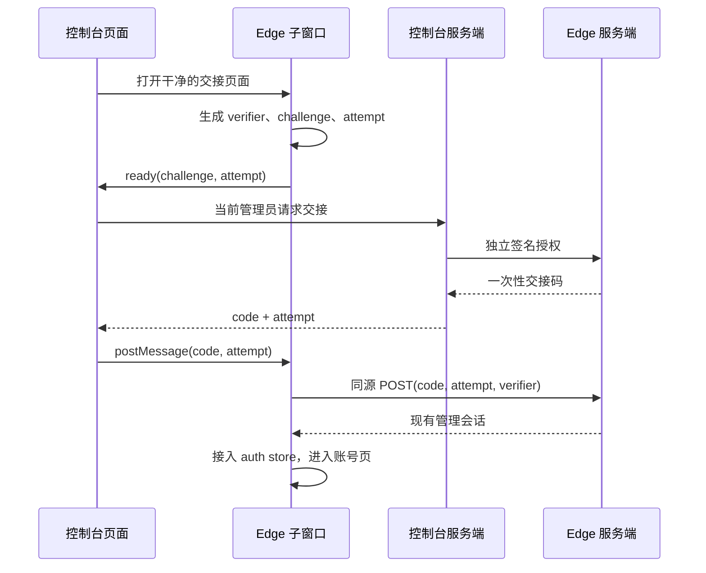

# Edge admin handoff

## Approved decision

用户已同意独立推进 Edge 安全交接，并保持管理员一键进入。本文将方向具体化为
**每个 Edge 独立的签名信任关系 + 子窗口持有 PKCE 证明 + 一次性兑换**，用户已确认进入生产实现。

原有 `EdgeAdminSessionHandler.Mint` 接受管理员拥有的镜像 Key，返回普通 access/refresh
会话；控制台把二者放入 URL fragment。fragment 不随 HTTP/Referer 发送，但父页面和
浏览器 URL 表面仍经过凭据。这是代码风险，不是已发生线上泄露的结论。

## Failure isolation (approved revision)

用户在本会话确认“交接故障只影响交接，网关持续服务”。缺失、不可读或非法配置
均关闭交接；非法配置记录 `edge_admin_handoff_disabled` 错误事件，不输出配置内容。
整份配置拒绝，不部分启用其中的 signer/receiver；初始化不返回中断主进程的错误。
运行时交接基础设施失败返回 503，签名/proof 无效返回 403；控制台保留输入 400、
目标不存在 404。不得用交接失败的 502/504 触发 Caddy 的整实例被动健康摘除。
配置校验工具仍严格失败退出，部署启用交接前必须通过；普通健康检查不代表交接就绪。
混合版本切换仍需单独安排窗口和直接登录验证，本修订不批准线上发布。

发布隔离延伸到混合版本：新版 Edge 部署前，实际承流 prod 必须已支持交接故障隔离。
`ops/stage0/check_edge_handoff_rollout.py` 是 release gate owner，Edge workflow 在部署
写入前调用；configuration 的只读 `X-TokenKey-Handoff-Isolation: 1` 响应头标识该代码
契约，即使交接信任未配置也返回。具体顺序与回滚边界以 ops runbook 为准。

## User experience

管理员点击现有“进入 Edge”，同步打开干净的 `/admin/edge-handoff` 窗口。
成功后直接进入该 Edge 的账号页；父页面保留原位置。
弹窗被拦截、Edge 不可达、授权过期时展示一个重试动作和直接登录入口。
失败回退始终走现有登录页，不恢复 token URL 或镜像 Key 签发能力。

## Trust and API contract

- 每个 Edge 使用独立 Ed25519 key pair。控制台仅在服务端持有该 Edge 私钥；Edge
  仅持有公钥。不能复用 JWT 签名密钥、镜像读取 Key 或供应商凭据。
- 控制台签发入口仍须通过当前管理员 JWT 校验，并由已有 Edge registry 解析固定
  audience/base URL；浏览器不能指定任意目标主机。HTTP client 禁止跟随重定向。
- 签名授权包含 `kid`, `iss`, `aud`, `purpose=edge-handoff`, 当前控制台管理员标识、
  子窗口随机 attempt、S256 challenge、iat/exp。签名覆盖原始编码字节；Edge 严格验证
  key ID、issuer、audience、purpose、时钟有效性和 proof 格式。
- 每个 Edge 明确配置一个可交接的管理员主体；该主体必须仍为 active admin，不能由浏览器
  或授权中的任意 user ID 选择。控制台 initiator 与 Edge subject 分别审计，不能混为同一 ID。
- 授权/code 有效期为 60 秒。`POST /api/v1/edge/admin-handoff/mint` 只接受签名
  授权，返回 `{code, attempt}`；镜像 Key 单独不能调用。授权 attempt 也只能 mint 一次。
- `POST /api/v1/edge/admin-handoff/exchange` 接受 `{code, attempt, verifier}`，在 Edge
  同源窗口内调用，验证实际 Origin 与内容类型，不开启跨域凭据交换。
  通过校验后仅向该窗口返回现有 token pair 格式。响应 `Cache-Control: no-store`。
- code、verifier、access/refresh 都不进入 URL、日志或测试保留工件。code 随 POST /
  精确目标的 postMessage 交接；verifier 始终只在 Edge 子窗口内存。

签名私钥的存储与分发接入现有部署 secret owner；新增每 Edge 配置记录的生产落地方案
包含受信公钥、issuer/origin、固定管理员主体。私钥不进入镜像账号记录或公开设置。
轮换允许明确列出的新旧 kid 短暂并存；单 Edge 可独立撤销信任。

## Browser and exchange lifecycle

双方同时检查精确 `event.origin` 和 `event.source`，每次点击绑定一个窗口及 attempt。
父页面不持有 verifier 或最终会话。成功、超时、窗口关闭和页面卸载都注销 listener、
清除 timer 与短时状态；超时后的迟到响应不能完成另一次交接。取消信号持续覆盖 auth store 的用户加载；
超时、卸载或 pagehide 时清理仍属本次交接的本地凭据，迟到用户响应不能恢复会话或覆盖后续登录。
成功后解除 opener。

生产 Redis owner 用 code 的摘要定位短时记录；Lua 在**同一个操作**中验证有效期、
attempt、challenge 后消费。错误 verifier/attempt 不得删除正确记录；并发只有一个赢家。
签名授权 replay guard 与 code 写入同样原子完成。Redis 故障 fail closed。
兑换后、创建会话前重新核对 Edge 管理员权限；禁用用户不签发会话。
若消费后 token 签发失败或返回包丢失，原 code 不重放，重新发起一次交接。

会话继续使用现有 AuthService 签发/刷新 owner。生产实现须将 initiator、attempt 和
可撤销的刷新会话族关联起来，只记录非密钥标识。补偿和撤销限于这次交接的会话族。

## Owners and isolation

| Responsibility | Owner |
| --- | --- |
| Target resolution and forwarding | existing `backend/internal/service/edge_accounts_aggregator_tk.go` |
| Public admin endpoints | existing `backend/internal/handler/admin/edge_accounts_handler_tk.go` |
| Delegation validation and exchange | `backend/internal/service/edge_admin_handoff_tk.go` |
| Redis atomic state | `backend/internal/repository/edge_admin_handoff_cache_tk.go` |
| Edge route handlers | `backend/internal/handler/edge_tk_admin_session_handler.go` |
| Parent window lifecycle | `frontend/src/composables/useEdgeAdminHandoff.tk.ts` |
| Trust configuration | `backend/internal/config/edge_handoff_tk.go` |
| Recovery presentation | `frontend/src/components/admin/account/EdgeHandoffRecoveryTk.vue` |
| Session family | `backend/internal/service/auth_service_tk_edge_session.go` + existing AuthService refresh owner |
| Child lifecycle | existing `frontend/src/views/admin/EdgeHandoffView.vue` |

`EdgeAccountsView` 与 `EdgeAccountPanelTk` 共用父窗口 owner，不能复制第二套状态机。
实现时登记 frontend/gateway/DI sentinel 及调用点；新增配置只经已有部署配置 owner 分发。

## Rollout and rollback

先在隔离环境验证生产 Go handlers + Redis + 真实浏览器完整路径，再准备各 Edge trust
配置与独立发布。首次部署必须先升级并切流具备故障隔离的 prod，再升级 Edge；具体门禁与回滚顺序由
`docs/ops/edge-admin-handoff.md` 拥有。旧 mint/旧 token-fragment 消费必须停用。版本不匹配时显示直接登录，不自动尝试旧协议。
具体部署、密钥写入、历史会话撤销均不由本文或原型执行；上线前列出每个实例的版本与
配置检查，并验证旧镜像 Key 请求明确失败。历史凭据处置依据独立证据清单决定。
安全回滚是停用交接并直接登录，不能回滚到 token URL。

## Production validation and provisioning

原型已收敛到现有 Vue 页面及 Go/Redis owner；审批原型可从历史提交读取。
本地浏览器 fixture `backend/cmd/edge-handoff-e2e` 使用生产 handlers、AuthService、
管理员鉴权和独立 Redis，固定用户/库存代替生产数据库与真实 Edge 发现。
生产 aggregator 的固定 origin、禁重定向、禁转发镜像 Key 由 TLS HTTP 测试验证。
这些验证覆盖本地实现，不代表已经部署或验证真实部署的网络、配置和历史会话。

运行生产浏览器旅程：先 `pnpm --dir frontend build`，再
`pnpm --dir frontend exec playwright test --config playwright.edge-handoff.config.ts`。
需要本机 `redis-server`；仅监听回环地址，临时 Redis 不持久化，测试退出即清理。
禁用 traces/HAR/video，避免凭据进入工件。

配置生成与部署准备见 [Edge trust runbook](../ops/edge-admin-handoff.md)。

刷新族 ID 来源于 issuer + attempt，初次与轮转签发都要求族索引成功；索引失败不返回会话。
沿用 `RefreshTokenCache.DeleteTokenFamily` 定向撤销刷新能力，不影响其他登录。
现有 access token 保持其原始有效期；立即禁用主体依赖现有管理员状态/TokenVersion 检查。
本实现不新增“立即撤销单个 access token”的承诺或管理 API。
