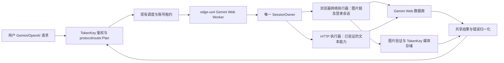

# Gemini Web 新通路方案与抓包结论

## 结论与当前边界

**最新迁移实验以第 9 节为准：**483 的现有图片已通过 us4 纯 HTTP 取得与浏览器一致的全尺寸原图，但之后出现会话失效迹象，Cookie refresh 返回 401，Linux Chromium 导入也未恢复登录态。原图下载可脱离浏览器的证据成立，长期无人值守与无登录迁移仍未通过；下文此前“HTTP 图片授权未打通”的记录保留为历史对照。

建议新增独立的 `Gemini Web` 账号通路：一个 SessionOwner 管理凭据与页面状态，HTTP 执行器处理已验证的文本/refresh，浏览器网络执行器处理图片。浏览器网络执行器在已登录上下文中直接使用 fetch，执行生成、原图 RPC、授权和文件读取；不依赖逐次点击页面或截图提取图片。两种执行器共享账号租约、会话版本和错误状态，不能分别维护 Cookie 或重复提交同一轮生成。人工登录/验证及未知页面动态状态仍由浏览器 UI 承接。

已经实测：483 浏览器对应 us4 #24 的 Google 身份；浏览器通过 us4 生图并下载 2816×1536 原图成功；浏览器网络执行器无需 UI 点击，能够下载字节级一致的原图，并独立发起新图生成和下载；us4 独立 HTTP 文本生成与 Cookie refresh 成功，刷新后重新 bootstrap 并生成文本成功。尚未完成：纯 HTTP 图片授权下载，以及在 us4 Linux 上独立建立浏览器会话后的图片验收。当前 Mac 指纹浏览器成功，不等于把其 Cookie 导入任意 Linux Chromium 就一定成功。

这条路径使用 Google 的 Gemini Web 前端数据面，不调用 `cloudcode-pa.googleapis.com`，不恢复或替代 #24 的 Antigravity OAuth 身份，也不能据此认定 Code Assist 的 403 已解除。

当前验收范围为 profile 133、483，484 不纳入本轮。两号均已有全尺寸图片源证据，但 TokenKey 尚未实现并验证官方 `GenerateContentResponse` 返回，不能标记为生产链路完成。现有 us4 先按单活跃浏览器槽做 Linux 验证；两个热账号同时服务建议至少 4 GiB 内存，具体预算见下文容量评估。

本方案未部署、未修改账户类型、未开新计费模型。涉及新凭据类型与路由契约的生产实现需要以本方案为审批基线。

## 1. 证据与环境

| 验证项 | 结果 |
|---|---|
| AdsPower profile | 483，现有 Gemini 会话；此前“478”为识别上的混淆 |
| 身份核对 | 浏览器与 #24 邮箱 SHA-256 前缀一致；刷新后的 HTTP 页面也匹配 |
| 浏览器出口 | SOCKS 1109 → SSH 32.188.80.151；同时核对 edge-us4 实际地址 |
| IPv6 出口 | 浏览器代理与 us4 均为 `2600:1f13:624:f200:f41f:9bf1:e12f:b45e` |
| 浏览器生图与原图下载 | 新生成橙色茶壶；下载 JPEG 为 2816×1536、2,605,151 字节，已视觉确认 |
| us4 原始 Web 请求重放 | HTTP/2 200，返回生成图片引用；不把引用本身算作图片下载成功 |
| us4 Cookie refresh | `RotateCookies` HTTP 200，PSIDTS 与 SIDCC 系列发生更新 |
| refresh 后 bootstrap | HTTP 200，找到全部五个页面字段，身份匹配 #24 |
| refresh 后文本生成 | 从真正的候选答案字段解析出精确的 `TK_WEB_REFRESH_OK` |
| 原图授权中间跳 | 浏览器 200；此前 us4 curl 默认地址族、curl IPv4、curl_cffi Chrome145 均为 403 |
| 浏览器网络执行器 | 原图下载与 UI 文件 SHA-256 一致；全新生图和图片读取均成功 |
| 将浏览器授权后的 URL 交给 curl | 三组请求头对照均得到 HTTP 200 的重新授权 URL，未得到 JPEG |
| TLS 对照的解释 | 单次 Chrome145 模拟并不等价于 AdsPower Chrome151；不足以认定或排除 TLS/浏览器绑定是根因 |

本文件集中保存脱敏结论；原始 Cookie、签名地址和个人会话抓包保留在受限临时目录，不入库。源码比对使用已 fetch 的 `origin/main`，不以当前旧工作分支为实现基线。所有 Google 主动请求通过 us4 或已核实的 us4 浏览器代理；本机只直接访问 CDP、AdsPower API、GitHub 等非 Google 资源。

## 2. 实际端点与请求链

| 阶段 | 方法与端点 | 请求/凭据 | 响应与证据等级 |
|---|---|---|---|
| 页面初始化 | `GET https://gemini.google.com/app` 或 `/app/<conversation>` | Google Web Cookie jar；浏览器 UA | HTML 内页面配置；浏览器及 us4 HTTP 均实测 |
| 能力、模型与会话 RPC | `POST https://gemini.google.com/_/BardChatUi/data/batchexecute` | Cookie；查询 `rpcids, bl, f.sid, hl, _reqid, rt, source-path`；表单 `at, f.req` | XSSI/JSON 帧；实际捕获多种 RPC |
| 文本/图片生成 | `POST https://gemini.google.com/_/BardChatUi/data/assistant.lamda.BardFrontendService/StreamGenerate` | Cookie、`at`、页面会话参数、JSPB 数组、模型/功能头 | 长连接分帧响应；文本和浏览器生图均实测 |
| 预览地址解析 | `GET https://lh3.googleusercontent.com/gg/<opaque>=s1024-rj?alr=yes` | 浏览器实际请求没有 Cookie | `200 text/plain`，内容为下一跳 URL；已捕获 |
| 预览授权 | `GET https://lh3.google.com/rd-gg/<opaque>...` | 按 `.google.com` 域发送 Cookie | `200 text/plain`，返回最终图片 URL；已捕获 |
| 预览图片 | `GET https://lh3.googleusercontent.com/rd-gg/<signed>...` | 捕获的浏览器请求没有 Cookie | JPEG；浏览器 CDP 及页面加载已确认 |
| 原图地址解析 | `GET https://lh3.googleusercontent.com/gg-dl/<opaque>...?...alr=yes` | 不应把 Gemini 域 Cookie 硬贴到此域 | `200 text/plain`，返回 work.fife 下一跳；浏览器和 us4 实测 |
| 原图授权 | `GET https://work.fife.usercontent.google.com/rd-gg-dl/<opaque>...` | Google 域 Cookie、网页请求上下文 | 浏览器 200 并返回最终 URL；独立 HTTP 当前 403 |
| 原图文件 | `GET https://lh3.googleusercontent.com/rd-gg-dl/<signed>...` | 捕获请求无 Cookie | 浏览器 200，实际文件已保存并校验；独立 HTTP 未打通前一跳 |
| 网页会话维护页 | `GET https://accounts.google.com/RotateCookiesPage` | 查询含 `og_pid, rot, origin, exp_id`；Google 登录会话 | 浏览器 200，实际更新 SIDCC 系列 |
| Web 会话刷新 | `POST https://accounts.google.com/RotateCookies` | Google Cookie jar；JSON body；Origin 为 accounts.google.com | us4 200，更新 PSIDTS/SIDCC 系列，后续文本验证成功 |
| 附件上传 | `POST https://content-push.googleapis.com/upload` | 社区实现为 multipart；`X-Tenant-Id: bard-storage`、动态 `Push-ID` | 仅社区实现；本次 UI 上传菜单未完成，未捕获上传请求 |

图片链里的若干“跳转”是 **HTTP 200 的正文返回 URL**，不是 HTTP 302。仅开启 HTTP 客户端的 follow-redirects 不会完成链路。必须解析文本 URL、验证目标域名、切换正确 Cookie 作用域，再执行下一跳。不能对所有 Google 子域复制同一条 Cookie header。

`c8o8Fe` 请求携带当前图片标识与 cid/rid/rcid，响应给出 gg-dl URL。实测原图解析使用 `=d-I?alr=yes`。

不把这里的 opaque/signed 路径存入公开日志或长期数据库；它们是短期资源引用。原图字节由 edge 获取并校验，可按需暂存于受控媒体存储；Gemini 原生接口统一返回官方 `Part.inlineData`，不返回自定义图片地址。

## 3. 生成请求结构

下面是脱敏的结构示意，不是可直接重放的完整请求：

```http
POST /_/BardChatUi/data/assistant.lamda.BardFrontendService/StreamGenerate?bl=<build>&f.sid=<session>&hl=en&_reqid=<request-id>&rt=c
Host: gemini.google.com
Cookie: <按目标域匹配的会话 Cookie>
Origin: https://gemini.google.com
Referer: https://gemini.google.com/
Content-Type: application/x-www-form-urlencoded;charset=utf-8
X-Same-Domain: 1
x-goog-ext-525001261-jspb: <模型及会话选择数组>
x-goog-ext-525005358-jspb: <本轮请求标识数组>

at=<SNlM0e>&f.req=<URL-encoded JSON>
```

`f.req` 是外层二元数组 `[null, JSON.stringify(inner)]`，inner 又是位置编码的 JSPB 数组。当前浏览器捕获到 99 个位置；社区实现当前构造 81 个位置。长度会随页面版本变化，不应当做永久协议契约。

已观察的重要位置：

- `inner[0]`：文本、附件引用等消息内容；文本在 `[0][0]`。
- `inner[1]`：语言。
- `inner[2]`：会话、回答和候选分支元数据。不能跨用户混用；新会话与继续会话必须明确区分。
- `inner[3]`、`inner[4]`：浏览器生成的动态字符串，本次分别为长字符串与 32 字符标识。尚未完成其生成算法和寿命验证，不能简单写死或认定为普通 OAuth token。
- `inner[59]`：本轮 UUID；模型、功能和其他位置必须与请求头保持一致。
- `x-goog-ext-73010989-jspb`、`x-goog-ext-73010990-jspb` 等功能头也在真实请求中出现。

短时重用一次捕获请求的动态字段成功，只证明该时刻可用。生产路径必须能重新生成这些字段，不能把抓到的一份请求当作永久模板。

## 4. 页面字段、模型与 RPC

| HTML 字段 | 用途 | 生命周期 |
|---|---|---|
| `SNlM0e` | 表单 `at`，页面调用所需校验字段 | 页面/会话级；不是 Google OAuth access_token |
| `cfb2h` | 请求查询 `bl`，前端 build | 随 Google 发布或重新 bootstrap 更新 |
| `FdrFJe` | 查询 `f.sid` | 页面会话级；重新初始化后重取 |
| `TuX5cc` | 语言 | 从当前页面取得 |
| `qKIAYe` | 上传相关 Push-ID | 页面初始化值；上传实现需要验证 |

抓包实际出现 `otAQ7b`（社区映射为用户/模型状态）、`qpEbW`、`aPya6c`（额度相关）、`GPRiHf`（状态检查）、`MaZiqc`、`hNvQHb`（会话列表/历史）等 RPC。点击“Download full size image”后实际捕获到 `c8o8Fe`，返回原图 URL，并完成图片文件下载。附件上传菜单连续三次无法被当前 UI 自动化操作成功，已停止该项重试；因此上传端点仍仅有社区来源证据。

本账号 `otAQ7b` 返回的模型条目包括：

| Web 标签 | Web 标识 | 同条目显示的版本标签 |
|---|---|---|
| Flash-Lite | `8c46e95b1a07cecc` | 3.5 Flash-Lite |
| Flash | `56fdd199312815e2` | 3.8 Flash |
| Pro | `e6fa609c3fa255c0` | 3.1 Pro |

这是当前账号、当前 Web build 的观测，不是永久映射，也不证明三者都实测可调用。公开 API 的 `gemini-*` 名称与 Web 标识需独立建立证据映射。社区把状态码放在返回位置 `[14]`，本次该位置为空；说明必须容忍结构漂移，不能套社区的一个数字位置直接停用账号。

## 5. 凭据与 refresh

### 凭据获取

运营在指定账号的持久化浏览器中完成 Google 登录；用受控的 CDP/本机代理读取该 profile 下相关 Google 域的 Cookie，连同 domain、path、secure、httpOnly、expires、sameSite、partition 信息保存。只读取已选定账号，不扫描整台电脑或其他 profile。

至少涉及 `__Secure-1PSID`、`__Secure-1PSIDTS` 及其他 Google 会话 Cookie。社区常以这两个值作为入口，但本次只验证了完整 jar；**尚未验证“仅两个 Cookie”足以覆盖生成、图片授权和刷新**。`SID`、`HSID`、`SSID`、`SAPISID`、3P 对应项、SIDCC 系列等不能未经实验直接删减。

Cookie 绑定的账号必须用页面身份再核验一次；检测到账号切换、authuser 改变或身份不一致时停止该账号调度，不能悄悄换到浏览器里的另一个 Google 身份。

### refresh：已验证流程与持久化要求

1. 对当前会话加独占锁，取最新版本 Cookie jar。
2. `POST https://accounts.google.com/RotateCookies`，`Content-Type: application/json`，`Origin: https://accounts.google.com`。本次采用社区格式 `[000,"-0000000000000000000"]` 做对照，成功并不代表这个占位 body 是官方稳定契约。
3. 按每条 `Set-Cookie` 合并 jar，保留 domain/path/expiry，不仅更新 `__Secure-1PSIDTS`。
4. `GET https://gemini.google.com/app` 重新获取页面字段，确认身份仍是预期账号。
5. 以刷新后的 session 发起低成本文本调用；本次候选回答精确为 `TK_WEB_REFRESH_OK`。
6. 生产实现要求（尚未实施）：持久化新版本并原子发布给执行器；禁止较旧浏览器快照覆盖较新的刷新结果。

本次服务端更新了 `__Secure-1PSIDTS`、`__Secure-3PSIDTS`、`SIDCC`、`__Secure-1PSIDCC`、`__Secure-3PSIDCC`。浏览器维护页单次只更新了 SIDCC 系列。HTTP 200 但某一 Cookie 未改变，不必然是失败，必须结合下一次有效调用判断。

社区默认约 600 秒加抖动进行刷新，并用约 60 秒缓存避免频繁刷新；这只是其客户端策略，不能写成 Google 官方 Cookie 寿命或 SLA。建议先沿用保守间隔做 canary，同时记录实际更新与失败分布，再确定生产调度。

这条通路没有已捕获的 OAuth `refresh_token`。登录被撤销、密码或会话安全状态改变、验证挑战出现时，RotateCookies 不保证恢复。状态应进入 `login_required` / `verification_required`，运营在同一受控浏览器和固定 edge 出口完成操作，随后做身份和实际生成复验。

### 凭据归属

建议每个 Google 身份只有一个 SessionOwner，负责 jar、页面字段、刷新锁、会话版本以及浏览器 profile。HTTP 执行器不单独运行第二个刷新循环。Cookie 不进入 prod 镜像账户、不进入客户端 API 配置、不返回 admin 普通详情或日志；中央账户只保存 edge 会话引用和脱敏状态。

## 6. 响应解析与错误处理

上游 `StreamGenerate` 不是 OpenAI SSE，也不是单个原生 Gemini JSON。其响应包含 XSSI 前缀和长度编码 JSON 帧，本次出现 `wrb.fr`、`di`、`af.httprm`、`e`。`wrb.fr` 的负载还可能是 JSON 字符串，需要再次解析。

解析器必须处理：跨 TCP chunk 的长度/UTF-8 字符、累计文本的增量去重、候选切换、图片先有引用后可下载、内层错误、流中断与最终完成状态。非流式入站请求也应消费同一个上游流解析器，完成后聚合返回；避免再制造一条与流式行为漂移的实现。

| 故障 | 建议动作 |
|---|---|
| Cookie/登录态失效 | 单次受控 refresh + bootstrap；仍失败则进入需登录状态 |
| Google 验证挑战 | 标记需验证；展示脱敏原因和受控操作入口；不把 RotateCookies 当作万能解封 |
| 图片中间跳 403 | 记录具体 host、阶段和执行器；保留已生成结果，交浏览器下载；不要再次生成同一张图 |
| 429/额度不足 | 按账号、Web 模型和操作类型冷却，结合 RPC/响应判定；不继承 Antigravity 限流状态 |
| HTTP 200 内嵌错误 | 返回业务失败，不登记成功用量 |
| 生成超时/客户端断流 | 用会话/轮次标识查恢复状态；不能无条件重发造成重复生图 |
| 未知协议字段/结构漂移 | 降级为明确错误并保留脱敏 build/解析证据；不凭空拼兼容答案 |

浏览器/Web 当前没有给出可直接等同 API `usageMetadata` 的可靠计费 token 数据。本次未验证精确 token 计量；不补造 usage。图片按成功交付计数、文本如何计费属于上线前需要确认的业务口径。

## 7. 新通路设计

### 方案选择

| 方案 | 优势 | 代价与失效面 | 当前结论 |
|---|---|---|---|
| 每次打开网页、点击生成/下载 | 最接近运营手动流程，容易观察错误页 | 控件/焦点/弹窗/语言变化会破坏操作；页面加载与冷启动；难做并发和幂等 | 保留人工操作与回归基线，不作为默认请求执行方式 |
| 常驻浏览器网络执行器 | 复用登录、Cookie、连接及浏览器网络行为；无需每请求刷新页面或点击；本次全新生图成功 | 仍有浏览器内存/进程成本；协议与动态字段可能漂移；不能保证 Linux 迁移后立即等价 | 当前图片通路的推荐执行器 |
| 纯 HTTP + 完整 Cookie jar | 资源小、部署与水平扩展简单、流式处理直接 | 文本/refresh 已验证；图片授权及最终下载移交未通过；Cookie/UA/动态字段生命周期仍需实验 | 先用于已验证能力，不承诺纯 HTTP 全图片链 |
| 浏览器只做授权，HTTP 下载文件 | 理想情况下进一步减少浏览器大文件搬运 | 当前最终 URL 移交后返回重新授权文本；跨客户端授权闭环尚未成立 | 保留研究，不作为当前生产依赖 |
| SessionOwner + HTTP/浏览器网络两个执行器 | 每项操作选择已验证路径；共享会话状态，UI 不在日常图片请求路径上 | 多执行器要防 Cookie 版本竞争、重复生成与错误归因漂移 | 推荐总体架构 |



生产 Worker 必须绑定固定 edge 出口，浏览器 profile 与 Cookie 加密保存。是否将浏览器进程与 edge 网关同机，需要通过资源预算决定；独立浏览器 Worker 经绑定 edge 的代理出网也是候选部署形态。不能把运营 Mac 483 是否开机作为生产可用性的前提；483 只作为现阶段原型和协议对照。迁移时应允许在 edge 浏览器中重新登录，而不是承诺复制 Mac profile 或 Cookie 就可搬走全部浏览器绑定状态。

### 账号、平台与 channel

建议的语义是 `platform=gemini`、新增账户类型 `web_session`、通路标识 `gemini_web`，展示为“Gemini Web（网页登录）”。这些都是**待实现的提案**，当前配置中不能直接填写后期待生效。

`origin/main` 目前账户类型包含 oauth/apikey/upstream/setup-token/bedrock/service_account，未见 web_session；`protocolrouter.GeminiEndpointProfile` 也没有 Web profile。需要新增明确的 Web endpoint/能力身份，并让 Plan 在既有候选资格 SSOT 下决定可用转换，不能把网页接口伪装成现有 Antigravity CloudCode。

现有数值 `channel_type` 目录来自 NewAPI 的 channel 枚举，不应擅自占用一个现有 Gemini 数字类型。实施时将 Web 作为原生账户通路接入现有分类 owner；只有最终采用 NewAPI adaptor 方案时才另行登记数值类型。当前推荐原生 Web 账户通路，不新造一个会误送官方 Gemini API 的数字配置。

### 内部接口与数据模型草案

内部 Worker 只绑定 localhost/受控内部网络，使用现有 edge 服务认证或新的受审查短期服务凭据。示例业务结构：

```json
{
  "account_ref": "<edge web-session reference>",
  "request_id": "<server request id>",
  "operation": "text | image",
  "model_ref": "<validated Web model selector>",
  "conversation_ref": "<tenant-scoped reference or null>",
  "input": {"text": "...", "attachments": []}
}
```

Worker 的内部执行状态可以记录生成、预览、原图、授权、落盘等阶段，但这些状态不构成 TokenKey 用户协议。对外的非流式响应直接采用 Google 官方 `generateContent` envelope；流式响应采用官方 `GenerateContentResponse` chunk 语义。服务端内部仍保留 Google cid/rid/rcid 与本地 request_id 的对应，客户端不接触 Cookie、页面 token 或签名下载 URL。

网页上游没有提供官方 API 的 token usage、modelVersion 或 responseId 时，不伪造精确值：按官方 schema 省略不可得的可选字段，或使用明确标记为网关生成的 request ID（仅在现有客户端契约必须有 responseId 时）。不能把内部 `image_ready`、`text_delta` 或 `completed` 事件直接返回给用户。

拟新增会话记录：`account_id / edge_id / identity_hash / profile_ref / encrypted_cookie_jar / session_version / bootstrap_build / bootstrap_at / last_refresh_at / last_verified_at / auth_state / failure_stage`。浏览器 profile 引用和凭据的保存位置必须沿用项目的敏感凭据 owner；这些字段不是本次已执行的 DB 迁移。

`conversation_ref` 必须隔离租户/API key；同一 Google 账号可服务多租户时不能共享上下文。每账号先设并发 1，生成租约覆盖“发起 → 完成/恢复 → 图片交付”；刷新在同一会话 owner 上串行。这个初始并发是设计上的保守值，不是实测容量结论。

### 运营入口

账号卡显示：网页登录身份（脱敏）、绑定 edge、会话健康、最近刷新/实测时间、Web 模型能力、图片执行方式、失败阶段。

操作包括“打开绑定浏览器登录/验证”“检查会话”“刷新会话”“文本测试”“图片测试”。多个页面复用一个会话服务和共享操作组件，遵守多端 UI 行为 SSOT。操作结果要区分“Cookie 已更新”“生成成功”“图片已下载”，不再用一个绿色授权成功页面代替三种能力验证。

客户端仍使用 TokenKey API Key。第一阶段仅开放已验证的文本和图片子集；tool calls、严格 JSON schema、视频、音频、Batch、精确 token 计量等未验证能力由 Plan 明确拒绝，不能静默丢弃参数。

## 8. 2026-09-19 深挖：延迟、稳定性与改进设计

### 实测方法与时间边界

复用本会话 483 的真实登录状态，Google 流量仍经 us4。先从浏览器 Resource Timing 拆解已经完成的 UI 原图下载，再在同一浏览器中直接执行 fetch：原图 RPC → 地址解析 → 授权 → 图片读取。另用独立新会话元数据和新请求 UUID，发起一笔全新蓝色杯子生图，确认不是读取旧图或截图。

这轮测量的浏览器在 Mac，经 SSH/SOCKS 到 us4；HTTP 对照在 us4 本机执行。网络距离、连接冷热、图片大小和 Google 缓存均不同，**不能用两者耗时相减来宣称浏览器的纯开销**。以下是观测样本，不是 p50/p95、成功率、容量或 SLA。

| 路径/阶段 | 实测耗时 | 解释 |
|---|---:|---|
| UI 原图下载：c8o8Fe RPC | 8.080 s | 其中请求发出至响应首字节约 7.39 s；等待主要发生在 RPC，不是点击动作 |
| UI 原图下载：地址解析 | 0.788 s | 第一层 200 text/plain URL |
| UI 原图下载：授权 | 0.585 s | Google 登录域上的授权请求 |
| UI 原图下载：2.6 MB 文件 | 1.711 s | 浏览器取得 JPEG；从第一个 RPC 开始到文件结束约 11.17 s |
| 浏览器网络执行器：原图 RPC | 0.684 s | 热会话下单次样本；与此前 UI 样本不是受控 A/B |
| 浏览器网络执行器：解析+授权 | 0.723 s | 0.414 s + 0.309 s |
| 浏览器网络执行器：原图文件 | 2.127 s | 2816×1536，2,605,151 bytes |
| 浏览器网络执行器：原图链合计 | 约 3.534 s | 各网络阶段耗时之和，不含 CDP 取回/落盘；没有 UI 点击，文件 SHA-256 与 UI 下载相同 |
| 浏览器网络执行器：全新生图首字节 | 2.212 s | HTTP 首字节时间，不等于用户首个可见图片时间 |
| 浏览器网络执行器：全新生图流结束 | 15.089 s | Google 生成阶段，包含接收完整分帧响应 |
| 全新生图：地址解析+授权+文件 | 约 2.410 s | 0.940 s + 0.801 s + 0.669 s |
| 全新生图：端到端 | 17.506 s | 1024×559、35,787 bytes 的新蓝色杯子，已视觉确认 |

原图一致性 SHA-256：`0dc3f65e8023d978e0cec9a08bb37ff84327b6395f3e3db746f51c0d29faaf70`。新图 SHA-256：`34901fef104f1e35cd8f5ced1c99e56f0521ddfe6559207140e395096dd70d02`。文件内容无需进入仓库。

### 比“每次操作网页”更好的图片执行方式

推荐浏览器网络执行器，保留浏览器 Cookie、站点上下文及实际网络栈，直接进行 fetch。已实测从新图生成到文件读取的完整过程，普通请求无需点击“生成/下载”按钮，也无需截图后再提取图片。

这样可以消除当前 UI 自动化里的焦点、菜单、语言、可见性和选择器依赖，复用热页面与连接；不需要每笔请求重新启动浏览器或刷新整个页面。但它仍然依赖 Google 的私有协议、登录态和动态请求字段，不能等同于稳定官方 API，也不能据一次成功宣称长期无人值守。

目前生成原型仍复用了捕获模板中的未解释动态字段，虽改用了新请求 UUID 和新会话元数据并成功生成新图，尚未证明这些字段可在长期过期、重启或 Google build 更新后自动重建。生产实现必须补齐这一生命周期；失败时应受控重新初始化或回到官方页面生成新请求，不能无限复用旧模板。

### “浏览器只授权，HTTP 下载”为什么暂不采纳

本轮将浏览器刚取得的图片 URL 交给 us4 curl，分别使用 Referer、Origin+Referer、捕获的 CDN 请求头。三组都返回 HTTP 200、约 598 bytes 的 URL 文本，指回 `lh3.google.com/rd-gg/...` 请求重新授权；不是 JPEG。浏览器网络执行器在其自身上下文中能取得同图 JPEG。

这比单看 403 更有区分度：跨客户端移交没有形成可用的授权闭环，HTTP 200 也可能只是重新授权入口。因此当前不把“拿到最终 URL 后随便换客户端下载”放入生产链路。

尚不能确定原因是浏览器状态、请求特征、签名约束还是客户端网络行为。已核对浏览器代理和 us4 的 IPv6，并从 edge 的 SSH 转发连接观察到该地址；仍不将这些证据扩大为对所有传输细节的等价证明。此前 Chrome145 模拟与当前 AdsPower Chrome151 也不完全相同。

此外，尝试让 HTTP 会话重新 bootstrap 和请求 c8o8Fe 时，使用较旧 Cookie/默认 UA 的一次初始化没有拿到必需字段；重新取当前浏览器 Cookie 并保持 UA 后，身份、页面字段和 RPC 均正常。这里同时改变了 Cookie 与 UA，不能单独归因于其中之一。RPC 返回了 `gg` 路径变体，初版探测器因只接受 `gg-dl` 而停止；这个 `rpc_url_found=false` 是探测器限制，不能算成上游拒绝。浏览器同样能从 `gg` 变体拿到与原图完全相同的文件，故不能仅凭 URL 路径前缀判分辨率。

CDN 移交对照连续三次未得到文件后，按会话 AGENTS.md 的三次失败纪律停止该项重试；没有再次生图来规避下载失败。末次脚本尾部的 ss/head 管道产生 SIGPIPE，已修复该机械问题并用纯读取探测复核保存的响应；不把脚本退出码当成 Google HTTP 状态。

### 资源与部署取舍

实测 Gemini 页面 JS heap 使用约 71.8 MiB、已分配约 87.1 MiB。现有 profile 有 14 个标签页；这些数值既不是整个浏览器 RSS，也不能作为一个 Linux Worker 的内存预算。Linux 冷启动时间、完整进程树 RSS、长时间泄漏和并发容量均未测。

#### 2026-09-20 edge 容量评估

结论：现有 edge 有余量进行低并发 Linux canary，但不能承诺两账号浏览器常驻、同时生图的生产容量。主要约束是浏览器内存；图片推理由 Google 完成，本机承担页面执行、图片下载、校验和响应编码。

通过 `ops/observability/run-probe.sh` 对全部当前 deployable edge 做只读采集：`nproc`、`free -m`、`uptime`、`df -h /`、`docker ps`、`docker stats --no-stream`、`vmstat 1 5`。快照时间为 **2026-09-20 08:36:20–08:36:29 UTC / 北京时间 16:36:20–16:36:29**。未发起 Google 请求、未部署或修改线上配置。

| Edge | 逻辑 CPU / 总内存 | MemAvailable | 1 分钟 load average | 根盘剩余（df -h） |
| --- | --- | ---: | ---: | ---: |
| us3 | 2 / 1,913 MiB（约 1.87 GiB） | 1,132 MiB | 0.01 | 52G |
| us4 | 2 / 1,913 MiB（约 1.87 GiB） | 1,103 MiB | 0.14 | 52G |
| us5 | 2 / 1,913 MiB（约 1.87 GiB） | 924 MiB | 0.46 | 54G |
| us6 | 2 / 1,913 MiB（约 1.87 GiB） | 1,033 MiB | 0.08 | 53G |

us4 容器内存快照：应用约 170.9 MiB、Postgres 412.5 MiB、Caddy 29.0 MiB、Redis 8.0 MiB。容器统计与宿主可用内存口径不同，不能直接相减重算余量。us4 已使用约 143 MiB swap，但短时采样 `si/so` 均为 0，没有持续换页证据；swap 不作为浏览器容量预算。瞬时 CPU 较空闲与当前 MemAvailable 不代表业务高峰、发布双容器重叠或浏览器启动时仍有同等余量。

| 新增成本 | 初步预算或测量 | 证据边界 |
| --- | --- | --- |
| 活跃浏览器完整进程树 | 暂按每账号 300–600 MiB 规划，启动与复杂页面可能更高 | 工程估算，尚无 us4 Linux RSS/PSS 实测；71.8 MiB JS heap 不能代替它 |
| 两个热账号 | 浏览器预算约 600–1,200 MiB，另加 Worker、图片缓冲及系统余量 | 将明显挤压现有 us4 的约 1,103 MiB 可用内存，不作为已验证容量 |
| CPU | 低并发预计可承受，浏览器启动、页面脚本和编码产生突发 | 未测 Linux 生图时 CPU 峰值、吞吐和 CPU burst 余量 |
| 原图与官方响应 | 已有原图约 2.1–2.6 MB/张；base64 后约 2.8–3.5 MB/张 | base64 长度为 `4 × ceil(bytes / 3)`；这是官方 inlineData 格式本身的成本，普通官方 API 也有 |
| 图片缓冲 | 原始字节、base64、JSON、CDP 搬运可能产生多份副本；若解码，2816×1536 RGBA 单份约 16.5 MiB | 不用压缩 JPEG 文件大小估算全部内存；生产尽量采用下载文件/CDP 流读取，最终出口再编码 |
| 对客带宽 | 假设每分钟 6 张上述大小图片，平均约 2.2–2.8 Mbps，另有 Google 下载流量、协议开销及可能的中间转发 | 仅算术场景，不是已验证吞吐；未测实际网络余量与流量套餐；双图同时返回有突发 |
| 持久化磁盘 | 保留 1 万张上述原图约 21–26 GB，另有 profile、缓存和日志 | 当前磁盘可做小规模验证；生产需明确短期缓存清理或转存策略，不默认无限保留 |

**部署建议（未执行）：**

- **最低成本验证：**先保留现有 us4 配置，两个账号各自持久化 profile，但同时最多一个活跃浏览器槽、全局生图并发 1。每账号并发也为 1，另一个账号排队。先测单槽实际内存，再决定能否同机保留；单槽是试运行约束，不是已经装得下的证明。
- **账号切换：**浏览器槽代表资源预算，不代表复用凭据。结束前一账号的租约并关闭其浏览器，再启动另一账号自己的 profile，核对身份；Cookie、刷新锁和会话版本始终隔离。持久化状态与进程常驻分开，切换冷启动会增加延迟，不能把 Mac profile 直接复制到 Linux 当作恢复保证。
- **两个热账号同时服务：**建议至少 4 GiB 内存作为同机部署的起步配置，每账号并发 1、全局并发 2；这仍需 Linux 实测和高峰余量检查，不是上线容量或 SLA。不能仅凭 2 核空闲就推导更多生图并发。
- **后续扩账号：**优先评估独立浏览器 Worker，经固定 us4 代理访问 Google，隔离网关/Postgres 的内存与进程故障。尽量同地域部署并复测控制及文件传输开销；代理不可用时停止请求，禁止回退 Worker 本机直连。运营 Mac 只用于原型，不作为生产依赖。
- **扩容决策依据：**补测 Linux 冷/热启动、完整进程树 RSS/PSS 与 cgroup 峰值、两号同时下载/编码、重启恢复、多个刷新周期以及现有网关延迟。计入业务高峰和发布重叠余量后，再确认同机部署或独立 Worker。

现有 [Edge 持续无错并发报告](../ops/edge-capacity-report-20260720-c1.md) 描述 API 账号的历史 F/H 并发，不是宿主浏览器容量证据，不能把 Antigravity OAuth 并发建议直接套给 Gemini Web。当前 17.506 秒新图样本只完成 1024×559 预览交付；全尺寸链另有约 3.534 秒样本，不能拼接为双账号原图 p95、生产吞吐或 SLA。

容量采集的 SSM CommandId：us3 `18b4ddcf-9145-4f83-a62d-87d2a0c76dff`；us4 `d6c9f4de-9b74-4ce6-bc0a-28f67b4c2712`；us5 `3c1c0119-353f-46da-891c-9efbbba58af3`；us6 `3a506dac-c2d2-4de7-b7bb-9fe2c4adc968`。四个命令均返回 Success；这次没有执行浏览器压力测试。

### 稳定性与延迟控制

保持 SessionOwner 的独占刷新锁和版本比较，防止 HTTP 刷新与浏览器 Cookie 更新相互覆盖。只有受限的执行队列可以使用同一账号/会话，租户上下文映射必须隔离。

把一次图片请求分为排队、冷启动/恢复、生成、原图准备、授权、传输、落盘几个阶段，各自记录耗时和错误。冷启动不能混入模型 TTFB；授权 200 文本不能登记图片交付成功；传输失败应恢复已生成图片，不能重新生成。

HTTP 适合已验证的文本/refresh；浏览器网络执行器适合当前图片链；完整 UI 保留登录、验证和协议故障时的操作入口。两种执行器不能各自维护一套模型目录、限流判断和收费成功条件，仍须汇入同一个 Plan、调度与结果归一化 owner。

### 三通路的资源、性能与账号稳定性比较

下面的比较把“Gemini OAuth”限定为仓库现有的标准 Google OAuth 通路。它可能根据 `oauth_type` 使用 AI Studio、Code Assist 或 Google One 相关能力；不能把它和 Antigravity 的 Cloud Code 数据面当成同一个端点。Web、Antigravity 和 Gemini OAuth 的额度、验证状态也分别由各自上游产品决定，不能互相推导。

| 维度 | Gemini Web 新通路 | Antigravity OAuth | Gemini OAuth |
|---|---|---|---|
| 主要凭据 | Google Web Cookie、页面字段、浏览器 profile/context | Antigravity/Cloud Code OAuth 凭据，以及与客户端匹配的 UA/TLS/请求指纹 | Google OAuth `access_token`/`refresh_token`，按类型还可能需要 `project_id`、tier 信息或自定义 OAuth client |
| 数据面 | `gemini.google.com` 的 Bard Web RPC；图片还要经过 Google 图片授权链 | `cloudcode-pa.googleapis.com` 的 Antigravity/Code Assist 数据面 | 由 OAuth 类型选择对应 Google API/Code Assist 数据面；OAuth token 端点和模型数据端点分离 |
| 常驻资源 | 高：浏览器进程、profile、页面上下文和有限热槽；当前仅测得页面 JS heap 约 71.8 MiB，不能当作进程 RSS 或容量承诺 | 低：HTTP 客户端、连接池和账号调度；不需要浏览器常驻 | 低：标准 HTTP 客户端与连接池；已有 refresh 和 token cache |
| 单请求路径 | 热浏览器可直接 fetch；图片包含生成、RPC、地址解析、授权、文件传输多个阶段 | 纯 HTTP，通常链路较短，适合现有高并发调度 | 纯 HTTP，通常链路较短；实际延迟仍取决于 OAuth 类型、项目和上游模型 |
| 本轮性能证据 | 新图到 1024×559 预览约 17.506 s；生成流结束约 15.089 s，预览链约 2.410 s；另有全尺寸链约 3.534 s 样本，不是 p95 或容量 | #24 当前仍遇到 `403 VALIDATION_REQUIRED`，没有可与 Web 同任务对齐的成功 A/B 样本 | 本轮没有同账号、同模型、同图片任务的受控 A/B 样本；不能填写具体 p50/p95 或并发数 |
| 图片能力 | Web 图片生成和原图下载已验证；图片授权暂需保留在浏览器网络上下文 | 图片端点和账号能力需按实际 Antigravity 模型单独验证；不能从 Web 成功推导 | 按 OAuth 类型和模型端点单独验证；不能把 Web 图片权益直接视为 OAuth 图片权益 |
| refresh/恢复 | `RotateCookies`、重新 bootstrap、低成本调用；挑战出现时仍需浏览器人工验证 | OAuth token refresh；还受 Cloud Code 验证、客户端指纹和上游风控影响 | 标准 OAuth refresh；refresh token 与 OAuth client 绑定，scope、project、tier 缺失会阻断恢复 |
| 账号稳定性 | 最接近用户网页体验，能利用网页已有权益；私有 JSPB、页面 build、Cookie 生命周期和浏览器状态变化带来维护成本 | 生产资源效率最高，但当前 #24 的 403 表明 Cloud Code 验证/客户端链路是独立故障面 | 凭据生命周期最清晰，适合服务端池化；稳定性受授权类型、OAuth client、scope、project/tier 和 Google API 策略约束 |
| 同一 edge/IP 多账号 | 可行，但每账号必须独立 profile、BrowserContext、Cookie jar、动态字段、refresh lock 和 session version；共享 IP 可能增加关联风控 | token/account 隔离即可避免凭据串号；共享 IP 仍可能触发上游关联验证或限流 | token/account 隔离即可避免凭据串号；共享 IP 仍可能影响上游风控，但不会自动混用 Cookie |
| 推荐角色 | 作为网页权益和图片能力的补充通路，先单账号 canary | 作为低资源生产通路；先单独修复/验证 Cloud Code 403 | 作为标准 OAuth 的主力通路；按 OAuth 类型建立能力矩阵 |

因此，Antigravity OAuth / Gemini OAuth 的服务端资源成本通常低于 Gemini Web；实际吞吐仍需按各通路的配额、时延和并发验证。账号稳定性没有单一总排名：Web 更贴近网页实际权益，OAuth 更容易服务端池化，但各自受不同的上游验证面约束。本轮只有 Web 图片链和 Web refresh/text 有真实成功证据，不能用结构性优势替代同账号受控 A/B。

### 多账号共用 edge-us4 的隔离结论

同一个 edge-us4 和出口 IP 可以承载多个 Web 账号，IP 本身不会把 Cookie 自动混在一起。真正会造成串号的是复用同一个浏览器 profile、同一个 BrowserContext、同一个 Cookie jar，或让旧会话的异步刷新结果覆盖新会话。每个账号应有唯一 `SessionOwner`，并绑定：

- 独立浏览器 profile 与 BrowserContext；浏览器槽可以复用，但切换前必须销毁上下文并核对新身份。
- 独立加密 Cookie jar、页面动态字段、会话版本和 refresh lock；任何 `Set-Cookie` 只允许写回自己的 owner。
- 独立账号租约、并发上限、冷却和错误状态；初始并发设为 1，不能把一个账号的 429、403 或验证状态传播给其他账号。
- 独立 `conversation_ref` 租户映射；同一 Google 身份服务多个租户时也不能跨租户复用上下文。

同 IP 的实际风险是 Google 能观察到多个身份共享出口、设备行为和请求时间模式，可能提高关联验证、429 或账号联动风控概率。它不等于必然污染，也不能通过代码消除；应在固定 edge 出口上做低并发 canary，记录每个账号的验证率、429、refresh 成功率和图片授权失败率，再决定热槽数量与账号密度。浏览器网络执行器一次只绑定一个账号租约，运营登录/验证也必须在该账号绑定的 profile 中完成。

### edge-us4 两账号的最小成本验证矩阵

本轮只验收 AdsPower profile `133`、`483`，`484` 暂不纳入。现有 Mac 浏览器统一经本机 SOCKS `127.0.0.1:1109` 绑定 us4；代理不可用时停止，不回退直连。采用串行 canary，优先复用已生成图片；这些测试验证固定出口下的账号与图片链，不替代 Linux Worker 或 TokenKey 网关验收。

| 验证层 | 判据 | 本轮结果 |
| --- | --- | --- |
| 出口、登录与 bootstrap | 实际出口为 us4、身份正确、页面字段齐全 | 两号通过 |
| 最小文本 canary | 共享解析器得到完整回答和精确回显标记 | 两号通过 |
| 图片预览 | 已生成图片自然尺寸、可读像素与响应字节 | 两号均为 1024×559 预览；canvas 仅作诊断 |
| 全尺寸图片源 | 原图授权完成，读取原始响应并检查 MIME、尺寸、字节 | 133 观察到约 2.2 MB 的 rd-gg-dl 全尺寸响应；483 捕获 image/jpeg、2,088,976 字节、2816×1536 |
| refresh 后调用 | Cookie 更新后重新 bootstrap、核对身份并成功调用 | 483 对应身份已有 us4 HTTP refresh + 文本成功证据；两号长期、重启后的刷新仍待验证 |
| 官方 API 交付 | 经 TokenKey 返回 GenerateContentResponse，客户端解码得到全尺寸原图 | 未实现、未验证 |

两号 `fullsize_ready` 已有证据；第 9 节新增 483 的 us4 HTTP 字节、尺寸与哈希一致性证据，下一阶段仍须完成持续可用性与 133 的 Linux 验收，不能仅靠预览图或 URL 路径判定全尺寸交付。483 全尺寸文件 SHA-256 为 `b41778df03063c08b62a819a57bcd893ca750bf31b49c308733b342ca1b8d3d9`。

这次复核修正了图片完成判定：不能等待页面文案从 `Creating your image` 消失，也不能只等待单一最终事件。浏览器已经完成生成与预览图片加载，并把预览图片放入 `blob:` URL；可靠的 `preview_ready` 条件应检查生成图片元素的自然尺寸和可读像素。`fullsize_ready` 必须另外看到全尺寸下载触发的 `gg/rd-gg` 链、原图授权响应和文件 MIME/尺寸/字节。483 的关键是下载请求会被浏览器标记为 Fetch/Download，普通 Network body 可能在 `ERR_ABORTED` 后不可读；生产 Worker 应在 response 阶段拦截或使用浏览器下载文件，而不是把 Network 缓存为空误判为上游失败。页面 spinner 只作为 UI 状态异常记录；预览已成功时不得因 spinner 超时重新生成图片。

本轮 canvas 导出的 PNG 只是验证预览像素可读的诊断工件，可能重新编码并降低原图信息量，不能直接作为生产的全尺寸交付物。生产仍应在同一浏览器上下文取得原始 blob/下载字节，并在落盘后检查 MIME、尺寸和长度。

### 图片链接与 base64 字节的交付边界

Google 图片链可以观察到短期的 `gg-dl`、`work.fife` 和 `rd-gg-dl` 地址，但这些是带签名的临时资源引用。它们需要在正确的浏览器上下文和 Cookie 作用域中使用，交给独立 curl 后曾返回重新授权入口；因此不能把 Google 签名 URL 当作 TokenKey 的稳定图片链接返回客户端，也不能长期存库。

在浏览器上下文内可以得到图片字节：预览图已经以 `blob:` URL 进入页面，133 的本轮全尺寸链还观察到约 2.2 MB 的最终 `rd-gg-dl` 响应。生产 Worker 应在同一浏览器网络上下文截取原始响应或受控下载文件，取得全尺寸原始字节并校验，可按需暂存受控媒体存储；对外固定返回官方 `inlineData.mimeType/data`，其中 data 是不带 data URL 前缀的 base64。base64 会增加约三分之一传输体积，并可能增加内存拷贝，这是与官方响应兼容的共同成本。

即使签名资源已经由页面加载成功，在页面里对该 URL 重新 `fetch` 仍可能因 CORS 失败；因此“浏览器能显示”不等于“任意 JavaScript fetch 或 curl 能读”。实现应接浏览器网络响应体或浏览器下载事件，不能把重新 fetch 签名 URL 当作唯一方案。

因此当前能力分层是：133/483 都已有全尺寸响应字节证据；两号也都有预览 blob 和可读像素。canvas 导出的 base64 只适合诊断或预览，生产应使用 Fetch response interception 或浏览器下载字节取得全尺寸原始数据。

### 官方 Gemini API 的图片返回形式：生产契约参考

需要先区分两个官方模型名称：`gemini-3-pro-preview` 是文本输出模型，官方模型页标注 **Image generation: Not supported**；支持图片生成的是独立的 `gemini-3-pro-image`（Nano Banana Pro），官方模型页标注输入和输出均为 `Image and Text`。因此不能把 Gemini 3 Pro 文本模型的响应能力直接套到网页通路上。

在 Gemini API `generateContent` 语义中，图片不是一个外部 URL，而是候选内容中的 `Part.inlineData`。脱敏后的 REST 响应形状是：

```json
{
  "candidates": [
    {
      "content": {
        "role": "model",
        "parts": [
          {"text": "<optional text>"},
          {
            "inlineData": {
              "mimeType": "image/png",
              "data": "<base64 encoded image bytes>"
            }
          }
        ]
      },
      "finishReason": "STOP"
    }
  ],
  "modelVersion": "<served model version>",
  "responseId": "<response id>",
  "usageMetadata": {"...": "..."}
}
```

`parts` 是有序数组，可能只有图片，也可能同时有文字和图片；实现必须遍历所有 candidate/part，不能假定 `parts[0]` 一定是图片。官方 schema 的 `Blob.data` 是 base64 编码的原始媒体字节，`mimeType` 是 IANA MIME；`finishReason` 还可能明确返回 `IMAGE_SAFETY`、`IMAGE_PROHIBITED_CONTENT`、`IMAGE_OTHER` 或 `NO_IMAGE`。流式 `streamGenerateContent` 仍应按相同的 part 语义聚合，不能把某一个中间 chunk 当作最终图片。

官方 Gemini API 的响应格式应成为 Web 适配器的对外契约：上游浏览器执行器负责取得并校验全尺寸原始字节，预览不得作为全尺寸交付物。网关将原始字节放入官方响应的 `candidates[].content.parts[].inlineData`，其中 `mimeType` 是 IANA MIME，`data` 是 base64 图片字节；文本放入同一 `parts` 数组中的 `text`。网关可以先把原始字节落到受控媒体存储来完成 MIME、魔数、尺寸和长度校验，但存储地址、`image_ready` 等内部状态不出现在用户响应里。不要把 Google 临时签名 URL 或 TokenKey 自定义图片字段作为公共响应字段。

这套契约保留了官方 API 的优点：调用方得到可验证的图片内容，不依赖图片 CDN 的 Cookie、Referer 或签名有效期。base64 是官方响应格式的一部分，不能为了节省体积擅自改成自定义 URL；如果 TokenKey 的媒体层需要避免重复传输，可以在内部缓存字节，但最终 Gemini 原生接口仍返回官方 `inlineData`。Web 通路仍要保留 `preview_ready` 与 `fullsize_ready` 两个内部阶段，因为网页图片可能先进入 `blob:` 预览，再异步完成原图 RPC；只有后者完成后才组装官方响应中的图片 `Part`。

因此需要把现有实现草案中的 `image_ready {mime_type, bytes, width, height, sha256}` 降级为内部校验对象，而不是公共响应协议。公共响应必须经过 Gemini 原生 converter：文本对应 `Part.text`，图片对应 `Part.inlineData`，完成原因对应官方 `finishReason`；无法从 Web 证据得到的 token usage 等字段保持缺省。

官方参考：

- [Gemini 3 Pro Image 模型页](https://ai.google.dev/gemini-api/docs/models/gemini-3-pro-image)
- [Gemini 3 Pro（文本）模型页](https://ai.google.dev/gemini-api/docs/models/gemini-3-pro-preview)
- [Gemini 图片生成指南](https://ai.google.dev/gemini-api/docs/image-generation)
- [Gemini API v1beta REST discovery schema](https://generativelanguage.googleapis.com/$discovery/rest?version=v1beta)（`GenerateContentResponse`、`Part.inlineData`、`Blob`、`finishReason`）

建议把每号结果只记录为 `profile_ref / egress_verified / login_state / bootstrap_fields / text_canary / image_canary / refresh_canary / failure_stage`，不记录邮箱、Cookie、Authorization、动态 `at` 或签名图片地址。后续 canary 优先复用既有图片验证下载；只有明确需要重新验证生成能力时，才追加新图。

本轮乔布斯式复审将范围收敛为两个已登录 profile：`133` 和 `483`。最小成本验证顺序是每号一次零额度 bootstrap、一次短文本，再复用已生成图片检查预览和全尺寸字节；不重新生成第二张图片、不验证 484、不部署 Worker。2026-09-20 的复核结果：两号实际出口均为 `32.188.80.151`，页面字段齐全，文本 canary 均成功；两号均存在 `1024×559` 的 `AI generated` 预览图，可在浏览器上下文转成 PNG base64（133：344,646 个 base64 字符；483：377,794 个 base64 字符）。133 有约 2.2 MB 全尺寸响应证据；483 通过 CDP Fetch response interception 取得 `image/jpeg` 全尺寸响应，2,088,976 字节、2816×1536。至此“两账号 Web 文本 + 全尺寸图片源”已走通，官方 `generateContent` envelope 转换仍属于后续实现工作。

生产验收应覆盖冷/热会话、完整浏览器重启、多个 Cookie 刷新周期、Google 页面 build 更新、下载中断恢复及受限并发。覆盖这些场景之前，不对稳定性百分比、p95、并发数或长期自动刷新作承诺。

### 本轮可追溯证据

| SSM CommandId | 用途与结果 |
|---|---|
| `e3fbe623-8ca4-4eed-8eda-736441410230` | 复核 us4 出口 |
| `9f74dce8-69f2-48e4-ba50-5fae8a0003ce` | 当前 Cookie/UA 的 HTTP bootstrap 与 c8o8Fe；身份及 RPC 正常，探测器路径白名单停止 |
| `d95d2d8e-8492-41b5-8228-61e5e53d4c7e` | CDN 移交：仅 Referer，返回重新授权文本 |
| `24d78ac3-1738-4651-8d02-39b8fbd93eef` | CDN 移交：Origin+Referer，返回重新授权文本 |
| `fd2f5819-1d69-41b5-8dea-476e112b0ff6` | CDN 移交：完整捕获请求头，返回重新授权文本；尾部观察命令 SIGPIPE 不影响已保存响应 |
| `ca12d01a-4c9e-4ba3-bb72-99b17fd21da1` | us4 CPU、内存与容器资源快照 |
| `5679a9eb-7d74-4c21-85d2-bf915fe5741e` | 纯读取复核：CDN 对照正文是重新授权 URL；SSH 转发使用已核实的 edge IPv6 |

浏览器网络实测通过本机 CDP 控制已绑定 us4 代理的 483；原始请求、动态字段与图片 URL 不随文档入库。

## 9. 2026-09-20 双路径迁移实验：下载成功与会话有效性分开判定

本节是此前“纯 HTTP 全尺寸授权链未打通”结论的后续证据。目标是从 Mac AdsPower 483 复制会话到 us4，完全不重新登录，复用已生成图片对照纯 HTTP 与 Linux Chromium。没有再次生图，也没有改动 TokenKey 账号、路由或线上服务。

### 环境与隔离

- us4 实际出口核对为 `32.188.80.151`。Mac 483 继续使用已绑定 us4 的 SOCKS 1109；容器在 us4 本机出网，没有本机直连 Google。
- 使用独立临时目录、通过 SSH 传输会话。凭据文件不入库、不输出日志、不写入镜像层。镜像只安装 Python、curl_cffi、Playwright、Pillow 与 Debian Chromium。
- 纯 HTTP 容器上限 256 MiB / 0.5 CPU；浏览器容器上限 640 MiB / 0.75 CPU，禁止额外 swap、限制 PID、移除 Linux capabilities，无暴露端口、无生产 Docker socket 或数据库挂载。这些是隔离限额，不是测得的实际内存消耗。
- Mac 浏览器报告 Chrome 151；Linux 为 Chromium 153.0.8010.52，使用复制的 UA，但没有复制 Mac 指纹浏览器内核或完整设备环境。本轮不将 UA 相同解释为浏览器等价。

### 路径一：不启动 Chromium 的全尺寸下载已成功一次

从当前 Cookie jar 初始化 curl_cffi HTTP 会话，重新请求 Gemini 页面获取 `at/bl/f.sid`，再用原图 RPC `c8o8Fe` 获取已有图片的地址。RPC 本轮返回的是 `gg`，不是之前探针限定的 `gg-dl`。按返回地址和原图参数解析 HTTP 200 正文里的下一跳，逐域使用 Cookie，成功走完：

`Gemini bootstrap → c8o8Fe → lh3.googleusercontent.com/gg → lh3.google.com/rd-gg 授权 → lh3.googleusercontent.com/rd-gg JPEG`

| 阶段 | HTTP 状态 | 单次耗时 |
| --- | ---: | ---: |
| bootstrap | 200 | 264 ms |
| 原图 RPC | 200 | 338 ms |
| 地址解析 | 200 | 260 ms |
| Cookie 授权 | 200 | 55 ms |
| 最终 JPEG | 200 | 238 ms |

图片为 **2816×1536、2,088,976 字节**，SHA-256 `b41778df03063c08b62a819a57bcd893ca750bf31b49c308733b342ca1b8d3d9`，与此前 483 浏览器全尺寸原图一致。图片授权链三跳合计约 553 ms；加 RPC 约 891 ms，加 bootstrap 约 1,155 ms。它是复用已有图片的热缓存可能性未排除的单次下载样本，不含新图生成、队列与官方响应编码，不是 p95。

该路径没有启动 Chromium、没有使用 OAuth token，也没有使用浏览器转交的最终签名 URL 作为起点。它证明“浏览器必不可少才能下载原图”并非普遍成立。但本轮使用了当前 Cookie、curl_cffi 和 RPC 新返回的路径，不能单凭成功归因于 TLS、Cookie 或路径中的某一项；也未证明旧 `work.fife` 403 路径已修复，或只需两个核心 Cookie。

### 路径二：Cookie 已导入并发出，但 Linux 登录态未恢复

在独立持久化 profile 中导入导出的 Cookie，Playwright 驱动真实 Chromium 页面打开同一 Gemini 会话。页面显示 Sign in，没有原图下载按钮；初始化响应缺少登录态必需的 `SNlM0e`，未匹配预期身份。

进一步通过 CDP 核对：SID、1PSID、1PSIDTS、SAPISID 等核心 Cookie 均未过期，已保存并随 Gemini 主文档请求发出；被浏览器阻止的 Cookie 属于其他域或路径，不能把正常的 DomainMismatch/NotOnPath 当作核心 Cookie 丢失。因此当前失败不是“没有把 Cookie 加进浏览器”的简单导入问题，尚不能归因于 Chromium 版本、设备绑定或 Google 对新环境的判断。

另做了独立的断网持久化对照：使用 `--network none` 创建新 profile，导入后退出并销毁容器，再以同一目录启动新容器。SID、1PSID、1PSIDTS、SAPISID 的值全部保留，证明基本 Cookie 导入与跨容器持久化可行。这不验证 Google 接受会话，也不等于重启后可下载。此前访问过 Google 的实验 profile 在离线重开时核心 Cookie 已不再保留原值；还未捕获其准确清除/修改时刻，不能把两者混成磁盘加密故障或确定的上游撤销机制。

### 会话变化与停止条件

纯 HTTP 下载成功之后，用原导出快照执行 `RotateCookies` 返回 **401**，没有 Cookie 更新。随后旧快照与从 Mac 重新读取的当前快照都只能拿到未登录 bootstrap；Mac 原浏览器后台重新请求 `/app` 也没有取得 `SNlM0e`。期间 Mac 的 SIDCC、1PSIDTS/3PSIDTS 等 Cookie 已变化。

这些证据说明后续样本的会话有效性发生变化，不能继续拿它与首次成功样本当作稳定 A/B 对照。不能据现有证据认定是跨环境复制导致账号会话失效，也不能认定仅重新导出 Cookie 就能恢复。已暂停 Google 侧探测，等待运营确认原 483 页面刷新后的实际登录状态；没有自动重新登录、没有触发人工验证，也没有通过重复刷新掩盖 401。

后续应先恢复可确认的源会话基线，再按“单一执行器独占会话 → 更新后的 Cookie 原子保存 → 重启 → 原图复验”验证生命周期。迁移时须协调源浏览器与 edge 的刷新归属，不能把长期运行的两个独立刷新循环作为生产方案。

### 对方案的影响

- 低成本方向调整为：优先验证纯 HTTP 原图 RPC 与授权下载，浏览器保留为协议和会话恢复的候选执行器；暂不以两账号常驻 Chromium 为生产前提。
- 当前只完成一次纯 HTTP 全尺寸下载；自动续期、跨重启后可用性和新图生成闭环均未通过本轮验证。此前 Mac 生图证据仍然有效，但不能替代新的容器端生成与交付验收。
- Linux Chromium 的完整迁移验收未通过；登录态未恢复，因而重启后原图下载、浏览器 refresh 后原图下载也不能标记为通过。
- 对外契约仍是官方 `GenerateContentResponse` / `Part.inlineData`；本轮没有实现 TokenKey 网关返回。

## 10. 实施与验收顺序

第 9 节发现的会话有效性阻塞应先处理：确认源浏览器刷新后的登录态，以新基线串行验证纯 HTTP 与 Chromium 生命周期；期间不进行自动失败重试或新图生成。此前的实现顺序如下，不能把其中的浏览器必需性当作已经定论。

1. 在 main 基线上建立独立 Web Worker 原型，把当前抓包与已验证 refresh/text 流程整理成可重复脚本；隔离于线上账号调度。
2. 在 us4 上的浏览器建立真实登录会话，完成生成与图片下载；验证重启后的 profile 恢复和浏览器 Cookie 刷新。这是当前最重要的缺口。
3. 以同一会话 owner 接 HTTP 文本执行器，做 Cookie 轮换、动态字段过期、并发与断流恢复验证；图片固定浏览器，不自动重复生成。
4. 才接 TokenKey 的账户创建、凭据脱敏、Plan/调度、admin 状态、日志和媒体交付；新增 owner 登记到项目现有 SSOT 文档，不复制第二套清单。
5. 用真实 Playwright UI 和网关做正/负向验收：同身份、固定出口、refresh 后调用、非流式聚合、流式、过期重新登录、图片授权失败不重复生图、租户会话隔离、实例重启恢复。单账号 canary 覆盖多个刷新周期后再考虑扩大账户池。

需要审批的实质决策是新网页登录凭据边界、浏览器 Worker 的运行位置与资源、公开能力/计费口径；当前证据不足以承诺无浏览器图片下载或长期无人值守。

## 11. 社区参考与解释边界

- https://github.com/HanaokaYuzu/Gemini-API
- https://github.com/HanaokaYuzu/Gemini-API/blob/master/src/gemini_webapi/client.py
- https://github.com/HanaokaYuzu/Gemini-API/blob/master/src/gemini_webapi/constants.py
- https://github.com/HanaokaYuzu/Gemini-API/blob/master/src/gemini_webapi/utils/rotate_1psidts.py
- https://github.com/HanaokaYuzu/Gemini-API/blob/master/src/gemini_webapi/types/image.py
- https://github.com/HanaokaYuzu/Gemini-API/blob/master/src/gemini_webapi/utils/upload_file.py

这些是社区逆向实现，不是 Google 稳定 API 承诺。本文将本次抓包、实际重放与社区代码推断分别标注。普通 curl 和 Chrome145 模拟都失败，不能再武断归结为“仅缺一个头”或“必然是 TLS”；设备绑定、地址授权有效期、额外浏览器状态仍需针对性证据。
