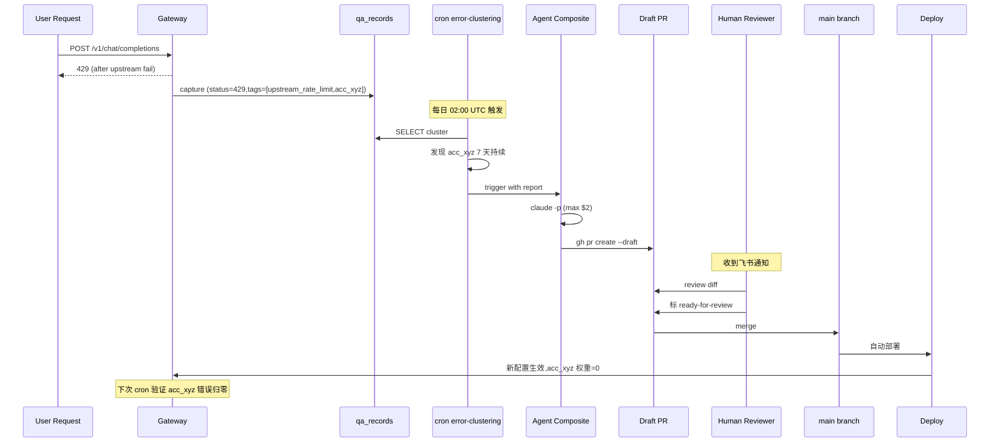

# OPC 自动化闭环 — MVP: 1 个 cron + 1 份周报 + Agent PR

## 0. TL;DR

**MVP 范围**：仅 **1 个检测 cron**（`error-clustering-daily`）+ **1 份观察周报**（`weekly-product-pulse`）+ **1 个 Agent composite action**（`agent-draft-pr`）。其他 4 个候选 cron（slo-budget / cost-anomaly / slow-request / account-health）进 §13 v2 backlog——**不做即不维护**。

**两阶段落地（信号先证、行动后赌）**：
- **Stage 2A（1 周开发 + 2 周 issue-only 观察）**：cron 跑聚类 + 飞书摘要 + GitHub issue;Agent step `if: false` 暂关
- **Stage 2B（1 周开 Agent）**：2A 过门后启用 `agent-draft-pr`,产 draft PR

**为什么从 1 个 cron + 两阶段开始**：OPC "对一千件事说不"——先用真实运行 1 个月的证据决定下一个 cron 该不该上，避免一次性堆 6 个 workflow（4 个未必用到，但全要写、要测、要维护、要监控）。两阶段的好处是不让"信号准确性"和"Agent 行动质量"两个未知数同时赌。Stage 2 落地总人力从原案的 6 周降为 **1+2+1=4 周（其中 2 周仅观察）**。

**核心架构**：

```
qa_records + ops_error_logs (来自文档 2)
        ▼
[ error-clustering-daily ]  — 唯一 MVP 检测 cron
        ▼ (持续型 cluster ≥3 天)
        │
   ┌────┴─────────────────────────────────────────┐
   ▼ Stage 2A (2 周观察)              Stage 2B (过门后)
[ open issue ] cluster-detected     [ agent-draft-pr ]
   ▼                                  ▼
人审 issue 给"会怎么改"             Claude Code 产 draft PR
                                      ▼
                                    人审 5 分钟 → merge → 部署 → 下次 cron 验证回归

每周一并行: [ weekly-product-pulse ] → docs/auto-reports/weekly/*.md + 飞书
                                       (含 MVP 4 KPI 自动测算)
```

**OPC 关键约束**：
- Agent **永远不直接合 main**，只产 draft PR
- **Stage 2A → 2B 过门**：信号准确率 ≥ 80% + 修复方向可在 5min 给出 + 至少 3 个独立 cluster；详见 §5.1
- 同一 cluster signature **7 天冷却**——基于 PR label `cluster-sig:<sha-12>`（**不**基于 title 字符串匹配,v1 草稿的 title search 永远 miss,已修）
- preflight 段强制要求"待处理 auto PR 数 ≤ 5"（仅 feature/chore/docs 分支生效;fix/* bypass 避免死锁）
- KPI 评估**不靠手算**——周报自动测算并归档
- 单次 Agent 任务预算 **≤ $2**，月度封顶 **$50**；杠杆比 = 节省人时 ÷ 预算 > 5

**前置依赖（main 已落地的部分）**：dev-rules submodule + CI preflight job + 8 段 preflight 通过 PR #11 已落地（详 [`ops-p0-observability.md`](./ops-p0-observability.md) §3.1）。本文档不再假设这些是待办。

**待落地依赖（Stage 2B 启用前必须完成）**：
1. `scripts/setup-claude-code.sh`（详 §7 清单；MVP 期 composite action 内已加 `npm` 兜底）
2. 项目级 `scripts/preflight.sh` wrapper（详 §6.2；引入即同步追加段 9-10，紧贴 dev-rules 模板的 1-8 段）

**审批门禁约束（R5）**：本文档 frontmatter `approved_by: pending`。dev-rules preflight 段 7 R5 在 `main`/`master` 分支会拒绝任何 `approved_by: pending` 的 approved doc 落地——合 main 前必须由 reviewer 把 frontmatter 改为真名。

---

## 1. MVP 范围（仅 2 个 workflow）

| Workflow | 频率 | 输入 | 输出 | Stage 2A 行动 | Stage 2B 行动 |
|----------|------|------|------|---------------|---------------|
| `error-clustering-daily.yml` | 每日 02:00 UTC | 过去 24h `qa_records` (status≥400) + `ops_error_logs` | 失败聚类 JSON + markdown 报告 | 持续型 cluster → **开 GitHub issue**（agent step `if: false` 暂关） | 持续型 cluster → **触发 `agent-draft-pr` composite action** |
| `weekly-product-pulse.yml` | 周一 09:00 UTC | 综合指标 + 4 KPI 测算 | 周报 markdown + 飞书推送 + `docs/auto-reports/weekly/*.md` 归档 | 同 Stage 2B（无差异） | 同左 |

**Backlog（v2，详见 §13）**：slo-budget-hourly / cost-anomaly-daily / slow-request-pulse-weekly / account-health-daily。各自的触发条件 + 升级判断标准在 §13 列出，不在 MVP 范围。

**OPC 拒绝清单**（贯穿 MVP 与 v2）：
- 不做 P3 / 4xx 类实时告警（告警疲劳，区分困难）
- 不做"用户体验类"自动检测（sentiment analysis 主观判断）
- 不让 Agent 自动 merge 任何 PR（哪怕 CI 全绿）

---

## 2. 单个 Workflow 详细设计

### 2.1 `error-clustering-daily.yml`（最关键）

**职责**：把过去 24h 所有失败请求按"错误指纹"聚类，找出反复出现的模式。

#### 触发与执行

```yaml
# .github/workflows/error-clustering-daily.yml（fork-only 新增）
name: Error Clustering Daily
on:
  schedule:
    - cron: '0 2 * * *'   # UTC 02:00 = 北京 10:00
  workflow_dispatch:
    inputs:
      since_hours:
        description: '回看小时数'
        default: '24'

permissions:
  contents: write
  issues: write
  pull-requests: write

jobs:
  cluster:
    runs-on: ubuntu-latest
    steps:
      - uses: actions/checkout@v4

      - name: Setup
        uses: actions/setup-go@v5
        with:
          go-version-file: backend/go.mod

      - name: Run clustering
        env:
          PG_DSN: ${{ secrets.PROD_PG_READONLY_DSN }}
          OBJSTORE_DSN: ${{ secrets.PROD_OBJSTORE_RO }}
        run: |
          go run ./scripts/error_clustering \
            --since-hours ${{ inputs.since_hours || 24 }} \
            --output report.json \
            --markdown report.md

      - name: Upload artifact
        uses: actions/upload-artifact@v4
        with:
          name: error-clustering-${{ github.run_id }}
          path: |
            report.json
            report.md

      - name: Decide if downstream action needed
        id: decide
        run: |
          # 触发条件: 同一 cluster (signature) 在过去 3 天每天都有 ≥10 次
          NEED=$(jq '.persistent_clusters | length' report.json)
          echo "need_action=$([ $NEED -gt 0 ] && echo true || echo false)" >> $GITHUB_OUTPUT

      # Stage 2A: 仅开 issue (issue-only),不调 Agent
      # 用 gh CLI 而非第三方 action,减少依赖漂移风险;签名 label 复用文档 §3.1 的 cooldown
      - name: Open / reuse cluster issue (Stage 2A)
        if: steps.decide.outputs.need_action == 'true' && vars.STAGE_2A_ISSUE_ONLY == 'true'
        env:
          GH_TOKEN: ${{ github.token }}
        run: |
          SIG=$(jq -r '.persistent_clusters[0].signature' report.json 2>/dev/null || echo "no-sig")
          SIG_SHORT=$(printf '%s' "$SIG" | shasum -a 256 | cut -c1-12)
          LABEL="cluster-sig:$SIG_SHORT"
          gh label create "$LABEL" --color BFD4F2 --description "cluster signature for cooldown" 2>/dev/null || true
          # 查找该 signature 的开放 issue;有则评论新报告,无则创建
          EXISTING_ISSUE=$(gh issue list --label "$LABEL" --state open --json number --limit 1 | jq -r '.[0].number // empty')
          if [ -n "$EXISTING_ISSUE" ]; then
            gh issue comment "$EXISTING_ISSUE" --body-file report.md
          else
            gh issue create \
              --title "[cluster] $(jq -r .summary report.json)" \
              --body-file report.md \
              --label "cluster-detected,needs-triage,automated,$LABEL"
          fi

      # Stage 2B: 过门后启用 Agent;切换方式 = 在 repo Variables 里把 STAGE_2A_ISSUE_ONLY 从 'true' 改为 'false'
      - name: Trigger Agent PR (Stage 2B)
        if: steps.decide.outputs.need_action == 'true' && vars.STAGE_2A_ISSUE_ONLY != 'true'
        uses: ./.github/actions/agent-draft-pr
        with:
          report_path: report.md
          report_json: report.json
          workflow: error-clustering
          claude_api_key: ${{ secrets.ANTHROPIC_API_KEY }}

      - name: Notify Feishu
        if: always()
        env:
          FEISHU_OPS_WEBHOOK: ${{ secrets.FEISHU_OPS_WEBHOOK }}
        run: |
          MSG=$(jq -r '.summary' report.json)
          # 飞书自定义机器人,文本消息;失败/无密钥时不阻塞 workflow
          curl -sS -X POST "$FEISHU_OPS_WEBHOOK" \
            -H "Content-Type: application/json" \
            -d "$(jq -n --arg t "[error-clustering] $MSG" \
              '{msg_type:"text",content:{text:$t}}')" || true
```

#### 聚类算法（[`scripts/error_clustering/`](../../scripts/) 新增 Go 程序）

**signature 生成**（按"语义指纹"而非字面 hash）：

```go
type ClusterSignature struct {
    Platform        string  // claude / openai / gemini ...
    StatusCode      int     // 4xx / 5xx
    UpstreamErrCat  string  // "rate_limit" / "context_too_long" / "auth" / "5xx_unknown"
    ErrorBodyShape  string  // 经 redact 后取前 N 个 token 的 hash
    InboundPath     string  // /v1/messages
}

func computeSignature(rec QARecord, blob ParsedBlob) string {
    cat := categorizeUpstreamError(blob.Response.Body, rec.StatusCode)
    shape := tokenShapeHash(blob.Response.Body, 32)  // 取关键 32 个 token 的 hash
    return fmt.Sprintf("%s|%d|%s|%s|%s",
        rec.Platform, rec.StatusCode, cat, shape, rec.InboundEndpoint)
}
```

**聚类规则**：
1. 取过去 24h 所有 `qa_records` where status >= 400
2. 按 signature group by，count >= 10 的 cluster 入候选
3. 与过去 7 天的 cluster history join，标记"持续型 cluster"（连续 ≥3 天 cluster）
4. 输出 top 20 cluster + 每 cluster 的代表样本 5 条（含 blob URI）

**输出 JSON 结构**：

```json
{
  "report_period": {"since": "2026-04-18T02:00Z", "until": "2026-04-19T02:00Z"},
  "summary": "24h 共 1234 次错误,聚为 18 cluster,其中 3 个持续型",
  "clusters": [
    {
      "signature": "openai|429|rate_limit|abc123|/v1/chat/completions",
      "count_24h": 487,
      "count_7d": 2890,
      "first_seen": "2026-04-12T10:00Z",
      "persistent_days": 7,
      "sample_request_ids": ["req_001", "req_042", ...],
      "sample_blob_uris": ["s3://...", ...],
      "affected_users": 23,
      "affected_accounts": ["acc_xyz", "acc_abc"],
      "suggested_tags": ["upstream_rate_limit", "needs_account_rotation"]
    }
  ],
  "persistent_clusters": [...]
}
```

#### Agent PR 触发逻辑

`.github/actions/agent-draft-pr/action.yml`（fork-only 新增 composite action）。详见 §3。

### 2.2 `weekly-product-pulse.yml`

**目标**：周一 09:00 UTC 自动产出"产品脉搏周报"，作为人决策素材；不开 PR、不开 issue，只 push 到 `docs/auto-reports/weekly/2026-WXX.md` 并飞书推送摘要。

**报告内容**（最小集，挣得位置后再扩）：

- 上周请求量同环比 + 错误率分布
- 上周成本同环比 + top 10 模型用量
- 当周由 `error-clustering-daily` 检测到的 top 3 持续型 cluster 摘要
- 待处理 auto PR 数（来自 GitHub API），> 5 时高亮提醒
- **MVP KPI 自动测算段**（避免人手算）：
  - Agent PR 采纳率 7d/30d：`merged_or_changed_then_merged / created`（标签 `automated`）
  - 人均看 auto PR 时间 7d：从 PR `createdAt` 到 `mergedAt`/`closedAt` 的中位数
  - MTTD 7d：从 `qa_records.created_at`（cluster 首次出现）到对应 `error-clustering-daily` workflow run 完成时间的中位数
  - MTTR 7d：从 cluster 首次出现到对应 fix PR merge 时间的中位数

**为什么不开 issue/PR**：周报是"全景观察"，不是"待办"——OPC 哲学 "拒绝纯展示" 的例外是周报本身就是决策素材，**不能让全景图变成 todo list**。如果某项指标连续多周糟糕，应当在 §13 评估升级对应的检测 cron。

**KPI 自动化的杠杆**：4 个 MVP KPI（§5）每月评估都要查 GitHub API + PG，手算约 30 分钟。嵌入周报后**每周 0 分钟**，且评估时直接看周报历史归档（`docs/auto-reports/weekly/*.md`）。把"靠记忆评估"转化为"靠数据归档"，符合 OPC "升级原则"。

---

## 3. Agent 草拟 PR 的具体落地

### 3.1 Composite Action：`.github/actions/agent-draft-pr/action.yml`

```yaml
name: Agent Draft PR
description: 调用 Claude Code CLI 基于报告产出草拟 PR
inputs:
  report_path:
    description: 报告 markdown 路径
    required: true
  report_json:
    description: 报告 JSON 路径
    required: true
  workflow:
    description: 触发的 workflow 名称
    required: true
  claude_api_key:
    description: Claude API Key
    required: true
  max_budget_usd:
    description: 单次任务预算
    default: '2.00'

runs:
  using: composite
  steps:
    - uses: actions/checkout@v4
      with:
        fetch-depth: 0

    - name: Install Claude Code CLI
      shell: bash
      run: |
        # scripts/setup-claude-code.sh 是 product-dev.mdc §"云端 Agent 调用" 要求的项目脚本,
        # 但本仓库尚未实现（见 §7 清单与 docs/preflight-debt.md）。Stage 2B 启用前必须落地;
        # MVP 期临时兜底:直接 npm 安装。
        if [ -x scripts/setup-claude-code.sh ]; then
          bash scripts/setup-claude-code.sh
        else
          echo "::warning::scripts/setup-claude-code.sh 未实现,临时使用 npm 兜底安装"
          npm install -g @anthropic-ai/claude-code
        fi

    - name: Compute branch name
      id: branch
      shell: bash
      run: |
        DATE=$(date -u +%Y%m%d)
        SHORT=$(echo "${{ inputs.workflow }}" | tr '_' '-')
        echo "name=auto/${SHORT}-${DATE}-${{ github.run_id }}" >> $GITHUB_OUTPUT

    - name: Compute signature short code
      id: sig
      shell: bash
      run: |
        SIG=$(jq -r '.clusters[0].signature' ${{ inputs.report_json }} 2>/dev/null || echo "no-sig")
        # 取前 12 字符作为 label（GitHub label 长度限制 50,留余量给 prefix）
        SIG_SHORT=$(printf '%s' "$SIG" | shasum -a 256 | cut -c1-12)
        echo "short=$SIG_SHORT" >> $GITHUB_OUTPUT
        echo "label=cluster-sig:$SIG_SHORT" >> $GITHUB_OUTPUT

    - name: Cooldown check (基于 PR label,非 title 字符串匹配)
      id: cooldown
      shell: bash
      env:
        GH_TOKEN: ${{ github.token }}
      run: |
        # 同一 cluster signature 7 天内只产一份提案;label 比 title search 可靠
        # gh pr list 默认按 created desc;7 天内有任意 state 的 PR 即视为冷却中
        EXISTING=$(gh pr list \
          --label "${{ steps.sig.outputs.label }}" \
          --state all \
          --json number,createdAt \
          --limit 5 \
          | jq --arg cutoff "$(date -u -v-7d +%Y-%m-%dT%H:%M:%SZ 2>/dev/null || date -u -d '7 days ago' +%Y-%m-%dT%H:%M:%SZ)" \
              '[.[] | select(.createdAt > $cutoff)] | length')
        if [ "$EXISTING" -gt 0 ]; then
          echo "skip=true" >> $GITHUB_OUTPUT
          echo "::notice::同 cluster signature ${{ steps.sig.outputs.short }} 在 7 天内已有 $EXISTING 个 PR,跳过"
        else
          echo "skip=false" >> $GITHUB_OUTPUT
        fi

    - name: Build prompt with embedded report
      if: steps.cooldown.outputs.skip == 'false'
      id: prompt
      shell: bash
      run: |
        # 关键: 用占位符 + bash 字符串替换,避免 heredoc 'EOF' 阻止 $(cat) 展开导致
        # Claude 拿到字面 "$(cat report.md)" 而非报告内容（v1 设计 bug,已修）
        PROMPT_TEMPLATE=$(cat <<'TEMPLATE_EOF'
        你是 TokenKey (sub2api) 项目的运维 Agent。

        ## 任务
        基于以下检测报告,草拟一个 draft PR 来缓解或解决问题。

        ## 输入
        - 报告 markdown:
        ===REPORT_MD_START===
        <<<REPORT_MD>>>
        ===REPORT_MD_END===

        - 详细数据 JSON:
        ===REPORT_JSON_START===
        <<<REPORT_JSON>>>
        ===REPORT_JSON_END===

        ## 必须遵守的约束
        1. 只输出 draft PR,不直接合并
        2. 改动范围限制: 配置文件 / Go 文件中追加注释或加 metric / 文档更新
        3. 禁止修改: ent schema / wire_gen.go / migrations / docs/approved/* / CLAUDE.md / dev-rules
        4. 必须在 PR 描述中说明:
           - 问题概述（来自报告）
           - 根因分析（基于代码 + blob 样本）
           - 提议的改动（diff 结构化列出）
           - 风险评估（high/medium/low + 回滚方案）
           - 验证步骤（人 review 时如何确认）
        5. 必须在 PR 标题前缀加 [auto-WORKFLOW_NAME]
        6. 改动总行数 < 200 行,超出请拆分
        7. 必须跑 ./dev-rules/templates/preflight.sh 通过(若项目已有 scripts/preflight.sh wrapper 则跑 wrapper)

        ## 工作流
        1. 阅读报告,理解问题
        2. grep / read 相关代码定位
        3. 设计最小改动
        4. 生成 patch
        5. 跑 preflight
        6. 输出 PR 描述模板到 /tmp/pr-body.md
        TEMPLATE_EOF
        )

        # 用 python 做字符串替换,避免 sed 在含特殊字符的报告内容上炸裂
        REPORT_MD_PATH="${{ inputs.report_path }}"
        REPORT_JSON_PATH="${{ inputs.report_json }}"
        WORKFLOW="${{ inputs.workflow }}"
        export PROMPT_TEMPLATE REPORT_MD_PATH REPORT_JSON_PATH WORKFLOW
        python3 - <<'PYEOF' > /tmp/agent-prompt.txt
        import os
        tpl = os.environ['PROMPT_TEMPLATE']
        with open(os.environ['REPORT_MD_PATH']) as f:
            md = f.read()
        with open(os.environ['REPORT_JSON_PATH']) as f:
            js = f.read()
        out = (tpl
               .replace('<<<REPORT_MD>>>', md)
               .replace('<<<REPORT_JSON>>>', js)
               .replace('WORKFLOW_NAME', os.environ['WORKFLOW']))
        print(out)
        PYEOF

    - name: Run Claude Code
      if: steps.cooldown.outputs.skip == 'false'
      shell: bash
      env:
        ANTHROPIC_API_KEY: ${{ inputs.claude_api_key }}
      run: |
        claude -p "$(cat /tmp/agent-prompt.txt)" \
          --max-budget-usd ${{ inputs.max_budget_usd }} \
          --output /tmp/agent-output.txt

    - name: Open Draft PR
      if: steps.cooldown.outputs.skip == 'false'
      shell: bash
      env:
        GH_TOKEN: ${{ github.token }}
      run: |
        if git diff --quiet; then
          echo "Agent 未做任何改动,跳过 PR 创建"
          exit 0
        fi
        git config user.name "tk-auto-agent[bot]"
        git config user.email "auto-agent@tokenkey.dev"
        git checkout -b ${{ steps.branch.outputs.name }}
        git add -A
        git commit -m "auto(${{ inputs.workflow }}): draft proposal from $(date -u +%Y-%m-%d)"
        git push origin ${{ steps.branch.outputs.name }}
        # cluster-sig:<short> label 是 cooldown 的唯一可靠匹配点,必须先确认 label 已存在
        gh label create "${{ steps.sig.outputs.label }}" --color BFD4F2 --description "cluster signature for cooldown" 2>/dev/null || true
        gh pr create --draft \
          --title "[auto-${{ inputs.workflow }}] $(jq -r .summary ${{ inputs.report_json }})" \
          --body-file /tmp/pr-body.md \
          --label "automated,needs-review,${{ steps.sig.outputs.label }}"
```

**Bug 修复说明（与 v1 草稿的差异）**：

| Bug | v1 写法 | 现修复 | 影响 |
|---|---|---|---|
| Cooldown 100% miss | `gh pr list --search "in:title ${SIG:0:24}"` 但 PR 标题里**没有** signature | 改用 PR label `cluster-sig:<sha-12>` 精确匹配 + 7 天 createdAt 过滤 | 不再每天给同一 cluster 重复产 PR |
| Prompt 字面字符串 | `<<'EOF'` 单引号阻止 `$(cat report.md)` 展开,Claude 拿到字面字符串 | 占位符 `<<<REPORT_MD>>>` + python 安全替换 | Agent 真的读到报告内容 |
| 报告含特殊字符炸 sed | sed/bash 替换在含 `&` `\n` 的报告内容上易出错 | python `str.replace` 字面替换 | 报告内容任意字节安全 |

### 3.2 Agent 安全约束（硬性）

| 约束 | 实现 |
|------|------|
| **永远 draft，永远人审** | `gh pr create --draft` |
| **改动量上限 200 行** | composite action 在 `git push` 前自查：`git diff --stat HEAD~1 \| awk '$1!="" {s+=$3}END{exit (s>200)}'` —— 超出立即 fail，不开 PR |
| **禁修敏感目录** | composite action 在 `git push` 前自查（**`ent/` 下仅允许 `ent/schema/` 改动**，其余生成代码禁改）：<br>`git diff --name-only HEAD~1 \| awk '/^ent\// && !/^ent\/schema\// {print; bad=1} /wire_gen/ {print; bad=1} /^backend\/migrations\// {print; bad=1} /^docs\/approved\// {print; bad=1} /^CLAUDE\.md$/ {print; bad=1} /^dev-rules\// {print; bad=1} END {exit bad+0}'`<br>—— awk ERE 不支持 PCRE 的负向先行断言 `(?!schema)`，故拆为两条规则联合（`^ent/` 命中且非 `^ent/schema/` 才视为违规）；命中任意一条立即 `exit 1` |
| **必须跑全套 preflight** | composite action 中显式 `[ -x scripts/preflight.sh ] && ./scripts/preflight.sh \|\| ./dev-rules/templates/preflight.sh` (与本机 hook + CI `backend-ci.yml` preflight job 走同一脚本) |
| **冷却机制** | composite action 的 cooldown step（**基于 PR label `cluster-sig:<sha-12>`** + 7 天 createdAt 过滤；**不**基于 title 字符串匹配——v1 设计中 PR 标题不含 signature 导致永远 miss） |
| **预算上限** | `--max-budget-usd 2.00` per task |
| **CI 必须全绿才能脱 draft** | branch protection rule on main |
| **审计** | bot commit author = `tk-auto-agent[bot]`，标签 `automated` + `cluster-sig:<short>`，便于过滤与审计 |

### 3.3 PR 描述强制模板

Agent 输出到 `/tmp/pr-body.md` 的内容必须符合：

```markdown
## 触发来源
- Workflow: <name>
- Run: <run_url>
- 检测报告: <link>

## 问题概述
<3-5 行描述什么坏了>

## 根因分析
<引用代码 + blob 样本>
- 相关文件: `path/to/file.go:123`
- 样本请求: `req_xxx` (blob: s3://...)

## 提议的改动
<diff 结构化列出每个文件的改动意图,不只贴 diff>

## 风险评估
- 风险等级: high / medium / low
- 影响面: <用户群>
- 回滚方案: <具体步骤>

## 验证步骤
1. <人 review 时如何在本地验证>
2. ...

## 自动化元数据
- Agent 模型: claude-4.6-sonnet
- 预算消耗: $X.XX
- 改动行数: N
- preflight: passed
- 冷却签名: <signature>
```

### 3.4 PR 类型分类与典型例子

#### 类型 A：配置调整（最常见）

**例子**：`error-clustering` 发现某 OpenAI 账号 7 天连续 429 → Agent 草拟改 [`backend/internal/integration/newapi/`](../../backend/internal/integration/newapi/) 中该账号的权重为 0。

**风险**：低（仅配置）。

#### 类型 B：超时/重试参数调整

**例子**：`slow-request-pulse` 发现 Gemini 在长 prompt 下 50% 超时 → Agent 草拟把 [`backend/internal/config/config.go`](../../backend/internal/config/config.go) 中 Gemini 的 default timeout 从 60s 改为 120s。

**风险**：中（影响所有 Gemini 调用）。

#### 类型 C：metric 加点

**例子**：`error-clustering` 发现某错误类型频繁但缺乏 metric → Agent 草拟在 [`backend/internal/service/fusion_metrics_tk_core.go`](../../backend/internal/service/) 增加一个 counter。

**风险**：低（纯观测）。

#### 类型 D：文档与 runbook 更新

**例子**：`account-health` 发现新型上游错误模式 → Agent 草拟更新 `docs/runbooks/<error_type>.md`，记录排查步骤。

**风险**：零。

#### 不允许的类型

- 修 ent schema（必须人主导）
- 修 wire_gen.go / 自动生成代码
- 改 migrations（防数据损坏）
- 改 Dockerfile / CI workflow（防自我授权升级）
- 改 `docs/approved/` 任何文件（产品决策必须人审）
- 改 [`CLAUDE.md`](../../CLAUDE.md) / dev-rules（哲学不该被自动化改）

---

## 4. 错误自动发现 → 解决的端到端示例

以"OpenAI 账号 acc_xyz 连续 7 天 429" 为例，演示完整闭环：



**人介入的总时间**：~5 分钟（看 PR + 点 merge）。

**没有这套自动化时**：人需要每天看告警 / 手工查 cluster / 手工改配置 / 手工部署，约 30 分钟/天。**杠杆 6x**。

---

## 5. 与 P0 / QA 的衔接

| 阶段 | 包含的内容 | 落地文档 | 工期 |
|------|-----------|---------|------|
| Stage 1（感官） | JSON 日志 + `/metrics` + preflight git hook + Grafana Cloud Free + QA capture | 文档 1 + 文档 2 | 3 天 + 5 周（dev-rules submodule 已通过 PR #11 接入 main） |
| Stage 1.5（最小消费） | QA 落地 D+1：daily failure top-10 飞书摘要（纯 SQL + jq） | 文档 2 §10 | 1 天 |
| **Stage 2A（信号验证，2 周 issue-only）** | `error-clustering-daily` 跑 cluster + 开 issue（**Agent PR 步骤暂关**）；`weekly-product-pulse` 同步上线 | 本文档 §2 | 1 周开发 + 2 周观察 |
| **Stage 2B（反射弧，开 Agent）** | 2A 跑稳后开 `agent-draft-pr` composite action | 本文档 §3 | 1 周 |
| v2 backlog（详 §13） | slo-budget / cost-anomaly / slow-request / account-health 4 个 cron | 本文档 §13 | 2B 跑 1 个月后**逐个评估** |
| Stage 3（自治） | 金丝雀 + SLO 自动回滚 + 模型成本自动重排 | 暂不规划 |  |

### 5.1 Stage 2A → 2B 的过门条件（信号先证、行动后赌）

**为什么先 2 周 issue-only**：当前架构是 cluster signal → Agent → draft PR。如果 cluster signal 噪声大,Agent 会基于错信号产错 PR,人审 5 分钟变 15 分钟拒绝,杠杆变负。**先证信号准确,再赌行动质量**。

**Stage 2A（issue-only）期间的具体动作**：
- `error-clustering-daily.yml` 跑全套聚类 + 输出报告 artifact + 飞书摘要
- 不调 `agent-draft-pr` composite action（在 workflow 里把 `Trigger Agent PR` step 暂时 comment 掉或 `if: false`）
- 改为开 GitHub issue（**通过 `gh issue` CLI + `cluster-sig:<sha-12>` label 做幂等**——查到同 label 开放 issue 则评论新报告，否则新建；详 §2.1 workflow 中 `Open / reuse cluster issue` step），label `cluster-detected,needs-triage,automated`
- 人在 issue 里以"如果信号准确,我会怎么改"格式回复 → 数据用于评估

**过门到 2B 的条件**（必须全部满足）：
- Issue 信号语义正确率 ≥ 80%（人手抽查 20 个 issue）
- 人在 issue 里平均给出"修复方向"在 ≤ 5 分钟内（说明信号足够具体可执行）
- 至少出现 3 个独立 cluster signature（说明聚类有区分度）

**未过门 → 调 cluster 算法（如 §2.1 token shape hash 长度、最小 count 阈值），不开 Agent**。

### 5.2 Stage 2B（开 Agent 后）的成功标准（运行 1 个月后回看）

- Agent PR **采纳率 ≥ 60%**（merge / 改后 merge 算采纳）
- 人均每天看 PR 的时间 **≤ 15 分钟**
- 错误平均检测时延（MTTD）**< 1 天**
- 错误平均修复时延（MTTR）**< 2 天**
- **杠杆比**：节省人时 ÷ Agent 月度成本 > 5（Agent 预算上限 $50/月,节省人时按 $30/h 折算需 ≥ 8h/月）

**KPI 全部由 `weekly-product-pulse` 周报自动测算并归档**（详见 §2.2），评估时不需要手算。

**升级到 v2 的判定**：达成上述 5 项 + 月度有具体场景诉求（见 §13 各 cron 的"启用条件"）。**未达成 → 不加新 cron，回头调 prompt / 调信号源**——OPC "对一千件事说不"。

---

## 6. preflight 守门（Stage 2B 启用时引入项目 wrapper）

按 `agent-contract-enforcement.mdc` "Hard Constraint Wiring"：**自动报告必须有未处理的硬约束**。

### 6.1 与 dev-rules 8 段的分工

[`dev-rules/templates/preflight.sh`](../../dev-rules/templates/preflight.sh) 已固定 8 段（分支命名、submodule 顺序、`.cursor/rules/` drift、契约 drift、story/test、approved doc 改动、approved 不变量 R1-R5、stat 漂移），覆盖通用规则。本节段 9-10 是 **sub2api-specific OPC 自动化逻辑**（关联 GitHub issue/PR 状态），按 [`CLAUDE.md`](../../CLAUDE.md) §10 "Add `scripts/preflight.sh` later only if a sub2api-specific check emerges that doesn't belong in dev-rules" 规定，**应作为项目 wrapper 引入**。

### 6.2 何时引入 wrapper

| 阶段 | wrapper 状态 | 理由 |
|---|---|---|
| P0 / 文档 2 落地期 | ❌ 不引入 | 没有"待处理 auto PR"概念，引入即冗余 |
| Stage 2A（issue-only 试运行） | ❌ 不引入 | 没有 auto PR，段 9 永远跳过 |
| **Stage 2B（开 Agent PR 当周）** | ✅ 引入 `scripts/preflight.sh`（开头 `exec` dev-rules 模板的 1-8 段，末尾追加段 9-10） | 段 9 真正起守门作用 |

**引入步骤**（Stage 2B Day 0）：
1. 新建 `scripts/preflight.sh`，开头 `exec` dev-rules 模板，末尾追加段 9-10（见 §6.3）
2. CI `backend-ci.yml` preflight job 已写 `if [ -x scripts/preflight.sh ]; then ./scripts/preflight.sh; else ./dev-rules/templates/preflight.sh; fi`，**无需改 CI**
3. 本机 hook 同样自动改走 wrapper（`install-hooks.sh` 同款 fallback）
4. 在 [`docs/preflight-debt.md`](../../docs/preflight-debt.md) 追加事件记录"为 sub2api-specific Agent OPC 检查重新引入项目 wrapper"

### 6.3 wrapper 末尾追加的 sub2api-specific 段（紧贴 dev-rules 模板 1-8 段，本仓库占用 9-10，预留 11 给 v2 SLO）

```bash
# 段 9: 自动 Agent PR 待处理数 ≤ 5
# 仅对 feature/* / chore/* / docs/* 分支生效;fix/* / hotfix/* / merge/upstream-* bypass
# (修 P1 本身就要 commit,不能让守门变成死锁)
BRANCH="$(git rev-parse --abbrev-ref HEAD)"
case "$BRANCH" in
  fix/*|merge/upstream-*|hotfix/*) ;;
  *)
    PENDING_AUTO=$(gh pr list --label automated --state open --json number 2>/dev/null | jq length)
    if [ "${PENDING_AUTO:-0}" -gt 5 ]; then
      echo "::error::已有 $PENDING_AUTO 个 auto PR 未处理 (上限 5),先消化再提交新 feature/chore/docs 代码"
      echo "       fix/* 分支可 bypass; 紧急情况 git commit --no-verify (但 CI 仍会 fail)"
      exit 1
    fi
    ;;
esac

# 段 10: P1 issue 待处理数 — 仅作 warning,不 block commit
# (v1 设计 block commit 是死锁:修 P1 的 PR 自己也要 commit;改为飞书提醒由人盯)
P1_OPEN=$(gh issue list --label p1 --state open --json number 2>/dev/null | jq length)
if [ "${P1_OPEN:-0}" -gt 0 ]; then
  echo "::warning::有 $P1_OPEN 个 P1 issue 未处理(不阻断 commit,但请优先处理)"
fi
```

**段 11（SLO 预算守门）随 v2 `slo-budget-hourly` 一起启用**——MVP 期没有 SLO 预算指标可查，预先写检查会永远 warning，反而稀释信号。

这把"自动报告"从"看了就忘"升级为"必须处理"。是 OPC 自动化哲学的硬约束。

**v1 设计 bug 修复说明**：v1 草稿的段 10（原编号段 13）写 `[ $P1_OPEN -gt 0 ] && exit 1` —— 修 P1 的 PR 自己也要 commit,会被自己的守门阻死。本版改为 warning + 段 9 仅对非 fix 分支生效,既保留"P1 优先"信号又不死锁。

---

## 7. 新增脚本与组件清单（MVP）

| 路径 | 类型 | 说明 |
|------|------|------|
| [`.github/workflows/error-clustering-daily.yml`](../../.github/workflows/) | workflow | §2.1 |
| [`.github/workflows/weekly-product-pulse.yml`](../../.github/workflows/) | workflow | §2.2 |
| [`.github/actions/agent-draft-pr/action.yml`](../../.github/) | composite action | §3.1 |
| [`scripts/error_clustering/`](../../scripts/) | Go 程序 | §2.1 聚类引擎 |
| `scripts/setup-claude-code.sh` | bash | **❌ 待落地**：[`product-dev.mdc`](../../.cursor/rules/product-dev.mdc) §"云端 Agent 调用 Claude Code CLI" 要求每个项目维护此脚本（检查 + 安装 Claude Code CLI + 校验 `ANTHROPIC_API_KEY`），本仓库尚未实现。Stage 2B 启用前必须落地；MVP 期 `agent-draft-pr/action.yml` 已加 `npm i -g @anthropic-ai/claude-code` 兜底。落地后同步在 [`docs/preflight-debt.md`](../../docs/preflight-debt.md) 标记关闭。 |
| `scripts/preflight.sh` | bash wrapper | **❌ 故意未创建**（[`CLAUDE.md`](../../CLAUDE.md) §10）；Stage 2B 启用 Agent PR 当周一并落地（详 §6.2）。MVP 期 hook 与 CI 直接走 [`dev-rules/templates/preflight.sh`](../../dev-rules/templates/preflight.sh)。 |
| [`docs/auto-reports/`](../../docs/) | 目录 | 周报与失败聚类报告归档 |

**v2 backlog 涉及的新增组件**（启用对应 cron 时一并新增）：`scripts/slo_budget/`、`scripts/cost_anomaly/`、`scripts/slow_request_pulse/`、`scripts/account_health/`、对应 workflow yml、`docs/runbooks/`（Agent 维护的 runbook 集合，等积累足够语料再开目录）。

---

## 8. 必需的 GitHub Secrets 与 Variables

| 名称 | 类型 | 用途 | 设置位置 |
|--------|------|------|---------|
| `ANTHROPIC_API_KEY` | Secret | Claude Code CLI 调用（Stage 2B 启用后才需要） | Repo Secrets |
| `PROD_PG_READONLY_DSN` | Secret | cron 查询生产数据 | Repo Secrets（**只读账号**） |
| `PROD_OBJSTORE_RO` | Secret | 拉 blob 样本 | Repo Secrets（只读 IAM） |
| `PROM_URL` | Variable | SLO 查询 | Repo Variables（非密） |
| `FEISHU_OPS_WEBHOOK` | Secret | 飞书运维群机器人 webhook URL | **本方案新增**——按 [`ops-p0-observability.md`](./ops-p0-observability.md) §4.3 上手步骤创建（v1 不启用签名校验，URL 季度轮换 + GitHub secret scanning 兜底） |
| `STAGE_2A_ISSUE_ONLY` | Variable | **Stage 2A/2B 切换开关**: `true` = 仅开 issue，`false` = 触发 Agent PR（详 §5.1 过门条件） | Repo Variables |

**安全约束**：所有 prod 数据访问必须是**只读**专用账号 + IP 白名单 GitHub Actions runner range。

---

## 9. Upstream 冲突面分析

| 类型 | 文件 | 冲突风险 |
|------|------|---------|
| `.github/workflows/*.yml` | 全部 fork-only | 零 |
| `.github/actions/*` | 全部 fork-only | 零 |
| `scripts/*` | 全部 fork-only | 零 |
| `docs/auto-reports/` | 全部 fork-only | 零 |
| `docs/runbooks/` | 全部 fork-only | 零 |
| Agent 草拟的 PR | 主要改 fork-only 文件 | 视具体 PR |

**Agent PR 自身的 upstream 冲突由 preflight 段 8（upstream-drift）兜底**——Agent 修 upstream-owned 文件时，preflight 会拒绝太大改动。

---

## 10. 验收 Checklist（合并前必过）

### 功能性
- [ ] Stage 2A 上线：`error-clustering-daily` + `weekly-product-pulse` 可手工 dispatch 成功，输出符合 §1 表
- [ ] Stage 2A 上线：repo Variable `STAGE_2A_ISSUE_ONLY=true`，cluster 检出**只开 issue 不开 PR**
- [ ] composite action `agent-draft-pr` 可以基于一份 mock 报告生成 draft PR（Stage 2B 启用前测试）
- [ ] **冷却机制基于 PR label**（`cluster-sig:<sha-12>`）+ 7 天 createdAt 过滤，故意触发同 cluster 两次确认第二次跳过
- [ ] **Prompt 包含真实报告内容**（用 `python str.replace` 注入）：触发后查 `/tmp/agent-prompt.txt` 应含报告而非字面 `$(cat ...)`
- [ ] preflight 段 9 生效：feature 分支制造 6 个 auto PR → preflight fail；fix 分支同条件 → bypass 成功
- [ ] preflight 段 10 不阻断 commit（仅 warning），故意 open 一个 P1 issue 后正常 commit

### 质量（Stage 2A 过门指标）
- [ ] Issue 信号语义正确率 ≥ 80%（人工抽查 20 个 issue）
- [ ] 人在 issue 给"修复方向"的中位时间 ≤ 5 分钟
- [ ] 至少出现 3 个独立 cluster signature

### KPI 自动化（不靠手算）
- [ ] `weekly-product-pulse.yml` 周报中"MVP KPI 自动测算段"输出 4 个数字：采纳率/看 PR 时间/MTTD/MTTR
- [ ] 历史周报归档至 `docs/auto-reports/weekly/2026-WXX.md`（评估时直接看归档,不再手算）

### OPC
- [ ] Agent 永远只 draft，main 分支保护规则禁止 bot account 直 push
- [ ] 单次 Agent 任务预算 ≤ $2，月度预算 ≤ $50；杠杆比（节省人时 ÷ 月预算 × $30/h）≥ 5
- [ ] 飞书通知不超过每日 5 条（聚合发送），且单分钟不超过 100 条（飞书自定义机器人硬限）

---

## 11. 风险与回滚

| 风险 | 影响 | 回滚 |
|------|------|------|
| Agent 产出垃圾 PR 刷屏 | 低（draft + 冷却 + 预算） | 关闭对应 workflow，单独 issue 跟 |
| Agent 提议错误改动被误合 | 中（preflight + CI 兜底） | branch protection 强制 review；revert 即可 |
| Cron 把 Prometheus / PG 拉爆 | 低（已用 readonly DSN + LIMIT） | 关 workflow，调 query |
| 飞书告警疲劳 | 低（MVP 仅 1 类检测推送 + 周报聚合） | 调群机器人或新建只读告警子群 |
| 飞书 webhook URL 泄漏（公开仓库） | 中（任意人可向群发垃圾） | v1 兜底：旋转 webhook + GitHub secret scanning + 群机器人收口"群内可用"；v2 升级：sidecar 加签名校验（详见文档 1 §4.3） |
| 飞书机器人被踢出群 | 低（通知静默丢失） | preflight 段加冒烟测试,每周自动跑一次 webhook ping |
| Claude API 成本失控 | 低（per-task budget cap） | 全局环境变量 `MAX_BUDGET=0` 一键关闭 |
| 自动报告变成"看了就忘" | **高** | 必须开 preflight 段 9-11 守门（Stage 2B Day 0 引入 wrapper） |
| Agent 暴露生产 secrets | 中（GitHub Actions secret masking） | 严格用 `PROD_*_READONLY` 命名 + IAM 最小权限 |

---

## 12. 不做的事（OPC 拒绝清单）

- **不让 Agent 自动 merge 任何 PR**——哪怕 CI 全绿
- **不让 Agent 调用 prod API**——只读 DSN，禁写
- **不做 Slack / 钉钉 / Telegram / 邮件多通道**——飞书一个群够用，多通道 = 维护负担 ×N + 同一告警重复消费
- **不做"AI 自动写运维 runbook"全自动**——runbook 是 Agent 草拟 → 人改 → 沉淀
- **不做实时告警风暴抑制系统**（PagerDuty/Opsgenie）——告警从源头精简到 3 个 P1，不需要去重器
- **不做 GitOps（ArgoCD/Flux）**——单机 docker-compose + ssh 部署够用，K8s 是反 OPC

---

## 13. v2 Backlog — 4 个候选 cron（**MVP 跑稳后逐个评估**）

每个候选都有明确的"启用条件"——条件未满足前不实现，避免预先写然后吃灰。

### 13.1 `slo-budget-hourly.yml`

- **目标**：每小时计算月度错误预算消耗百分比，预算 < 20% 时开/更新单一 SLO issue（用 `gh issue` CLI + 固定 label `slo-budget` 做幂等，与 §2.1 cluster issue 同模式）。
- **启用条件**：MVP 跑满 1 个月 + 已经被人为发现 ≥1 次"错误率持续高但没人盯"的事件。
- **实现新增**：`scripts/slo_budget/`（Go 程序，查 Prometheus）+ workflow yml + preflight 段 11（SLO 预算 < 50% 时 warning）。

### 13.2 `cost-anomaly-daily.yml`

- **目标**：每日 03:00 UTC 检测"今日 user/api_key/model 单元的 cost > 7 日均值 ×3 且绝对值 > $1"的异常，开 issue 列出疑似账号被盗或失控的 key。
- **启用条件**：单用户月度 cost > $50 的账号数 ≥ 5（金额规模到了，异常才有信号意义；同时也确认有"可暂停 key"的人介入意愿）。
- **实现新增**：`scripts/cost_anomaly/`（Go 程序 + SQL）+ workflow yml。

### 13.3 `slow-request-pulse-weekly.yml`

- **目标**：每周分析"哪些 (model, upstream_account) 组合慢请求最多"，输出"该不该把权重调低"的 Agent PR。
- **启用条件**：日均请求 ≥ 10K（流量低于此 p99 噪声大于信号）+ `qa_records.duration_ms` 列已稳定（依赖文档 2 落地后至少 4 周数据）。
- **实现新增**：`scripts/slow_request_pulse/` + workflow yml。

### 13.4 `account-health-daily.yml`

- **目标**：每日 04:00 UTC 给每个上游账号打健康度评分（失败率 + 慢请求率 + 充分使用），评分 < 60 持续 3 天 → Agent PR 提议"权重 50%" 或 "禁用 X 天"。
- **启用条件**：上游账号池规模 ≥ 20（账号少时人盯效率更高）+ 已经手动调整过权重 ≥3 次（说明人介入次数高到值得自动化）。
- **实现新增**：`scripts/account_health/` + workflow yml。

### 升级时的统一动作清单

逐个 cron 启用时，按此清单走，避免遗漏：

1. 复制 §2.1 `error-clustering-daily.yml` 的骨架，改 query + 触发条件
2. 在 §7 组件清单表追加新行
3. 在 §10 验收 checklist 增加对应"功能性"勾选项
4. 在 §6 preflight 评估是否需要新增段
5. 在 `weekly-product-pulse` 周报模板中追加该 cron 的当周指标，避免周报与新检测脱节
6. 同步更新 P0 文档 §0.1 文档索引行（如果工期表有变）

