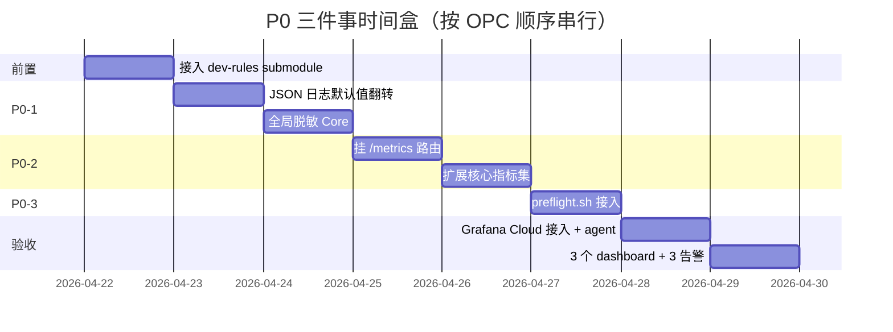

# P0 可观测性最小起步：冲突面、OPC 冲击、推荐运维栈

## 0. TL;DR

**P0 三件事**（按 OPC "杠杆最大化"原则筛出的最小集合）：

| # | 改动 | 工作量 | 一句话价值 |
|---|------|--------|-----------|
| P0-1 | Zap 默认 `Format` 由 `console` 改为 `json` + 全局脱敏 hook | 1 天 | 解锁后续 Loki/任何聚合方案；杜绝"开发者随手打日志泄漏 token" |
| P0-2 | 把已有的 [`PrometheusMetrics`](../../backend/internal/handler/prometheus_metrics.go) 路由挂上 + 扩展核心指标集 | 1.5 天 | 把"写了不用"的代码激活；为 Stage 2 SLO 看板提供数据 |
| P0-3 | 新建 [`scripts/preflight.sh`](../../scripts/) 接入 git hook + CI | 0.5 天 | 把 dev-rules 的"软约束"全部转化为机械门，符合 `agent-contract-enforcement.mdc` 硬要求 |

**Upstream 冲突结论**：三件事都可以做到 **upstream-owned 文件零侵入或一行 hook**——P0-1 改的是 fork-only 文件，P0-2 走 `*_tk_*.go` 同伴文件 + 一行 router 注册，P0-3 是 fork 独有脚本。**不会增加任何 upstream merge 难度**。

**OPC 冲击结论**：三件事都是**"加感官"而非"加流程"**——人不需要每天看新东西，只在告警/preflight fail 时介入。属于 OPC 的"杠杆型"投入，不是"维护型"负担。

### 0.1 本目录的三份文档（OPC 落地次序）

| # | 文档 | 解决什么 | 何时读 |
|---|------|----------|--------|
| 1 | **本文** [`ops-p0-observability.md`](./ops-p0-observability.md) | JSON 日志 + `/metrics` + preflight + 推荐运维栈 + 飞书告警 | **从这里开始**——5.5 天落地（含 dev-rules submodule 0.5d 前置），没有它后两份没有信号源 |
| 2 | [`ops-qa-full-capture.md`](./ops-qa-full-capture.md) | 用户 API key 调用形成的 QA 数据 **100% 全落盘**（业务硬决策）+ 低成本存储分层 + 月度导出 | P0 跑稳后，约 4 周落地 |
| 3 | [`ops-cron-agent-workflow.md`](./ops-cron-agent-workflow.md) | OPC 自动化闭环：error-clustering cron + Agent 草拟 PR（**MVP 版**，其余 cron 在 v2 backlog） | 文档 2 跑稳 1 个月后，约 4 周落地（Stage 2A 1 周开发 + 2 周 issue-only 观察 + Stage 2B 1 周开 Agent） |

**Upstream 友好原则**：所有新增代码进 `*_tk_*.go` 同伴文件或 fork-only 目录（[`internal/integration/newapi/`](../../backend/internal/integration/newapi/)、`internal/observability/` 新目录），upstream-owned 文件改动控制在"一行 hook"级别。详见 [`CLAUDE.md`](../../CLAUDE.md) §5。

**关于 dev-rules submodule**：本仓库 `.cursor/rules/` 当前为空，**未按 `dev-rules-convention.mdc` 接入 `dev-rules/` submodule**（无 `.gitmodules`）。文档中提到的规则当前由 home 全局级 `~/.cursor/rules/` 同步生效。落地 P0-3 的前置步骤是先接入 submodule（详见 §3.1）。

**审批流程**：本文档 frontmatter `status: Draft`、`approved_by: pending`。人工 review 后改为审批人 GitHub 用户名 + merge PR，本文档即成符合性基线。否决/需修改的反馈直接在 PR 评论给出。

---

## 1. P0-1：Zap JSON 化 + 全局脱敏

### 1.1 现状

[`backend/internal/pkg/logger/options.go`](../../backend/internal/pkg/logger/options.go) 第 54-57 行：

```55:57:backend/internal/pkg/logger/options.go
	out.Format = strings.ToLower(strings.TrimSpace(out.Format))
	if out.Format == "" {
		out.Format = "console"
	}
```

默认 `console` 格式 → 容器 stdout 是带颜色码的人类可读文本 → **任何聚合方案都得先解析 console，成本极高**。同时 [`logger.go`](../../backend/internal/pkg/logger/logger.go) 中没有全局 redact hook，开发者写 `logger.Info("body", body)` 直接把 token/key 输出到 stdout。

### 1.2 改动方案（最小侵入）

**方案 A（推荐）**：默认值翻转 + 新增脱敏 zapcore.Core。

1. **默认值改为 `json`**：仅修改 [`options.go`](../../backend/internal/pkg/logger/options.go) 第 56 行 `"console"` → `"json"`，保留 `LOGGER_FORMAT=console` 环境变量为本地开发逃生口。
2. **全局脱敏 Core**：在 [`logger/`](../../backend/internal/pkg/logger/) 新增 `redact_core.go`（**fork-only 文件**），包装 `zapcore.Core`，对所有字段值统一过 [`logredact.RedactText`](../../backend/internal/util/logredact/redact.go)（已存在的脱敏库）。`buildLogger` 的最后一步把 core 包一层。
3. **配置开关**：`config.yaml` 新增 `logger.redact.enabled`（默认 true）和 `logger.redact.extra_keys`（用户可加自定义敏感字段名）。

### 1.3 Upstream 冲突面分析

| 文件 | 归属 | 改动量 | 冲突风险 |
|------|------|--------|----------|
| [`backend/internal/pkg/logger/options.go`](../../backend/internal/pkg/logger/options.go) | **Fork-only**（grep upstream 历史确认 logger 包是 TK 增加的） | 1 行字符串字面量 | 零 |
| [`backend/internal/pkg/logger/logger.go`](../../backend/internal/pkg/logger/logger.go) | Fork-only | `buildLogger()` 末尾 1 行 wrap | 零 |
| `backend/internal/pkg/logger/redact_core.go` | **新增 fork-only** | 全新文件 | 零 |
| `backend/internal/config/config.go` | Upstream-owned | 加一个 `Logger.Redact` 子结构（约 5 行） | 低（新字段在结构末尾追加） |

**验证方法**：

```bash
# 在 fork 顶端跑一遍，确认 upstream merge 不会触碰这些行
git diff upstream/main..HEAD -- backend/internal/pkg/logger/
git merge-tree upstream/main HEAD -- backend/internal/pkg/logger/
```

### 1.4 OPC 冲击评估

| 维度 | 影响 |
|------|------|
| **新增日常工作** | 0。JSON 日志对人类可读性下降，但人类已经不再 `tail -f` 容器日志（用 Grafana/Loki 查），所以**反而减负**。 |
| **本地开发体验** | 通过 `LOGGER_FORMAT=console` 一键回退，本地开发不受影响。 |
| **运维成本** | 一次性配置，零长期维护。 |
| **杠杆系数** | **极高**——为 Loki/任何 SaaS 日志栈提供前置条件。 |

### 1.5 验收标准

- 在生产 docker container 中 `docker logs sub2api 2>&1 | head -1 | jq .` 必须能成功解析（断言 JSON 格式）。
- 故意打一条 `logger.Info("debug", zap.String("token", "sk-fake-1234"))`，输出中 `token` 字段必须是 `[REDACTED]` 或类似掩码。
- 新增单元测试：`backend/internal/pkg/logger/redact_core_test.go`，至少 3 个 case（key/token/email）。

---

## 2. P0-2：挂 `/metrics` 路由 + 扩展核心指标

### 2.1 现状

[`backend/internal/handler/prometheus_metrics.go`](../../backend/internal/handler/prometheus_metrics.go) 全文 34 行，注释明确写"GET /metrics"，**但 grep 整个 [`server/`](../../backend/internal/server/) 没有任何路由注册引用**：

```text
$ rg "PrometheusMetrics|/metrics" backend/internal/server/
(空)
```

当前指标只有 6 个（bridge dispatch、affinity、payment webhook），**严重不足以支撑 SLO**——缺核心 QPS、p99 延迟、按平台/模型/账号的错误率。

### 2.2 改动方案

**两步**：

#### 第一步：挂路由（5 分钟）

在 [`backend/internal/server/routes/`](../../backend/internal/server/routes/) 新增 **`metrics_tk_route.go`**（按 §5 命名规范，明确这是 TK 改动）：

```go
// metrics_tk_route.go
package routes

import (
    "github.com/Wei-Shaw/sub2api/internal/handler"
    "github.com/gin-gonic/gin"
)

// RegisterMetricsRoute 注册 Prometheus 指标端点。
// 仅监听内网/管理端，避免外暴；prod 由 Caddy 反代时不映射 /metrics 给公网。
func RegisterMetricsRoute(r *gin.Engine) {
    r.GET("/metrics", handler.PrometheusMetrics)
}
```

在 [`server/router.go`](../../backend/internal/server/router.go) 的 `registerRoutes` 函数末尾追加 **一行**：

```go
routes.RegisterMetricsRoute(r)
```

#### 第二步：扩展指标集（1 天）

在 [`internal/service/`](../../backend/internal/service/) 新增 **`fusion_metrics_tk_core.go`**（fork-only 文件名前缀），扩展 `CollectFusionIntegrationMetrics()` 返回值，加入：

| 指标名 | 类型 | 标签 | 含义 |
|--------|------|------|------|
| `sub2api_http_requests_total` | counter | `platform`, `model`, `status_class` | 总请求数 |
| `sub2api_http_request_duration_seconds` | histogram | `platform`, `model` | 端到端延迟分布 |
| `sub2api_first_token_seconds` | histogram | `platform`, `model` | 首 token 延迟（流式） |
| `sub2api_account_pool_size` | gauge | `platform`, `status` | 各平台可用账号数 |
| `sub2api_account_failure_total` | counter | `platform`, `account_id`, `reason` | 账号失败次数（用于 Stage 2 自动剔除） |
| `sub2api_usage_billing_apply_errors_total` | counter | `reason` | 计费失败原因（dedup 冲突 / DB 错） |

**为什么不在 P0 列 `sub2api_qa_capture_total`**：QA 落盘是文档 2 的事，P0 阶段没有数据源，提前列会让指标显示 `0` 一个月，稀释信号。每个指标必须在它出现的那刻就有数据（Jobs "挣得位置"）。文档 2 落地时再加。

**为什么不引入 prometheus client_golang 的完整 registry？**

- 当前 `prometheus_metrics.go` 用的是 `strings.Builder` 手写文本格式（约 30 行），**零依赖**。
- `go.mod` 里 `prometheus/client_golang` 是 indirect，引入它意味着多 4-5 个 transitive 依赖，违反 OPC "依赖最小化"。
- 手写格式在指标数 < 50 时完全够用；超过 50 再迁移不迟。

**实现细节**：每个 service 维护本地 `atomic.Int64` 计数器，`CollectFusionIntegrationMetrics` 时聚合。histogram 用预定义 bucket（`0.1, 0.5, 1, 2, 5, 10, 30, 60` 秒），手写 8 行输出。

### 2.3 Upstream 冲突面分析

| 文件 | 归属 | 改动量 | 冲突风险 |
|------|------|--------|----------|
| `backend/internal/server/routes/metrics_tk_route.go` | **新增 fork-only** | 全新文件 | 零 |
| [`backend/internal/server/router.go`](../../backend/internal/server/router.go) | Upstream-owned | **1 行**追加注册调用 | 极低（行号末尾追加） |
| `backend/internal/service/fusion_metrics_tk_core.go` | **新增 fork-only** | 全新文件 | 零 |
| 各 handler 中的 metric 上报点 | Upstream-owned 文件 | 每个点 1 行 `metrics.Inc...()` | 低（追加风格，不改既有逻辑） |

**关键约束**：metric 上报必须封装为**单行函数调用**，禁止在 upstream 文件中写 5 行 `if-else` 标签构造逻辑——所有标签生成放在 `fusion_metrics_tk_core.go` 的 helper 里。

### 2.4 OPC 冲击评估

| 维度 | 影响 |
|------|------|
| **新增日常工作** | 0（指标自动采集） |
| **存储成本** | Prometheus 单机 15 天保留约 500MB，可忽略 |
| **运维负担** | Stage 1 单实例无 HA，挂了重启即可，无数据丢失（指标都是过程值） |
| **杠杆系数** | **极高**——所有 Stage 2/3 自动化都依赖这套 metrics |

### 2.5 验收标准

- `curl http://localhost:8080/metrics | head -50` 输出包含上表 6 类指标。
- 跑一次完整请求（Claude `/v1/messages` + OpenAI `/v1/chat/completions` + Gemini `generateContent`），检查 `sub2api_http_requests_total` 三个 platform 标签都 +1。
- 故意把一个账号 disable，10s 内 `sub2api_account_pool_size{status="active"}` 必须减 1。

---

## 3. P0-3：`scripts/preflight.sh` + git hook + CI

### 3.1 现状

[`scripts/`](../../scripts/) 目前只有 4 个文件：
- `check-upstream-drift.sh`
- `sync-new-api.sh`
- `export_agent_contract.py`
- `release-tag.sh`

**没有 `preflight.sh`**。dev-rules（`agent-contract-enforcement.mdc` "Required Workflow" 段）和 `dev-rules-convention.mdc` "强约束门禁"段都明确要求 `preflight.sh` 存在并接 git hook，**当前是合规债**。

> 注：本仓库当前**未接入 dev-rules submodule**（详见本文档 §0.1 关于 dev-rules submodule 的说明）。落地 P0-3 的前置步骤是先接入 submodule，否则没有 `dev-rules/templates/preflight.sh` 模板可拷。

### 3.2 改动方案

**完全照搬 dev-rules 模板，零创新**：

```bash
# 步骤 1：拷模板
cp dev-rules/templates/preflight.sh scripts/preflight.sh

# 步骤 2：装 git hook
bash dev-rules/templates/install-hooks.sh

# 步骤 3：CI 接入
# 在 .github/workflows/backend-ci.yml 新增一步：
#   - name: Preflight checks
#     run: ./scripts/preflight.sh
```

`preflight.sh` 的 8 段检查（来自 dev-rules 标准模板）：

| 段 | 检查项 | 失败动作 |
|----|--------|----------|
| 1 | 分支命名规范（`feature/`、`fix/`、`prototype/`、`merge/upstream-`） | 拒绝 commit |
| 2 | submodule 提交顺序（`dev-rules` 必须先于父仓库） | 拒绝 commit |
| 3 | `.cursor/rules/` drift 检查（`sync.sh --check`） | 拒绝 commit |
| 4 | 契约文档 drift（`export_agent_contract.py --check`） | 拒绝 commit |
| 5 | User Story / Test 对齐（`.testing/user-stories/verify_quality.py`） | warning（暂不强制） |
| 6 | `docs/approved/` 改动门禁（必须有审批 frontmatter） | 拒绝 commit |
| 7 | 散文档数值漂移（`dev-rules/sync-stats.sh --check`） | 拒绝 commit |
| 8 | 项目专属：upstream drift 监控（`check-upstream-drift.sh --quiet`） | warning（每周 issue 单独跟） |

### 3.3 项目专属扩展

在 `scripts/preflight.sh` 末尾追加 **TK 专属段 9-11**：

```bash
# 段 9：.new-api-ref 与 sibling clone 的一致性
bash scripts/sync-new-api.sh --check

# 段 10：VERSION 与 latest tag 的合理性（非 release 提交时不拦）
# 详见 scripts/release-tag.sh 已有逻辑，preflight 仅 echo 当前差距

# 段 11：preflight-debt.md 是否有过期项
python3 scripts/check_preflight_debt.py  # 新增脚本，检查 docs/preflight-debt.md 中 deadline < today 的条目
```

### 3.4 Upstream 冲突面分析

**完全无冲突**：
- `scripts/preflight.sh`、`scripts/check_preflight_debt.py`、`docs/preflight-debt.md` 都是 fork-only 新增文件。
- `.github/workflows/backend-ci.yml` 是 fork-only（grep `Wei-Shaw/sub2api` 上游确认 CI workflow 是 TK 重写的）。
- `.git/hooks/pre-commit` 不进入 git，每个开发者本地装一次。

### 3.5 OPC 冲击评估

| 维度 | 影响 |
|------|------|
| **新增日常工作** | 提交时多 2-5 秒等待 preflight。但**等价于免费的人工 review 第一轮**。 |
| **学习成本** | 0。preflight 失败信息明确指出修复路径。 |
| **杠杆系数** | **核心**——这是把 dev-rules 全部"软约束"自动化的唯一手段。没有它，`agent-contract-enforcement.mdc` 全是空话。 |

### 3.6 验收标准

- 故意提交一个不规范分支名（如 `mybranch`）→ preflight 必须拒绝。
- 故意改 `backend/internal/server/routes/admin.go` 加一个新路由但不跑 `export_agent_contract.py` → preflight 必须 fail。
- `bash scripts/preflight.sh` 在干净的 main 分支必须 0 fail（基线绿）。

---

## 4. 三件 P0 完成后的推荐运维栈

### 4.1 推荐：Grafana Cloud Free Tier 起步

**OPC 决策**：v1 用 [Grafana Cloud Free](https://grafana.com/products/cloud/) 而非自建——免维护、免升级、免备份，注册后 1 小时上手。Free tier 配额（截至撰写时）：

| 资源 | Free 配额 | TokenKey 当前估算 | 余量 |
|------|----------|------------------|------|
| Logs (Loki) | 50 GB/月 | 约 5 GB/月（按 [`backend/internal/pkg/logger/options.go`](../../backend/internal/pkg/logger/options.go) lumberjack 切片估算） | ~10x |
| Metrics (Prometheus) | 10K series | ~500 series（详见 §2.2 指标清单） | ~20x |
| Traces (Tempo) | 50 GB/月 | 暂不接入 | n/a |
| 用户席位 | 3 | 1（OPC） | 充足 |

**接入步骤（1 小时）**：

1. 注册 [grafana.com/free](https://grafana.com/auth/sign-up/create-user)，创建 stack（区域选 `prod-us-central-0` 或就近）
2. 在 stack 设置页拿到 `Prometheus push URL` + `Loki push URL` + API key
3. **后端推送 metrics**：在 [`backend/cmd/server/main.go`](../../backend/cmd/server/main.go) 启动 [Prometheus remote-write](https://prometheus.io/docs/practices/remote_write/) goroutine（fork-only 新文件 `metrics_remote_write_tk.go`，约 50 行）
4. **日志推送**：本机部署 [Grafana Alloy](https://grafana.com/docs/alloy/latest/) agent（一个 binary，无需自建 Loki/Promtail），配置文件 < 30 行，把容器 stdout 推到 Loki push URL
5. 飞书告警绑定见 §4.3（Grafana Cloud 内置 Alertmanager）

**v1 不做的事**：

- ❌ 自建 docker-compose 套件（4 个新容器 = 4 个新维护对象，反 OPC）—— 见下方"Backlog"
- ❌ Grafana Cloud Pro/Advanced 付费版（除非 Free 配额吃满 60% 持续 2 个月）
- ❌ Tempo 链路追踪（gateway 是单层转发，链路追踪 ROI < 0.5）

**升级到自建的触发条件（v2 backlog）**：

- Free 配额吃满 60% 持续 2 个月，或
- 出现合规要求"日志不可出境"，或
- 出现可观测数据隐私事件

**v1 不在本文档预留任何自建方案的细节**——预留即心理承诺，会被人在闲时"提前做了再说"，违反 OPC "对一千件事说不"。触发条件出现的当天再开 v2 设计文档（届时栈选型、ARM 兼容性、容器数量都需要按当时实际情况判断，现在写下的清单大概率会过期）。

### 4.2 推荐：日志分级保留策略

| 类别 | 保留期 | 存储位置 |
|------|--------|----------|
| Access log（JSON） | **7 天**（Loki） | docker volume |
| 业务 zap log | **3 天**（Loki） + **30 天**（lumberjack 文件，宿主机） | volume + 宿主机 `/var/log/sub2api/` |
| `ops_error_logs` | **30 天**（已配置） | PostgreSQL |
| `ops_system_logs` | **30 天**（已配置） | PostgreSQL |
| `usage_logs` | **180 天**（计费追溯） | PostgreSQL |
| `payment_audit_logs` | **永久**（合规） | PostgreSQL + 季度导出到对象存储 |
| `qa_records`（文档 2） | **v1: 统一 60 天**（单一保留期，最简实现） | PG + 对象存储 |

### 4.3 推荐：告警最小集（绑定飞书自定义机器人）

通过 Grafana 内置 Alertmanager 直推飞书群机器人，**3 个 P1 告警就够**：

| 告警 | 阈值 | 收件人 |
|------|------|--------|
| `gateway_error_rate_5m > 5%` | 5 分钟错误率超 5% | 运维群 + value-on-call |
| `gateway_p99_latency_5m > 30s` | 5 分钟 p99 超 30 秒 | 运维群 |
| `account_pool_active < 1` per platform | 任一平台无可用账号 | 运维群 + 立即电话 |

**为什么只设 3 个？** OPC "对一千件事说不"——告警太多 = 告警疲劳 = 全部失效。等 Stage 2 跑顺再加。

**为什么用飞书自定义机器人**：单 secret（webhook URL 本身即 secret）+ 国内直连 + 群里加机器人 1 分钟搞定。Slack/Telegram/飞书应用机器人都至少多一个 secret 或权限审批，对一人公司是过度成本。

#### 上手步骤（5 分钟）

1. **创建机器人**：飞书运维群 → 设置 → 群机器人 → 添加机器人 → 自定义机器人 → 命名 `tk-ops-alert` → 复制 webhook URL
2. **v1 不启用签名校验**——见下方"为什么 v1 不签名校验"。如未来开启,本节会更新为带签名版本。
3. **存入 GitHub Secrets**：
   - `FEISHU_OPS_WEBHOOK`：完整 URL，形如 `https://open.feishu.cn/open-apis/bot/v2/hook/<token>`（**本身即 secret,纳入 GitHub secret scanning + 季度轮换**）
4. **存入 Grafana**：Grafana → Alerting → Contact points → New → Type=Webhook → URL=<上述 URL> → Body 模板见下
5. **冒烟测试**：

   ```bash
   curl -X POST "$FEISHU_OPS_WEBHOOK" \
     -H "Content-Type: application/json" \
     -d '{"msg_type":"text","content":{"text":"[tk-ops] webhook smoke test ok"}}'
   ```

   群内收到消息即配置成功。

#### Grafana Alert 推送模板（飞书"卡片"格式）

```json
{
  "msg_type": "interactive",
  "card": {
    "header": {
      "title": {"tag": "plain_text", "content": "[{{ .Status }}] {{ .CommonLabels.alertname }}"},
      "template": "{{ if eq .Status \"firing\" }}red{{ else }}green{{ end }}"
    },
    "elements": [
      {"tag": "div", "text": {"tag": "lark_md",
        "content": "**触发时间**: {{ .StartsAt }}\n**当前值**: {{ .CommonAnnotations.value }}\n**Runbook**: {{ .CommonAnnotations.runbook_url }}"}},
      {"tag": "action", "actions": [
        {"tag": "button", "text": {"tag": "plain_text", "content": "查看 Grafana"},
         "url": "{{ .ExternalURL }}", "type": "primary"}
      ]}
    ]
  }
}
```

**关键约束**：
- **v1 明确不启用签名校验**：webhook URL 即 secret,通过 GitHub Actions secret + Grafana secret 存储,**禁止入仓库**(由 GitHub secret scanning 兜底)。签名校验需要在 Grafana ↔ 飞书之间放一个 sidecar 做 timestamp + HMAC 签名转发(Grafana 原生 webhook 不支持飞书签名格式),多一个进程 = 多一份维护对象 + 多一个故障点,违反 OPC "依赖最小化"。**当前替代措施**:webhook URL 季度轮换 + 群机器人开"群内可用"权限收口(只能向本群发,不能跨群)。
- **何时升级到签名校验**:出现以下任一情况:(1) webhook URL 泄漏被滥发垃圾,(2) 要求合规审计每条告警来源真实性。届时 v2 加签名 sidecar 是 1d 工作量,不预设。
- **频率限制**：飞书自定义机器人 100 条/分钟、5 条/秒。Alertmanager 端必须设 `group_wait + group_interval` 聚合，避免风暴。
- 同一 alert 在 `repeat_interval` 内不重发——Grafana 默认 4 小时合理。

### 4.4 不推荐做（明确说不）

| 不做的事 | 理由 |
|---------|------|
| 不引入 OpenTelemetry / Jaeger / Tempo trace | 单服务架构，无微服务调用链；trace 价值低于成本 |
| 不引入 ELK / Elasticsearch | 资源占用是 Loki 的 5-10 倍，OPC 单机扛不住 |
| 不接入 SaaS 日志（Datadog 等） | 合规出境问题，且月成本不可控 |
| 不做日志全文搜索的 fuzzy 匹配 | Loki 的 LogQL `|=` 已够用；fuzzy 是"看起来高级但用不到 3 次/月"的功能 |
| 不在 Stage 1 加 SLO Service | SLO 在 Stage 2 周报里手算即可；专门的 sloth/pyrra 等过度工程 |

---

## 5. 落地顺序与时间盒



**总计：5.5 天人力**（不含审批等待）。明细：
- **前置（D0）**：接入 `dev-rules/` submodule = **0.5d**（按 [`dev-rules-convention.mdc`](../../.cursor/rules/dev-rules-convention.mdc) "新项目接入"段；P0-3 必须先有 submodule 否则无 `templates/preflight.sh` 模板可拷——v1 草稿把这个隐藏依赖埋在 §3.1 注释里没纳入工期，本版补上）
- **P0-1** = 1d（0.5+0.5）
- **P0-2** = 1.5d（0.5+1）
- **P0-3** = 0.5d
- **验收** = 2d（Grafana Cloud 注册 + Alloy agent + 3 dashboard + 3 飞书告警）

**审批门禁顺序**（按 [`product-dev.mdc`](../../.cursor/rules/product-dev.mdc) §"产品研发工作流"）：
1. 本设计文档 merge → `approved_by: <github-user>`，进入功能实现
2. 前置 submodule PR 单独 merge（不与 P0 实现混合，符合 [`CLAUDE.md`](../../CLAUDE.md) §5.y "小 + 频"）
3. P0-1/2/3 三件事可在同一 feature PR

**兜底方案**：如果暂时不接入 submodule，P0-3 可手写 8 段 preflight.sh = 1d 而非 0.5d，但后续 dev-rules 升级要逐项跟进（违反 OPC "靠脚本不靠记忆"），不推荐。

完成 P0 后才能开始文档 2（[`ops-qa-full-capture.md`](./ops-qa-full-capture.md)）的工作。

---

## 6. 验收 Checklist（合并前必过）

- [ ] `curl localhost:8080/metrics` 返回 200，含 6 类核心指标
- [ ] `docker logs sub2api 2>&1 | head -1 | jq .` 返回 JSON 对象（无解析错误）
- [ ] 脱敏单测：`go test -tags=unit ./internal/pkg/logger/... -run TestRedact` 全绿
- [ ] `bash scripts/preflight.sh` 在 main 分支 0 fail
- [ ] `git diff upstream/main..HEAD -- backend/internal/server/router.go` ≤ 3 行（仅 1 行注册 + 必要 import）
- [ ] `git diff upstream/main..HEAD -- backend/internal/pkg/logger/options.go` ≤ 1 行
- [ ] Grafana 三个 dashboard 截图附在 PR 描述里
- [ ] 文档 [`docs/approved/ops-p0-observability.md`](./ops-p0-observability.md) frontmatter 已 approved

---

## 7. 风险与回滚

| 风险 | 影响 | 回滚 |
|------|------|------|
| JSON 日志破坏现有 stdout 解析脚本（如有） | 低（项目无 grep stdout 的脚本） | 设 `LOGGER_FORMAT=console` 一键回退 |
| 脱敏 Core 性能开销 | 低（每条日志 +几 µs） | 关闭 `logger.redact.enabled` 配置 |
| `/metrics` 被外网扫描 | 中（暴露内部模型清单） | 配置层加 `metrics.allowed_ips` IP 白名单；prod Caddy 不映射 `/metrics` |
| preflight 卡死开发节奏 | 低（每段都有明确修复指引） | 紧急时 `git commit --no-verify`（但 CI 仍会 fail） |
| Prometheus/Loki 占满磁盘 | 中 | retention 配死（Prom 15d / Loki 7d）；compose 里加 `volumes: max-size` |

