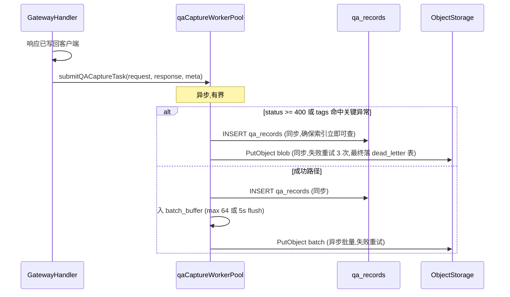
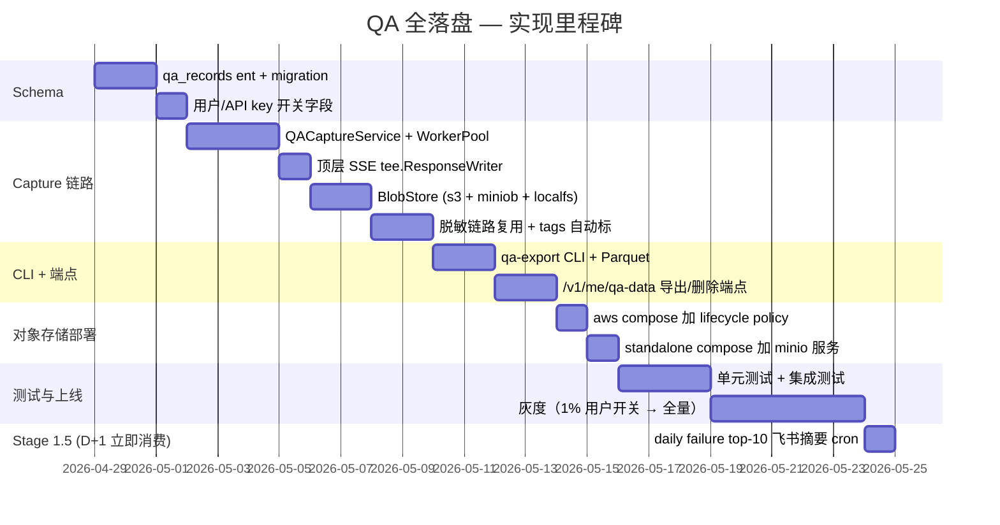

# QA 数据 100% 全落盘 — 低成本改造、存储、定期导出

## 0. TL;DR

**目标**：用户通过 API key 调用 LLM 形成的 **prompt + completion + tool_calls + 多模态指针** **100% 全落盘（业务硬决策,无采样）**——错误样本与成功样本同等待遇,符合 OPC 单人公司"低成本 + 自动化 + 合规"三铁律。

**核心架构**：

```
┌─────────────────────────┐
│  网关请求/响应（含 SSE）  │
└──────────┬──────────────┘
           │ 异步入队（不阻塞热路径）
           ▼
┌─────────────────────────┐
│  qa_capture worker pool │ ── 复用 usageRecordWorkerPool 模式
└──────────┬──────────────┘
           │
   ┌───────┴────────┐
   ▼                ▼
┌─────────┐  ┌──────────────────┐
│  PG     │  │  对象存储 ZSTD    │
│ qa_index│  │ qa_blobs/yyyy/mm │
└─────────┘  └──────────────────┘
   │ 日清理     │ lifecycle 自动清理
   │ 月分区     │ Glacier 转冷存储
```

**月成本估算**（按 10M req/月、平均 8KB 原始 QA、4x ZSTD 压缩）：

| 组件 | 体量 | 月成本 |
|------|------|--------|
| PG `qa_index` | 10M 行 × 1.5KB = **15 GB**/月，分区后查询 ms 级 | $0（复用现 PG） |
| 对象存储 blobs | 10M × 2KB（压缩后）= **20 GB**/月 | $0.46（AWS S3 Standard-IA）/ $0（自建 MinIO） |
| 月度全量导出（Parquet） | **5 GB**（列式 + ZSTD） | $0.12 |
| **合计** | | **< $1/月** 或自建 0 |

**核心原则**：**"100% 全落"不等于"100% 同等优先级"**——用**双速通道**：成功路径热写入 PG 索引 + 异步批量上传 blob，错误路径同步立刻写两份。这是 OPC 的"对延迟的 SLA 不一刀切"。

**审批门禁约束（R5）**：本文档 frontmatter `approved_by: pending`。dev-rules preflight 段 7 R5 在 `main`/`master` 分支会拒绝任何 `approved_by: pending` 的 approved doc 落地——合 main 前必须由 reviewer 把 frontmatter 改为真名。

---

## 1. 现状回顾（与文档 1 同步基线）

[`docs/approved/ops-p0-observability.md`](./ops-p0-observability.md) 已盘点 8 类日志。**对话正文当前完全不入库**，仅有：

- [`backend/ent/schema/usage_log.go`](../../backend/ent/schema/usage_log.go)：仅 token 数与成本，**无文本列**
- [`backend/internal/service/usage_billing.go`](../../backend/internal/service/usage_billing.go) + [`backend/internal/repository/usage_billing_repo.go`](../../backend/internal/repository/usage_billing_repo.go)：请求体 SHA256 用于扣费指纹，**不可反查**
- [`backend/internal/handler/ops_error_logger.go`](../../backend/internal/handler/ops_error_logger.go)：仅 status≥400 的请求，且经过截断 + 脱敏，**不是完整原文**
- [`backend/internal/service/idempotency.go`](../../backend/internal/service/idempotency.go)：`DefaultIdempotencyConfig` 中 `DefaultTTL = 24 * time.Hour`，`NormalizeIdempotencyKey` 强制要求请求显式携带 `Idempotency-Key`；即只有"主动带 key 的写请求"才落 `idempotency_records` 表，且 24h 后过期

**缺口**：成功路径的完整对话内容、tool_calls、多模态附件指针、流式聚合结果，**全部缺失**。

---

## 2. 数据模型（双层存储）

### 2.1 PG 索引表 `qa_records`

新建 ent schema `backend/ent/schema/qa_record.go`（**fork-only 新增**，本方案落地后产生）：

```go
// 字段清单（最小实用集；每列必须有"当前已存在的查询"支撑——Jobs"挣得位置"）
type QARecord struct{ ent.Schema }

func (QARecord) Fields() []ent.Field {
    return []ent.Field{
        field.String("request_id").Unique().NotEmpty(),
        field.Int64("user_id"),
        field.Int64("api_key_id"),
        field.Int64("account_id").Nillable(),

        field.String("platform"),       // claude / openai / gemini / antigravity / newapi
        field.String("requested_model"),
        field.String("upstream_model").Nillable(),
        field.String("inbound_endpoint"),    // /v1/messages / /v1/chat/completions ...
        field.String("upstream_endpoint").Nillable(),

        field.Int("status_code"),
        field.Int64("duration_ms"),
        field.Int64("first_token_ms").Nillable(),
        field.Bool("stream"),
        field.Bool("tool_calls_present").Default(false),
        field.Bool("multimodal_present").Default(false),

        field.Int("input_tokens").Default(0),
        field.Int("output_tokens").Default(0),
        field.Int("cached_tokens").Default(0),

        // 内容指纹与摘要
        field.String("request_sha256"),       // 与 usage_billing fingerprint 一致
        field.String("response_sha256"),
        field.String("blob_uri").Nillable(),  // s3://bucket/qa_blobs/2026/04/<request_id>.json.zst

        // 异常标签（自动聚类用,文档 3 §2.1 的 signature 算法当前不直接 group by tags,
        // 但写入便宜,作为未来 cluster 算法升级的扩展点保留）
        field.JSON("tags", []string{}).Default([]string{}),
        // 例: ["error_5xx", "slow_p99", "tool_loop", "tokens_overflow", "redacted_prompt"]

        field.Time("created_at").Default(time.Now).Immutable(),
        field.Time("retention_until"),  // v1: capture 时统一 = created_at + 60d
    }
}

func (QARecord) Indexes() []ent.Index {
    return []ent.Index{
        index.Fields("created_at"),
        index.Fields("api_key_id", "created_at"),
        index.Fields("user_id", "created_at"),
        index.Fields("platform", "status_code", "created_at"),
        // 注:tags GIN 索引 v1 不建——文档 3 当前聚类用 signature 而非 tag group by;
        // GIN 写入放大 + VACUUM 负担实测显著(tags 列变更频繁时尤甚)。
        // 等真出现 "WHERE tags ?| array['x','y']" 查询频率 > 100/h 时再加,届时一行 SQL 即可。
    }
}
```

**v1 删的列（与 v0 草稿差异）**：
| 列 | 删除理由 |
|---|---|
| `blob_size_bytes` | 消费方仅 v2 backlog 的 cost-anomaly cron;v1 用不到,v2 启用时 `ALTER TABLE` 一行加回 |
| `redactions` JSON | 99% query 路径不查它;**移入 blob JSON**(blob 本来就有 `redactions` 字段,§2.2);PG 表少一列 → 索引页更紧凑 + pg_dump 更快 |

**migration 策略**：
- 新建 [`backend/migrations/tk_004_create_qa_records.sql`](../../backend/migrations/)（按 [`CLAUDE.md`](../../CLAUDE.md) §5 fork-only 命名约定，与 upstream 数字编号空间隔离；当前 upstream 编号已到 107，TK 命名空间已用至 `tk_003`）
- 启用 PG 原生 **declarative partitioning**：按 `created_at` 月分区，分区表名 `qa_records_2026_04` 等
- **不引入 pg_partman 扩展**——v1 用 GitHub Actions 月度 cron 建下月分区（约 20 行 SQL，零 PG 扩展依赖），见 §2.1.1。等分区数 > 24（约 2 年）再考虑 pg_partman。OPC "依赖最小化"。
- **不建议手写每分区** SQL——下面 §2.1.1 的 cron 是参数化的,只要写一次。

#### 2.1.1 GitHub Actions 月度建分区 cron（替代 pg_partman）

```yaml
# .github/workflows/qa-records-partition-monthly.yml（fork-only 新增）
name: QA Records — create next month partition
on:
  schedule:
    - cron: '0 1 25 * *'   # 每月 25 号 01:00 UTC,提前一周建下月分区
  workflow_dispatch:

jobs:
  partition:
    runs-on: ubuntu-latest
    steps:
      - name: Create next month partition
        env:
          PG_DSN: ${{ secrets.PROD_PG_DSN }}   # 需要写权限
        run: |
          NEXT=$(date -u -v+1m +%Y-%m 2>/dev/null || date -u -d 'next month' +%Y-%m)
          YYYY=${NEXT%-*}; MM=${NEXT#*-}
          NEXT_NEXT=$(date -u -v+2m +%Y-%m 2>/dev/null || date -u -d '2 months' +%Y-%m)
          YYYY2=${NEXT_NEXT%-*}; MM2=${NEXT_NEXT#*-}
          psql "$PG_DSN" -v ON_ERROR_STOP=1 <<SQL
          CREATE TABLE IF NOT EXISTS qa_records_${YYYY}_${MM}
            PARTITION OF qa_records
            FOR VALUES FROM ('${YYYY}-${MM}-01') TO ('${YYYY2}-${MM2}-01');
          SQL
      - name: Notify Feishu on failure
        if: failure()
        env:
          FEISHU_OPS_WEBHOOK: ${{ secrets.FEISHU_OPS_WEBHOOK }}
        run: |
          curl -sS -X POST "$FEISHU_OPS_WEBHOOK" \
            -H "Content-Type: application/json" \
            -d '{"msg_type":"text","content":{"text":"[tk-qa] partition cron failed,下月写入将无分区!"}}'
```

**为什么这够用**:cron 失败的最坏后果是"下月初写入落到 default 分区"——只要 default 分区存在 `qa_records DEFAULT` 子句,数据不会丢。监控有飞书告警兜底。pg_partman 的复杂场景（自动 detach 老分区 + retention）我们用文档 §4.4 的 ALTER TABLE DETACH 月度脚本处理,同样零扩展依赖。

### 2.2 对象存储 blob

**路径规范**：`{bucket}/qa_blobs/{yyyy}/{mm}/{dd}/{request_id_first_2_char}/{request_id}.json.zst`

**为什么按 `request_id` 前 2 字符分桶？** UUID 前 2 字符是 256 等概率分布，避免单目录百万文件（S3 listing 慢、本地 ext4 inode 紧）。

**blob 内容 schema**（结构第一版，新增字段走加段，不引入 schema_version 字段——blob_uri 隐含按月分桶天然版本化，未来真要破坏性变更直接换桶名即可）：

```json
{
  "request_id": "...",
  "captured_at": "2026-04-19T12:34:56Z",
  "request": {
    "method": "POST",
    "path": "/v1/messages",
    "headers": { "...": "已脱敏白名单" },
    "body": { "model": "...", "messages": [...], "tools": [...] }
  },
  "response": {
    "status_code": 200,
    "headers": { "...": "..." },
    "body": { "id": "...", "content": [...], "usage": {...} },
    "stream_chunks_count": 142
  },
  "stream": {
    "first_chunk_at_ms": 234,
    "chunks": [
      {"t": 234, "raw_b64": "ZGF0YTogeyJ0eXBlIjoiY29udGVudF9ibG9ja19zdGFydCIsLi4ufQoK"},
      {"t": 256, "raw_b64": "ZGF0YTogeyJ0eXBlIjoiY29udGVudF9ibG9ja19kZWx0YSIsLi4ufQoK"}
    ]
  },
  "redactions": [...],
  "compression": {"algo": "zstd", "level": 6, "original_bytes": 8192}
}
```

**关键决策**：
- **流式 chunks 100% 全留**——这是后续做"模型行为分析"的核心信号（哪个模型在第几个 chunk 卡顿）。**v1 存 raw SSE wire bytes（base64 编码）**而非 typed delta,符合"100% 落盘"业务硬决策的最强解释（业务约束未变化,只是落得更原始）;ZSTD 压缩后体积与 typed JSON 相当,且解析延后到分析时（§3.3）。
- **headers 走白名单**——只保留 `content-type / user-agent / x-request-id / accept-encoding`，其余一律 drop（避免泄漏 cookie、地址等）。
- **JSON body 整体过 [`logredact.RedactText`](../../backend/internal/util/logredact/redact.go) + `sanitizeAndTrimRequestBody`** 已有链路（[`backend/internal/service/ops_service.go`](../../backend/internal/service/ops_service.go) 406-477）。
- **多模态附件**（图片/音频）**只存 SHA256 + size + MIME**，**不存原始字节**——用户上传的图可能是隐私敏感（人脸/证件），落盘风险远大于价值。如未来需要，单独做"用户主动开启的多模态归档"功能。

### 2.3 双速通道写入流程



**为什么错误路径要同步写 OS？** 错误样本是 OPC 自动化闭环（文档 3）的**核心信号**，丢任何一条都直接影响"自动发现 + 自动产 PR"质量。成功样本批量延迟几秒入 OS 没关系，错误样本必须 reliably 落地。

---

## 3. 实现接入点（最小侵入 upstream）

### 3.1 新增 fork-only 模块

新建目录 `backend/internal/observability/qa/`（**本方案落地后产生**）：

```
backend/internal/observability/qa/
├── service.go          # QACaptureService
├── worker_pool.go      # 复用 usageRecordWorkerPool 模式
├── sse_tee.go          # 顶层 ResponseWriter wrapper + 请求体 tee（§3.3 + §3.3.1）
├── blob_writer.go      # 对象存储抽象（S3 / MinIO / 本地 fs）
├── dlq.go              # 本地文件 dead-letter（§8.3,不新建 PG 表）
├── redact_pipeline.go  # 复用 ops_service 的脱敏链路;支持 typed JSON 与 raw SSE bytes（§3.3.2）
├── tags.go             # 异常标签自动打标
├── exporter.go         # 月度 Parquet 导出 + 用户级 presigned URL 导出（§5.2）
└── service_test.go
# 注:
# - v1 单一 60d 保留期, retention_until = created_at + 60d 直接在 service.go capture 时算,
#   不另起 retention.go 模块——避免"为想象的分档功能预留代码骨架"。
# - dlq.go 用本地文件 + metric 暴露,不引入新 PG 表,符合 OPC "不多加数据库对象"。
```

### 3.2 接入 hook（upstream 文件改动）

**两类 hook,各司其职**(handler hook 提交元数据 + middleware sniff 流字节,职责正交):

#### Hook 类 A — handler 内提交 capture（拿元数据用）

各平台 handler 的 `submitUsageRecordTask` 紧邻位置（如 `gateway_handler.go` 约第 1742 行 / `openai_chat_completions.go` 等），各加**一行**：

```go
h.QACapture.SubmitFromGateway(ctx, captureInput) // TK qa-capture
```

`captureInput` 结构在 fork-only `qa/types.go` 定义，handler 把 `forwardResult` + `requestBytes` 打包传过去。**响应字节由 §3.3 的 tee 从 `ctx` 取出**,handler 不直接传 `responseBytes`(流式场景 handler 拿不到完整字节)。

**为什么 handler hook 不可省**：中间件拿不到 `forwardResult`（账号选择、上游响应、首 token 时间等业务元数据）——这些在 handler 内决策,强行注入 `gin.Context` 会污染 upstream 接口。元数据走 handler hook,是最小侵入。

#### Hook 类 B — middleware 注册 SSE tee（仅 sniff 字节）

`backend/internal/server/router.go` 注册 gateway 路由组时新增**一行**：

```go
gatewayGroup.Use(qa.SSETeeMiddleware(qaService)) // TK qa-capture stream sniff
```

middleware 的唯一职责是包 `c.Writer` 为 tee 实例并塞进 `ctx`,**不做业务判断**——tee 是被动透传字节的 `gin.ResponseWriter`,handler 写流量时同步 sniff;handler 退出后 `qaService.SubmitFromGateway` 从 `ctx` 取 `tee.Snapshot()`。这与"中间件做业务"是两码事——它做的是"字节拦截",不是"业务编排"。

**Hook 总数**:N 个 handler 各 1 行 + 1 个 middleware 注册 + 0 个 SSE 解码层(v0 草稿是 N+M,v1 是 N+1)。

### 3.3 SSE 流式聚合（**顶层 ResponseWriter wrapper,非 SSE 解码层 hook**）

**问题**：流式响应是逐 chunk 写回客户端，handler 没有"完整响应 body"可以传给 capture。

**v1 解决方案（顶层化）**：在 gateway 响应链路顶层（gin middleware 或 handler 入口）包一层 `tee.ResponseWriter`——实现 `gin.ResponseWriter`（含 `http.ResponseWriter` + `http.Flusher` + `http.Hijacker`），所有写入字节按 SSE 协议 `data: \n\n` 边界切分,带时间戳累积到 ring buffer（默认 1MB）。流结束时 `tee.Snapshot()` 返回 `[]RawSSEChunk{Bytes, RecvAtMs}` 给 capture。

```go
// backend/internal/observability/qa/sse_tee.go (示意)
type RawSSEChunk struct {
    Bytes    []byte // 原始 wire bytes,含 "data: " 前缀和 "\n\n" 终止
    RecvAtMs int64  // 自请求开始的相对毫秒
}

type teeResponseWriter struct {
    gin.ResponseWriter
    startNs int64
    buf     bytes.Buffer  // 累积当前未完成的 chunk
    chunks  []RawSSEChunk
    cap     int           // 默认 1MB
}

func (t *teeResponseWriter) Write(p []byte) (int, error) {
    n, err := t.ResponseWriter.Write(p)
    t.appendAndSplit(p[:n])  // 按 \n\n 切边界
    return n, err
}
```

**与 v0 草稿（每个平台 SSE 解码层 hook）的对比**：

| 维度 | v0 N 处 hook | v1 顶层化 |
|---|---|---|
| Hook 点数量 | N 个 SSE handler（每平台 1+） | **1**（顶层 ResponseWriter） |
| Upstream 重构 SSE 解码 | hook 全失效，需逐个修 | **不受影响**（顶层抽象稳定） |
| 100% 落盘的"原始性" | 解码后的 typed chunk | **raw wire bytes**，更原始 |
| 工期 | 2d | **0.5d** |
| Upstream 冲突等级 | 中（§7 v0 表自己承认） | **低**（仅 1 处 middleware 注册） |

**Trade-off**：blob 中 `stream.chunks` 改为 raw SSE byte slices（不存 typed `content_block_delta` / `text_delta` 等结构化字段）。下游分析（文档 3 聚类）需要时用独立 SSE parser 处理一次——SSE 协议简单（`data: <json>\n\n`），parser 约 30 行,且**只在需要时跑**,不常态消耗。

**关键**：`tee.ResponseWriter` 是**可选注入**——middleware 检查 `qa_capture.enabled` + 用户/key 级开关,关闭时注入原始 `gin.ResponseWriter`,零开销。

#### 3.3.1 请求字节捕获（容易漏的实现陷阱）

`gin.Context.Request.Body` 是 `io.ReadCloser` 一次性流,handler 读完后游标到末尾,后续 capture 无法再读。**v1 在同一个 SSE tee middleware 内顺手做请求体 tee**：

```go
// sse_tee.go middleware 内
bodyBytes, _ := io.ReadAll(c.Request.Body)
_ = c.Request.Body.Close()
c.Request.Body = io.NopCloser(bytes.NewReader(bodyBytes))  // 让 handler 还能读
ctx.Set("qa_request_bytes", bodyBytes)                       // capture 出口取
```

体积上限走全局 `qa_capture.max_body_kb`（默认 256 KB）配置,超限截断 + 写 `tags=[req_truncated]`。模型 multimodal 上传可能超这个,**业务约束未变**(仍 100% 全落盘),只是 blob 标记截断点 + 用户/key 可临时调高（在 §4 隐私配置中暴露 per-key override）。

#### 3.3.2 脱敏顺序（raw SSE bytes 也必须脱敏）

`redact_pipeline` 必须能消费两种输入:(a) typed JSON request body,(b) raw SSE chunk bytes 数组。后者的脱敏需要先按 `data: <json>\n\n` 解一次帧 → 对每帧 JSON 跑脱敏 → 重写回 raw bytes。**模型输出可能反弹用户给的 token/email**(`Sure, here's your sk-xxx...`)——如果只对请求体脱敏放过响应,会留下与请求体同等敏感的"输出泄漏"。脱敏 → 计算 sha256 → ZSTD → 上传 blob,顺序不可调换(sha256 应基于脱敏后内容,否则就形成"脱敏前指纹"反向反查表)。

### 3.4 对象存储抽象

`blob_writer.go` 暴露接口：

```go
type BlobStore interface {
    Put(ctx context.Context, key string, body []byte, opts PutOptions) error
    Get(ctx context.Context, key string) ([]byte, error)
    Delete(ctx context.Context, key string) error
    Exists(ctx context.Context, key string) (bool, error)
}
```

**三种实现**（按部署形态选择）：

| 实现 | 适用场景 | 配置 |
|------|---------|------|
| `s3blob` | AWS / 阿里云 OSS（S3 兼容） | 复用 `aws-sdk-go-v2`（项目已 indirect 依赖） |
| `miniob` | 自建 MinIO（OPC 推荐） | 同 S3 SDK，endpoint 改成 MinIO |
| `localfs` | 本地开发 + 单机 standalone 部署 | 写到 `${DATA_DIR}/qa_blobs/` |

**默认**：standalone compose 用 `localfs`，aws compose 用 `s3blob`。

### 3.5 Wire DI 接入

[`backend/cmd/server/wire.go`](../../backend/cmd/server/wire.go) 新增 `qa.NewService` provider，注入到 `Handlers`。`go generate ./cmd/server` 重生成 wire_gen.go。

---

## 4. 低成本改造的具体决策

### 4.1 为什么不用 ClickHouse / Druid？

| 方案 | 月成本（10M req） | OPC 维护 | 决策 |
|------|------------------|---------|------|
| **PG 分区 + 对象存储 blob** | < $1 | 复用现有 PG 备份链路 | **采用** |
| ClickHouse | $30-100（自建 EC2）或 $200+（Cloud） | 新增数据库 = 新增备份/升级/调优 = 反 OPC | 拒绝 |
| Druid | 类似 ClickHouse | 集群型架构，OPC 单机扛不住 | 拒绝 |
| MongoDB | $20-50 | 又一个数据库 + JSON 索引体验弱于 PG | 拒绝 |

**OPC 哲学**：每多一个数据库 = 多一份备份 + 多一份监控 + 多一份升级。**stick with PG until pain forces change**。

### 4.2 压缩选型

实测 LLM JSON 体积压缩比：

| 算法 | 压缩比 | 压缩速度 | 解压速度 |
|------|-------|---------|---------|
| gzip-6 | 4.2x | 50 MB/s | 200 MB/s |
| **zstd-6** | **5.1x** | **180 MB/s** | **800 MB/s** |
| zstd-19 | 6.8x | 8 MB/s | 700 MB/s |
| brotli-6 | 5.5x | 30 MB/s | 350 MB/s |

**选 zstd-6**：压缩比仅次于 brotli/zstd-19，速度是它们的 6-22x。Go 用 [`klauspost/compress/zstd`](https://github.com/klauspost/compress)（pure Go，无 cgo）。

### 4.3 为什么不存数据库 BLOB 列？

| 方案 | 1000 万行 PG 表性能 | 备份大小 | 决策 |
|------|---------------------|---------|------|
| `bytea` 列存 blob | TOAST 表膨胀，VACUUM 慢，查询拖累 | pg_dump 100GB+ | 拒绝 |
| 对象存储 + URI 列 | 索引表瘦长，查询毫秒 | pg_dump 1GB | 采用 |

### 4.4 PG 表生命周期（与 §2.1.1 同 cron 模式，零 PG 扩展依赖）

新建 `.github/workflows/qa-records-archive-monthly.yml`，每月 1 号 02:00 UTC 跑：

```bash
# 计算 7 个月前的分区表名
CUTOFF=$(date -u -v-7m +%Y_%m 2>/dev/null || date -u -d '7 months ago' +%Y_%m)
PART="qa_records_${CUTOFF}"

# 检查分区是否存在,不存在跳过(避免冷启动期重复 fail 告警)
EXISTS=$(psql "$PG_DSN" -tAc "SELECT to_regclass('public.${PART}') IS NOT NULL")
[ "$EXISTS" = "t" ] || { echo "no old partition to detach,skip"; exit 0; }

# DETACH + COPY + DROP（DETACH 后表仍可查,COPY 完再 DROP 才安全）
psql "$PG_DSN" -v ON_ERROR_STOP=1 <<SQL
ALTER TABLE qa_records DETACH PARTITION ${PART};
SQL
psql "$PG_DSN" -c "\COPY ${PART} TO PROGRAM 'gzip > /tmp/${PART}.csv.gz' WITH CSV HEADER"
aws s3 cp /tmp/${PART}.csv.gz s3://${BUCKET}/qa_archive/${PART}.csv.gz
psql "$PG_DSN" -c "DROP TABLE ${PART}"
```

PG 表保留 6 个月明细 + 月度索引 dump 在对象存储归档（够便宜，归档 6 个月 ~10GB CSV.gz）。**与 §2.1.1 的建分区 cron 同模式**(GitHub Actions + psql + 飞书失败告警),不引入 pg_partman 等 PG 扩展。

---

## 5. 定期导出方案（OPC 月度任务）

### 5.1 月度 Parquet 全量导出

**为什么 Parquet？**
- 列式存储 + ZSTD 压缩比 JSON 高 3-5x
- 任何分析工具（DuckDB / Spark / pandas / Athena）开箱可读
- 适合做"半年一次回看 / 训练数据筛选 / 用户报表"

**执行**：cron workflow `qa-monthly-export.yml`（详见文档 3）

```yaml
# .github/workflows/qa-monthly-export.yml
on:
  schedule:
    - cron: '0 4 1 * *'  # 每月 1 号 04:00 UTC
  workflow_dispatch:

jobs:
  export:
    runs-on: ubuntu-latest
    steps:
      - uses: actions/checkout@v4
      - run: |
          ssh tk-prod 'docker exec sub2api /app/sub2api qa-export \
            --month $(date -d "last month" +%Y-%m) \
            --output s3://tk-archive/qa-monthly/'
      - name: Notify Feishu
        if: always()
        env:
          FEISHU_OPS_WEBHOOK: ${{ secrets.FEISHU_OPS_WEBHOOK }}
        run: |
          MONTH=$(date -d 'last month' +%Y-%m)
          STATUS="${{ job.status }}"
          curl -sS -X POST "$FEISHU_OPS_WEBHOOK" \
            -H "Content-Type: application/json" \
            -d "$(jq -n --arg m "$MONTH" --arg s "$STATUS" \
              '{msg_type:"text",content:{text:("[tk-qa-export] monthly " + $m + ": " + $s)}}')"
```

**`qa-export` CLI 子命令**实现在 [`backend/cmd/server/qa_export.go`](../../backend/cmd/server/)（fork-only 新增），用 [`apache/arrow-go/parquet`](https://github.com/apache/arrow-go) 写 Parquet。

### 5.2 用户级数据导出（GDPR 合规要求）

新增端点 `GET /v1/me/qa-data/export?since=YYYY-MM-DD&until=YYYY-MM-DD&format=zip`（fork-only）,**`since` + `until` 必填**(限制单次范围,避免几 GB 包),最大跨度 31 天。

**v1 同步生成 + presigned URL**（**不走邮件链路**——SMTP 是新依赖,且 [`CLAUDE.md`](../../CLAUDE.md) §9.2 提到 SMTP 测试假错的历史风险）：

1. 服务端流式生成 zip（`qa_records` JSON 行 + 关联 blob）写入对象存储临时桶 `tk-qa-export-tmp/<user_id>/<request_id>.zip`
2. 返回 **presigned URL（24h 有效）**给客户端,用户直接 GET 下载
3. 临时桶配 lifecycle policy 7 天后 expire,自动清理

**31 天跨度上限的兜底**:大用户超出范围请分批 `?since=2026-01-01&until=2026-01-31`,然后 `?since=2026-02-01...`。**v1 不做"分批合并 zip + 邮件下载链接"**——OPC 拒绝多依赖路径。

实现：复用 §3.4 `BlobStore.Put` + AWS SDK `GeneratePresignedURL` API；S3/MinIO 都原生支持。

**v2 才考虑**：单用户单次 > 5GB 的"超大导出"场景（届时再决定是否引入异步邮件链路或 SFTP push）。

### 5.3 用户级数据删除（GDPR 合规要求）

新增端点 `DELETE /v1/me/qa-data?before=YYYY-MM-DD`（fork-only），同步：
1. PG `DELETE FROM qa_records WHERE user_id=? AND created_at < ?`
2. 异步触发 blob 删除任务（按 PG 删除前查到的 `blob_uri` 列表）

**删除要求记录在 `payment_audit_logs`**（已存在表），保留删除事件本身用于合规审计。

---

## 6. 隐私 / 合规底线（默认 ON）

| 控制 | 实现位置 | 默认值 | 合规对应 |
|------|---------|--------|---------|
| 用户级 `qa_capture_enabled` 开关 | `users` 新增 bool 列 + 用户中心 UI 显著位置 | true | GDPR 知情同意 |
| API key 级 `qa_never_capture` 标 | `api_keys` 新增 bool | false | 调试 key 可关 |
| 全局 `qa_capture.enabled` | admin 设置项 | true | 总开关 |
| `qa_capture.headers_whitelist` | admin 配置（默认列表） | 见 §2.2 | 防泄漏 |
| `qa_capture.body_max_bytes` | 默认 256KB，超过截断（保留前 N + 后 N + 中间标记） | 256KB | 防 DoS |
| `qa_capture.skip_models` | admin 配置（如某些极敏感模型） | 空 | 客户协议 |
| `qa_capture.tenant_isolation` | admin 看其他用户 QA 全文必须有审批工单 ID | 强制 | 合规审计 |
| TTL（v1 单一保留期） | `retention_until = created_at + 60d`，统一不分档 | 60 天 | 数据最小化原则 |
| 用户主动删除端点 | `DELETE /v1/me/qa-data` | 必须实现 | GDPR 第 17 条 |
| 用户主动导出端点 | `GET /v1/me/qa-data/export` | 必须实现 | GDPR 第 20 条 |
| Admin 查看审计 | 写 `payment_audit_logs.detail`（JSON 包含 admin_id、查询时间、命中行数） | 强制 | 合规审计 |
| 加密静态存储 | 对象存储 SSE-KMS（AWS）或 MinIO server-side encryption | 强制 | 合规基线 |
| 传输加密 | HTTPS（已有 Caddy） | 强制 | 合规基线 |

**关键设计**：用户级开关在用户 onboarding 时**必须显式同意**——首次登录弹窗"我们记录你的 API 调用以改进服务，可随时关闭"，这是 GDPR 与中国个保法的最低合规线。

---

## 7. Upstream 冲突面分析

| 文件/目录 | 归属 | 改动量 | 冲突风险 |
|----------|------|--------|----------|
| `backend/internal/observability/qa/*` | **新增 fork-only 目录** | 全新 ~2000 行 | 零 |
| `backend/ent/schema/qa_record.go` | **新增 fork-only** | 全新 schema | 零（ent 生成代码每次 regen，§5 已豁免） |
| `backend/migrations/tk_004_*.sql` | **新增 fork-only**（TK 命名空间） | 全新 SQL | 零（与 upstream 数字编号空间隔离） |
| `backend/internal/handler/gateway_handler.go` | Upstream-owned | **1 行 hook**（提交 capture） | 极低 |
| 其他平台 handler | Upstream-owned | 各 1 行 hook | 极低 |
| `backend/internal/server/router.go` 或 gateway middleware 注册点 | Upstream-owned | **1 行**注册 `tee.Middleware()` | 极低 |
| SSE forward 文件 | Upstream-owned | **0 行**（v1 顶层 ResponseWriter wrapper 取代 v0 SSE 解码层 hook） | **零**（不再依赖 SSE 解码点稳定性,v0 草稿的"中等风险"已消除） |
| `backend/cmd/server/wire.go` | Mixed | provider 列表 +1 | 低 |
| `backend/cmd/server/qa_export.go` | **新增 fork-only** | 全新 CLI | 零 |
| `users` 表加 `qa_capture_enabled` | Upstream schema | migration 加列 | 低（追加列不影响上游） |
| `api_keys` 表加 `qa_never_capture` | Upstream schema | migration 加列 | 低 |

**v1 已消除 v0 草稿的 SSE 中等风险**——v0 在每个平台 SSE 解码层注入 `chunkRecorder`,upstream 重构会失效;v1 改为 gateway 顶层 ResponseWriter wrapper（§3.3）,只依赖 `gin.ResponseWriter` 接口稳定性（与 gin 框架版本绑定,极少破坏性变更）,upstream 业务代码重构不影响。仍建议每次 upstream merge 跑一次"流式 capture 集成测试"作为防御。

---

## 8. 性能与容量验证

### 8.1 性能预算（每条请求 capture 开销）

| 阶段 | 开销 | 是否阻塞响应 |
|------|------|-------------|
| 序列化 + 脱敏 | < 1 ms | 否（异步） |
| zstd 压缩（8KB → 2KB） | < 0.5 ms | 否 |
| PG INSERT（单行） | < 2 ms | 否 |
| 对象存储 PUT（2KB） | 10-50 ms | 否（批量） |
| **客户端可见延迟增量** | **0 ms** | — |

### 8.2 容量预估（中量级部署）

| 量级 | req/月 | PG `qa_records` | blobs 总量 | PG IOPS 增量 |
|------|--------|----------------|-----------|--------------|
| 小 | 1M | 1.5 GB/月 | 2 GB/月 | < 5% |
| 中 | 10M | 15 GB/月 | 20 GB/月 | < 15% |
| 大 | 100M | 150 GB/月 | 200 GB/月 | 需要 PG 调优 / 分库 |

**100M 阈值是 OPC 单机的天花板**——届时再考虑迁移到 ClickHouse 或加只读副本。**当前先按 10M 设计**。

### 8.3 失败模式与恢复

| 失败 | 影响 | 恢复 |
|------|------|------|
| 对象存储不可达 | blob 入**本地文件 dead-letter** `${DATA_DIR}/qa_dlq/<request_id>.json.zst`（**不新建 PG 表**——多一张表 = 多一份备份/监控/迁移负担,反 OPC） | 后台 retry worker 每分钟扫目录重试，3 次失败保留 + 写 `qa_records.blob_uri = 'dlq://...'` 标记;`sub2api_qa_dlq_size` gauge metric 暴露给告警 |
| PG 写入失败 | capture 任务丢弃，**不影响主流程** | 记 metric `sub2api_qa_capture_drops_total`，告警阈值 >1%/h |
| Worker pool 溢出 | 入队丢弃，best-effort | 同上 metric，扩 worker 数 |
| ZSTD 压缩失败 | blob 退化为未压缩 JSON | metric 计数，自动告警 |

---

## 9. 与 OPC 自动化的衔接

`qa_records` + blob 是文档 3（[`ops-cron-agent-workflow.md`](./ops-cron-agent-workflow.md)）所有自动化的**信号源**：

- **失败聚类**：`SELECT tags, count(*) FROM qa_records WHERE status_code >= 400 GROUP BY tags` → 自动周报
- **慢请求分析**：`duration_ms > p99 baseline` 的 blob 拉下来给 Agent 看 prompt 模式 → 自动出"加 timeout"或"换模型"建议
- **模型成本回看**：`usage_logs JOIN qa_records` → 找出"高成本但用户体验差"的组合 → 自动出"调默认模型"PR

**没有 QA 数据，文档 3 全部失效**。这就是为什么 P0 → 文档 2 → 文档 3 的顺序不可调换。

---

## 10. 落地时间盒



**总计：约 4 周人力**（含灰度上线 + Stage 1.5）。

**Stage 1.5（D+1 即开消费）**——v0 草稿到文档 3 落地有 1 个月空窗,QA 数据只堆不消费,运维感知"做了一堆没回报"。**Stage 1.5 在 QA 上线 D+1 立即开**:

```yaml
# .github/workflows/qa-failure-daily-summary.yml（fork-only 新增,1 天工作量）
name: QA Failure Daily Summary
on:
  schedule:
    - cron: '0 1 * * *'   # 每日 01:00 UTC
jobs:
  summary:
    runs-on: ubuntu-latest
    steps:
      - env:
          PG_DSN: ${{ secrets.PROD_PG_READONLY_DSN }}
          FEISHU_OPS_WEBHOOK: ${{ secrets.FEISHU_OPS_WEBHOOK }}
        run: |
          SQL="SELECT platform, status_code, count(*) AS c
               FROM qa_records
               WHERE created_at > now() - interval '24 hours' AND status_code >= 400
               GROUP BY platform, status_code ORDER BY c DESC LIMIT 10"
          TOP10=$(psql "$PG_DSN" -t -A -F'|' -c "$SQL")
          curl -sS -X POST "$FEISHU_OPS_WEBHOOK" \
            -H "Content-Type: application/json" \
            -d "$(jq -n --arg t "[qa-daily] 24h failure top10:\n$TOP10" \
              '{msg_type:"text",content:{text:$t}}')"
```

100 行不到的 cron,QA 落地第一天就有飞书价值。文档 3 §2.1 的 `error-clustering-daily` 上线后,Stage 1.5 cron 可保留也可关（重叠不冲突,关掉一行注释即可）。**Jobs 端到端体验**:用户（运维）从 QA 上线 D+1 起就感知到价值,不等 1 个月。

---

## 11. 验收 Checklist（合并前必过）

### 功能性
- [ ] 跑一次完整 Claude `/v1/messages` 调用，PG 中可查到对应 `qa_records` 行
- [ ] blob URI 可下载，zstd 解压后 JSON 结构符合 §2.2 第一版 blob schema
- [ ] 故意带敏感信息（email/phone/key）调用，blob 中相应字段必须 `[REDACTED]`
- [ ] 流式调用结束后，blob 中 `stream.chunks` 数组非空且时间戳合理
- [ ] 错误请求（故意 401）→ blob 立即可下载（不等批量 flush）
- [ ] `GET /v1/me/qa-data/export?since=...&until=...` 返回 200 + presigned URL（24h 有效），URL 直接 GET 下载 zip 内容包含该范围全部记录
- [ ] 跨度 > 31 天时端点返回 400 + 引导分批
- [ ] `DELETE /v1/me/qa-data?before=...` 后 PG 同步查不到，blob 在 24h 内（内部 SLA）从对象存储删除
- [ ] `qa-export` CLI 输出 Parquet 可用 DuckDB `SELECT * FROM 'file.parquet' LIMIT 10` 读取

### 性能
- [ ] 灰度期间 `sub2api_http_request_duration_seconds` p99 不增长 >5%
- [ ] `sub2api_qa_capture_drops_total` 占比 < 0.1%
- [ ] PG `qa_records` 表大小预估与 §8.2 偏差 < 30%

### 合规
- [ ] 用户中心可一键关闭 `qa_capture_enabled`
- [ ] 关闭后立即生效（下一次请求不入库，已有记录可主动删除）
- [ ] Admin 查看其他用户 QA 必须输入审批工单号
- [ ] 所有上述操作在 `payment_audit_logs` 留痕

### Upstream 友好
- [ ] `git diff upstream/main..HEAD -- backend/internal/handler/gateway_handler.go` 仅 1 行 hook
- [ ] 无任何 `func` 签名修改、无 import 大幅重排
- [ ] `internal/observability/qa/` 100% fork-only（grep upstream history 确认）

---

## 12. 风险与回滚

| 风险 | 影响 | 回滚 |
|------|------|------|
| 对象存储意外暴露公网 | **极高**（用户隐私泄漏） | bucket policy 强制 deny public，CI 内加 `aws s3api get-bucket-policy` 检查 |
| 脱敏规则漏配，blob 含敏感信息 | 高 | 关 `qa_capture.enabled` 即停采集；老数据用 `qa-export --redact-pass` 二次脱敏 |
| PG 分区切换 bug 导致写入失败 | 中（capture 丢失，主流程不受影响） | 切回单表（migration 反向），可用 |
| `qa-export` CLI 把生产 PG 拉爆 | 中 | export 走 read replica（如有）或限速 1000 行/秒 |
| 对象存储成本失控 | 中 | lifecycle: 创建 30 天后转 IA、60 天后 expiration（与 v1 retention_until 一致），CloudWatch 设月度预算告警 $10。注：v1 单一 60d 保留期下不会触发 Glacier，只有进 v2 多档保留期后才考虑 90 天 Glacier 转冷 |
| GDPR 删除请求未及时执行 | 高（合规） | **内部 SLA 24h**（异步 blob 删除 worker 完成）；30 天是 GDPR 法规上限,贴线即风险,OPC 不应贴线。超 24h 自动飞书告警 + 升级到 owner |

---

## 13. 不做的事（OPC 拒绝清单）

- **不做向量化检索**——这是搜索/RAG 产品功能，不是观测；如要做单独立项
- **不做实时分析仪表盘**——Grafana 够看趋势，深度分析靠月度 Parquet
- **不做用户级 QA 查看 UI**——产品需求暂未提，避免过度工程
- **不做训练数据导出**——涉及版权/合规复杂度，单独立项
- **不做多模态附件原文存储**（仅存指纹+尺寸）——隐私风险远大于价值
- **不做 cross-region 复制**——单 region 备份足够，跨 region 是企业级需求

