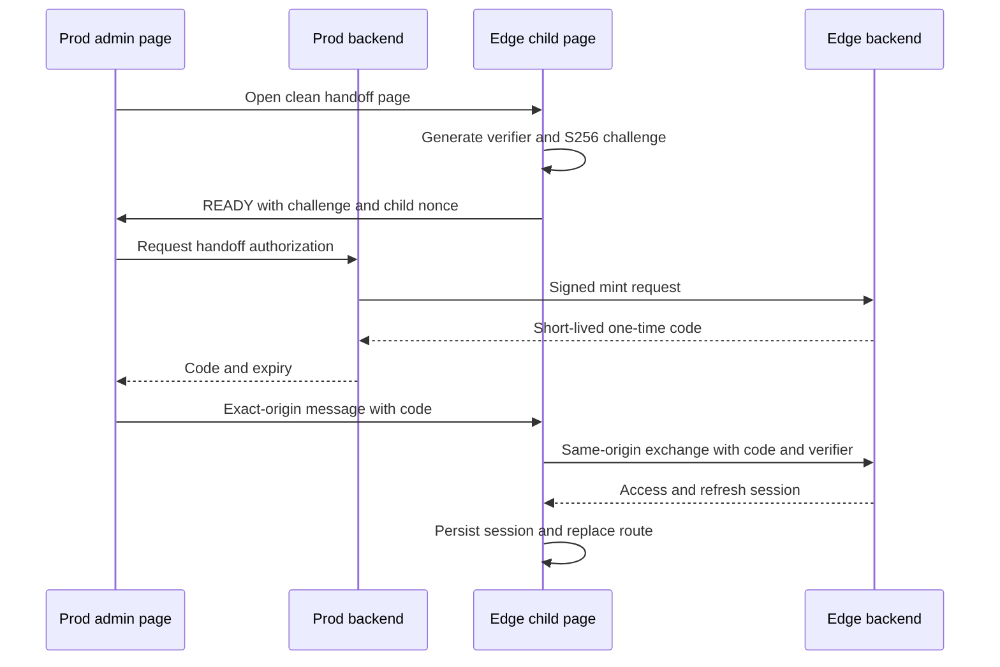
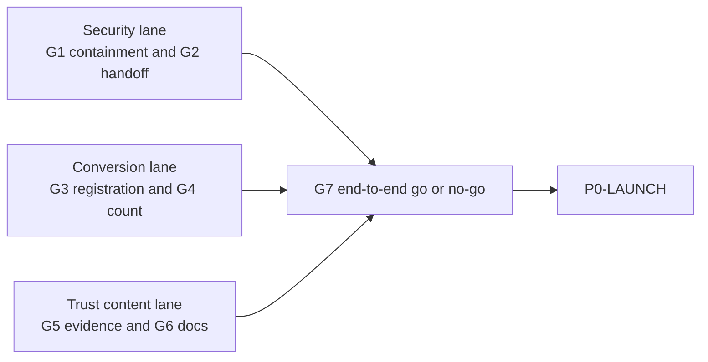

# P0 Conversion and Trust

## 0. Approval state

This document is a **pending design**, not production authorization.

- Human approval is required before implementation Goals leave design/read-only preparation.
- Production credential revocation, rotation, browser-history cleanup, paid probes, and
  `registration_enabled` changes each retain their own explicit approval gate.
- `approved_by: pending` must not be changed by an agent.
- The authenticated competitor report is a private external research artifact and is
  intentionally excluded from this repository and PR. Its SHA-256 pins the exact reviewed
  input; this approval baseline is self-contained and publishes none of that report's
  credentials, authenticated screenshots, or private evidence.
- If approved, this document supersedes only the email-trial fail-open behavior and
  marketing-count guidance in `docs/approved/user-cold-start.md`. Existing shipped
  behavior remains the baseline until replacement code is separately reviewed and deployed.

## 1. One product promise

> A user can safely enter TokenKey, see the products TokenKey actually serves, verify
> whether their client combination is supported, and—when email trial registration is
> promised—reach a working Quickstart without human help or a credit card.

This is not six unrelated features. It is one trust chain:

```text
safe operator access
+ truthful registration offer
+ sellable catalog truth
+ inspectable compatibility evidence
+ reachable canonical documentation
= credible first success
```

### 1.1 Non-goals

- No model-count race or new SKU expansion.
- No real-time capacity or SLA status page.
- No migration of all authentication to HttpOnly cookies.
- No organization, project, budget, procurement, or smart-routing product.
- No unattended full or paid production probe.
- No production registration enablement as a side effect of implementation.
- No public exposure of account, pool, Edge topology, probe authorization, or raw evidence.

## 2. Verified current baseline

The following facts were re-derived from current `origin/main`; no retired draft was used.

| Area | Current behavior | Trust gap |
| --- | --- | --- |
| Edge handoff | A normal mirror API key can mint a renewable admin access/refresh pair; prod builds a fragment URL containing both tokens. | A read/relay credential is also a session-mint credential, and credentials enter URL/history/UI process surfaces before scrubbing. |
| Registration | `registration_enabled` is checked near request start; bonus can be atomic with user creation, but trial-key creation and several entitlements are post-create/best-effort. | Public promises can be true while a new account has no usable key or entitlement. |
| Public settings | The browser receives separate registration/bonus flags and recomputes CTA truth. `auto_generate_default_token` is not in the public shape. | There is no browser-observable single registration promise. |
| Catalog | `/api/v1/public/pricing` is filtered and availability-pruned in the handler after the catalog service returns. | A count derived before the handler's final projection can disagree with the displayed catalog. |
| Compatibility | `docs/ops/endpoint-compat-baseline.md` is curated operational memory and explicitly is not a public product promise. | Users cannot inspect safe, current evidence by client/protocol/transport/model. |
| Documentation | `/quickstart` is authenticated; first-party public Quickstart/SDK/client/error/media routes do not exist. `doc_url` is optional. | Home, model, and login journeys can have no canonical public help path. |
| Custom home | `home_content` can replace the entire default landing page, including its header. | A docs/count fix only in the default landing does not guarantee a production entry point. |

## 3. System invariants

These invariants are release blockers, not aspirations.

1. No access token, refresh token, authorization code, or PKCE verifier appears in a URL,
   browser history, Referer, application log, APM label, analytics payload, or retained test artifact.
2. The ordinary Edge mirror/read API key cannot authorize handoff mint or exchange.
3. The PKCE verifier exists only in the Edge child window until same-origin exchange.
4. A visible email-trial promise is exactly the backend `EffectiveRegistrationOffer`; public
   components do not reassemble feature flags.
5. A successful promised email registration commits user, signup journal, required
   entitlements, exactly one trial key, and recoverable idempotency metadata atomically.
6. “当前可售 / currently sellable” means the final **served × priced × displayed**
   public catalog projection. It is the service promise; it is not instantaneous free capacity.
7. A green compatibility verdict is evidence-backed and freshness-bounded. Unknown is never
   rendered as compatible.
8. Public docs and authenticated Quickstart render one versioned content registry.
9. Security, conversion, and evidence/docs releases can each be rolled back without restoring
   the legacy token-in-URL path or changing production registration.

## 4. Edge historical containment

Historical containment and the replacement protocol are separate release units. New code does
not revoke credentials by itself, and containment does not wait for a perfect historical log.

### 4.1 Read-only inventory

For every deployable Edge, produce a redacted target record containing only:

- Edge ID and canonical origin;
- the mirror key ID and its owning Edge admin user ID;
- whether refresh sessions can be distinguished by issuance path and time;
- retained log windows actually available;
- break-glass login verification state;
- proposed revocation unit and expected operator impact.

Never print or persist a mirror key, token, refresh value, URL fragment, or secret-pattern match.
Secret scanning reports count, time bucket, source class, and a one-way correlation digest only.

Local browser-history inspection is opt-in and operator-run. Cleanup is never silent. A retained
log with no match proves only “no match in this retained source and window,” not “never exposed.”

### 4.2 Revocation unit

- If historical handoff refresh families are uniquely tagged, revoke only those families.
- If they are indistinguishable from ordinary sessions, the minimum honest unit is the complete
  refresh/token-version family of the mapped Edge admin user. Show the resulting manual-session
  logout before approval.
- Disable the old mint authority before rotating the generic mirror key; then rotate that key
  because it previously carried excess privilege.
- Verify refresh-cache cleanup, token-version reconciliation, manual login, and Edge admin
  authorization after each Edge. Stop that Edge's batch on any failed reconciliation.

The incident record contains IDs, counts, time ranges, reason codes, and outcomes only.

## 5. Secure Edge handoff

### 5.1 Separate control credential

Each Edge gets a handoff-only control client:

- `client_id` identifies the Edge-local admin subject and allowed prod origin;
- a dedicated HMAC secret is stored in the existing secret-management path on both sides,
  never in the mirror-account API-key field;
- active and next key IDs permit staged rotation;
- its only authority is `handoff:mint`; it cannot read accounts, relay model traffic, mutate
  accounts, or exchange a code.

Prod first authorizes the authenticated administrator for Edge handoff. The canonical mint body
includes a stable non-secret `initiator_admin_id` and `prod_request_id` in addition to the
audience, source origin, window nonce, PKCE challenge, and attempt ID. Prod signs method, path,
body hash, timestamp, request nonce, and key ID. Edge enforces a narrow clock skew and uses Redis
`SET NX` with TTL for request-nonce replay protection. A retry uses a new request nonce and mints
a new code. The initiator fields are audit attribution only: they never select the Edge-local
subject or grant authority beyond the control client's fixed mapping.

### 5.2 Child-owned PKCE flow

The prod page already knows the Edge `base_url`, so it can open a clean child synchronously
before any network await.



Normative browser rules:

- Parent opens an allowlisted canonical Edge origin at `/admin/edge-handoff` with only
  non-secret origin/window correlation fields; it never trusts an arbitrary browser-supplied base URL.
- Child validates the configured prod origin, `event.origin`, and `event.source === opener`.
- Parent validates the canonical Edge origin and the exact child window object.
- The child-generated verifier never crosses `postMessage`.
- The transient child route must not set a cross-origin opener policy that severs `window.opener`
  before the handshake; tests cover deployed response headers.
- The code crosses only backend TLS responses and exact-origin `postMessage`; it is never put in
  `location`, storage, telemetry, console output, or error text.
- Popup-blocked, closed-window, timeout, and capability failures lead to manual Edge login.

### 5.3 Authorization-code record and exchange

Edge stores only a hash of a random authorization code in shared Redis. The value binds:

- `audience`: canonical Edge origin;
- allowed prod `source_origin`;
- child/window nonce;
- PKCE S256 challenge;
- Edge-local admin subject;
- prod initiator admin ID and prod request ID;
- mint attempt ID;
- issued time and an at-most-60-second TTL.

Exchange is a same-origin `POST` carrying code, verifier, source origin, and window nonce, with
`Cache-Control: no-store`. One atomic Redis script loads the record, verifies
audience/source/window binding and verifier, and deletes only after all checks pass.
Wrong-verifier and wrong-binding attempts do not consume the valid code; successful concurrent
exchanges have exactly one winner.

The resulting refresh family and Edge audit event are tagged `edge_handoff` plus the non-secret
attempt ID, prod initiator admin ID, and prod request ID for attribution and future targeted
revocation. Neither prod backend nor prod SPA ever receives the session pair.

### 5.4 Retry, shutdown, and rollback

- Mint is intentionally non-idempotent at the plaintext-code level. A stable non-secret attempt
  ID has a Redis pointer to its current code hash; retry atomically invalidates any unconsumed
  prior hash and returns a newly generated code.
- Fleet capability reports must prove mint/exchange/Redis support before prod UI switches.
- After switch and a zero-use observation window, legacy
  `POST /api/v1/edge/admin-session` becomes `410 Gone`; the token URL builder is removed.
- Rollback may restore the new code flow or manual Edge login only. It must never restore a
  token-bearing URL or generic mirror-key mint authority.

## 6. Effective Registration Offer

### 6.1 One backend-owned public fact

`GET /api/v1/settings/public` adds one object owned by `RegistrationOfferService`:

```json
{
  "registration_offer": {
    "kind": "email_trial",
    "state": "available",
    "revision": "opaque-revision",
    "bonus_usd": "1.00",
    "trial_key_included": true,
    "next_path": "/quickstart"
  }
}
```

When unavailable, monetary and key promises are omitted:

```json
{
  "registration_offer": {
    "kind": "email_trial",
    "state": "unavailable",
    "revision": "opaque-revision",
    "reason_code": "trial_temporarily_unavailable",
    "next_path": "/docs/quickstart"
  }
}
```

Allowed public reason codes are deliberately coarse:

| Code | User meaning | UI action |
| --- | --- | --- |
| `registration_closed` | Email registration is not open. | Show login and docs; no trial claim. |
| `invitation_required` | This registration path requires an invitation. | Ask for an invitation code. |
| `verification_temporarily_unavailable` | Required email/abuse verification is not ready. | Retry later; keep docs visible. |
| `trial_temporarily_unavailable` | The complete trial bundle cannot be guaranteed. | Hide register/bonus CTA; link Quickstart docs. |

No reason code names an internal setting, dependency, account, group, or secret state.

Legacy public flags may remain temporarily for backward compatibility, but home, pricing, model,
login, and registration components must consume only `registration_offer` for this promise.
A source gate rejects new first-party CTA logic that combines the legacy flags.

### 6.2 Availability predicate

The offer is `available` only when all required facts are true:

- email registration is enabled and backend mode does not prohibit it;
- this is the generic email-trial mode, not an invitation-only path;
- configured signup credit is enabled and strictly positive;
- automatic trial-key creation is enabled with a valid name and routing mode;
- the registration activation bundle reports ready;
- configured email verification and Turnstile dependencies report ready;
- referenced default entitlement/subscription groups are valid.

Missing rows, parse errors, mixed deployment revisions, or dependency-readiness errors fail
closed. The opaque revision includes the settings guard version, deployment version, and
readiness digest; clients cannot infer configuration from it.

### 6.3 Settings/registration linearization

A seeded, server-owned `registration_offer_revision` settings row is the database guard. It is
not exposed as an admin-writable request field.

1. A registration transaction locks that row `FOR SHARE`, reads required settings through its
   transaction-bound client, recomputes the offer, and compares the submitted revision.
2. Concurrent registrations also take `FOR SHARE`; they do not serialize globally.
3. Admin settings update takes `FOR UPDATE` on the guard **before** changing settings, applies
   changes and bumps revision in one transaction.
4. Therefore a close waits for already-linearized registrations; after close commits, no new
   transaction can commit with the old revision.

Runtime readiness removal follows an operational order: close the database offer, wait for
in-flight transactions, then remove the dependency. Rolling pods with different readiness
digests reject mismatched revisions rather than accepting a stale promise.

## 7. Atomic registration activation bundle

### 7.1 Transaction owner

`RegistrationActivationService` is the sole transaction owner. It starts one Ent transaction,
places it in context, and performs no SMTP, Turnstile, Redis, HTTP, token signing, or other remote
call inside the transaction.

The handler first normalizes the request, hashes the supplied idempotency key, and looks for a
succeeded record. A matching recovery record still requires the supplied password to verify
against the committed user's password hash before any new session is signed; the idempotency
key alone is never authentication.

For a new attempt, before the transaction it:

- normalizes and validates the request;
- checks Turnstile when configured;
- verifies the email code without deleting it;
- hashes the password;
- validates non-secret bundle prerequisites.

Inside the transaction it writes, through `tx.Client()` or explicitly transaction-aware
repositories:

1. the user and normalized email identity;
2. opening/signup balance and the existing redeem-code balance journal;
3. all default entitlements/subscriptions required for the trial key's first call;
4. exactly one active universal trial key;
5. accepted invitation/promo consumption and its required credit, when present;
6. a succeeded registration idempotency record pointing to user ID and API-key ID.

The current generic `apiKeyRepository.Create` and generic idempotency repository are not used
inside this bundle because they are not transaction-bound. The implementation adds narrow
transaction writers using `tx.Client()`; it does not assume an exposed `*sql.Tx`. The existing
idempotency entity gains nullable, non-secret `resource_user_id` and `resource_api_key_id`
fields rather than serializing an auth response.

Any write failure rolls back the entire bundle. There is no “account created, key best-effort”
success state.

### 7.2 Idempotency and concurrency

Email-trial registration requires a browser-generated, at-least-128-bit `Idempotency-Key`. The
header is redacted from logs/telemetry and only its scoped hash is stored. The request fingerprint
includes normalized email, offer revision, and non-secret request shape, never password, email
code, token, or API key.

The transaction performs `INSERT ... ON CONFLICT DO NOTHING` for the idempotency row:

- the winner creates the bundle and marks the row succeeded before commit;
- a concurrent duplicate waits for the first transaction, then reads its committed result;
- same key plus different fingerprint returns `409 idempotency_conflict`;
- rollback also removes the uncommitted processing row, so a retry can become the winner;
- succeeded records store only resource IDs and expiry, never an auth response or key secret;
- a later replay reads the succeeded record before requiring the now-consumed email code, but
  returns a session only after the replayed password verifies against that committed user.

Normalized-email uniqueness remains an independent guard: different idempotency keys cannot
create two users or two trial keys for one email.

Email-code check and compare-delete are bound to normalized email and registration purpose.
After commit, the service atomically compare-deletes the verified email code and signs a normal
login session. If signing or response delivery fails, the same idempotency key recovers the
committed user and signs a fresh session. The frontend routes a successful response to
`/quickstart`, which loads the committed trial key.

Public error codes for this path are:

| HTTP | Code | Meaning |
| --- | --- | --- |
| 409 | `offer_revision_changed` | Refresh the current offer before retrying. |
| 409 | `idempotency_conflict` | The key was already used for a different request. |
| 409 | `email_already_registered` | Use login or password recovery. |
| 422 | `verification_invalid` | The verification proof is invalid or expired. |
| 503 | `registration_bundle_unavailable` | The complete promised bundle cannot be committed. |
| 503 | `registration_session_unavailable` | Bundle committed; retry with the same key to recover login. |

### 7.3 Launch boundary

Implementation deploys with production `registration_enabled` unchanged. Staging proves offer
off/on states, rollback, and the real email-to-first-call journey. A separate `P0-LAUNCH`
approval changes production settings only after the cross-Goal go/no-go.

## 8. Sellable catalog projection and count

### 8.1 Definition

“Currently sellable” is the final public projection:

```text
served
AND priced
AND displayed
AND not structurally unreachable
```

It is the service/pricing/display SSOT and therefore means TokenKey offers the model. Temporary
account cooldown, RPM, latency, and instantaneous spare capacity do not change this product
count; they belong to runtime health.

### 8.2 One projection owner

Introduce `PublicCatalogProjectionService.Project(ctx)`. It owns the current sequence now split
between service and handler:

1. build the priced catalog;
2. filter to servable rows;
3. decorate availability and prune structurally unreachable rows;
4. deterministically deduplicate by normalized `model_id`;
5. return data, `updated_at`, and summary from that exact immutable result.

`GET /api/v1/public/pricing` and every first-party model count consume that projection. The
projection cache stores the complete final response, never a separately calculated count.
The response adds:

```json
{
  "object": "list",
  "data": [
    {"model_id": "example-model-a"},
    {"model_id": "example-model-b"}
  ],
  "catalog_state": "ready",
  "summary": {
    "sellable_model_count": 2,
    "definition": "served_priced_displayed",
    "catalog_updated_at": "2026-07-23T00:00:00Z"
  },
  "updated_at": "2026-07-23T00:00:00Z"
}
```

The example abbreviates the existing model-row fields. Normatively,
`sellable_model_count == count(distinct normalized data[*].model_id)` for the same response; the
value is a runtime-derived integer, never a source constant. Home,
`/models`, and `/pricing` render only `summary.sellable_model_count` from a successful
`catalog_state=ready` response. The catalog source must surface degraded status instead of
silently turning source failure into an authoritative empty projection. Failure or degraded
source hides the number and links to the catalog; an authoritative final projection cache may
be served within its defined TTL, but the browser never falls back to an independently cached
count, `119`, `200+`, or custom marketing text.

A source/locale gate rejects first-party static model-count claims. The global first-party trust
navigation remains outside `home_content`, so an admin custom page cannot remove canonical
catalog/docs access. Admin-authored custom content is labeled custom and is not a catalog SSOT.

## 9. Public compatibility evidence

### 9.1 Safe snapshot, not the ops baseline

The operational baseline and raw logs remain private. A deterministic publisher converts
authorized test/probe results and the current sellable catalog projection into a versioned,
reviewable artifact such as the planned path:

`backend/resources/public-compatibility/v1/current.json` *(planned)*

The publisher writes canonical JSON bytes plus a detached
`backend/resources/public-compatibility/v1/current.json.sha256` digest *(planned)*. The build
gate recomputes SHA-256 and rejects any mismatch before embedding both immutable resources.
Runtime validation recomputes the digest before schema, runtime, freshness, and catalog checks.
The digest is content identity and reproducibility evidence, not a digital signature or a claim
that bypasses repository review.

Each row contains only:

- client ID and tested client version;
- protocol, transport, and model ID;
- verdict;
- public limitation codes;
- `last_verified_at`, runtime release, and non-secret evidence kind.

It contains no keys, requests, prompts, response bodies, account/group IDs, pool state, hostnames,
Edge IDs, raw log paths, or probe-resource names.

### 9.2 Verdict semantics

| Verdict | Meaning |
| --- | --- |
| `verified` | The exact client × version × protocol × transport × model combination passed an authorized live or staging-equivalent test on the declared runtime within policy freshness. |
| `compatible` | Current contract/component tests support the combination, but no fresh exact live proof exists. It is visibly weaker than verified. |
| `limited` | The combination works only with listed user-facing constraints and workaround. |
| `unknown` | No public compatibility claim. Hidden from positive counts but available as an honest empty state. |

When a `verified`, `compatible`, or `limited` row expires under its evidence-kind freshness
policy, its public verdict becomes `unknown`. A current `compatible` row requires its own valid
contract/component evidence; it is never inferred from expired live evidence. A row-level
runtime/client version mismatch also becomes `unknown`. Paid media never becomes verified from
a non-paid gate.

Allowed limitation codes describe user impact and action only:

- `http_only`
- `websocket_not_supported`
- `async_media_only`
- `requires_anthropic_protocol`
- `requires_openai_protocol`
- `requires_universal_key`
- `client_version_not_verified`
- `model_not_verified`

Each code has localized impact and workaround text in the public content registry. Internal
pool, entitlement, routing, and topology causes are not public codes.

### 9.3 API and UI

`GET /api/v1/public/compatibility` serves the validated embedded snapshot with `ETag` and
`Cache-Control`. Invalid schema, an invalid or missing snapshot-level runtime contract anchor,
an unavailable/degraded current catalog projection, or detached content-digest failure returns
`503 compatibility_evidence_unavailable`; it never serves the previous artifact as current.
Rows whose models are no longer in a valid current catalog are excluded from the final public
representation; ordinary catalog membership drift is not an artifact-wide `503`.

Because freshness downgrades and catalog membership can change without changing the embedded
bytes, the response `ETag` is derived from the canonical **final public representation** after
those transformations, including its runtime and catalog anchors—not from the artifact digest
alone. `Cache-Control` freshness cannot extend past the next row-expiry transition. A client can
therefore never retain a stale green row through a `304 Not Modified`.

The public matrix supports client, protocol, transport, model, and verdict filters and always
shows last verification time. Gaps are rendered as “not yet verified,” not “unsupported.”
Green-row candidates are limited to models in the G4 sellable projection.

## 10. Public documentation content SSOT

### 10.1 Canonical routes

The first-party SPA adds public, stable routes:

- `/docs/quickstart`
- `/docs/sdk`
- `/docs/clients`
- `/docs/errors`
- `/docs/media`
- `/docs/compatibility`

Home first viewport/global trust nav, `/models`, `/pricing`, and `/login` always link to the local
Quickstart/docs index. `doc_url`, when configured and sanitized, is a secondary “extended docs”
link; it never gates the canonical entry.

### 10.2 One content registry

A typed, versioned frontend content registry owns navigation, prose blocks, client/protocol
metadata, snippets, limitation explanations, and error guidance. The public docs renderer and
authenticated Quickstart use this same registry:

- public context substitutes `YOUR_TOKENKEY_API_KEY`;
- authenticated context may substitute the selected key in component memory only;
- neither renderer places keys in URLs, analytics, source artifacts, or persisted docs state;
- the existing client integration catalog becomes a registry dependency, not a copied list;
- media docs explicitly describe asynchronous submit/status/result behavior;
- error docs map stable public codes to action-oriented recovery.

Static content remains usable during API failure. Contract tests prove both renderers reference
the same content version and every manifest route resolves.

## 11. Independent release and rollback



| Lane | Can ship when | Rollback |
| --- | --- | --- |
| Security | New protocol has fleet capability and break-glass proof. | New code flow off; manual Edge login. Never legacy token URL. |
| Conversion | Offer/bundle and projection tests pass; production registration flag unchanged. | Hide offer/count UI or disable new endpoints; existing login remains. |
| Trust content | Snapshot validates and static docs render. | Hide matrix or revert content bundle; canonical docs shell remains. |
| Launch | All Goals are GO and a human approves the production setting change. | Close offer through the guarded settings transaction. |

No lane waits for another merely because it shares a page. G5 alone depends on G4 for the
sellable model candidate set. G7 validates integration but does not combine deployment units.

## 12. Required verification

### 12.1 Security and backend

- HMAC clock/nonce/key rotation, authorization boundary, Redis TTL, binding, wrong-verifier,
  concurrent single-consume, and refresh-family tagging tests.
- Dual-origin Playwright verifies popup timing, exact origins, success, close/blocked/timeout,
  history, address bar, Referer, console, analytics, and retained artifacts contain no secret.
- Registration PostgreSQL integration tests inject failure at every bundle write and prove full
  rollback; concurrency tests cover same/different idempotency key and email.
- Settings-lock tests prove registrations share the lock while a close update orders after
  in-flight transactions.
- Offer tests cover backend mode, registration, bonus, key, entitlement, email, Turnstile,
  malformed settings, mixed revision, and dependency failure.

### 12.2 Catalog, evidence, and content

- Projection tests prove count equals the exact deduplicated returned data after final pruning.
- Frontend component tests prove home/models/pricing agree and hide count on error.
- Artifact schema, secret-pattern, catalog membership, runtime/freshness, paid-scope, and
  deterministic-build gates.
- Public matrix tests cover all filters, limitation copy, stale downgrade, 503, and unknown.
- Docs manifest route/link tests and public/authenticated shared-version tests.
- Playwright journeys start at home, models, and login and reach each canonical docs family.

### 12.3 Mechanical G0 gate

Before design approval:

- Markdown and Mermaid render without syntax errors.
- approved-doc status validation passes.
- Story structure/contract checks pass and Story IDs are unique.
- repository preflight passes, or unrelated pre-existing failures are documented with evidence.
- the diff changes documentation and Story contracts only; it does not change production behavior.

## 13. Human approval checklist

The approver explicitly decides:

- [ ] The conservative historical revocation unit and operator impact are acceptable.
- [ ] A separate handoff credential and child-owned PKCE boundary are approved.
- [ ] The registration transaction scope and shared-lock linearization are implementable.
- [ ] “Currently sellable” is accepted as the served/priced/displayed service promise.
- [ ] Public verdicts and limitation codes are honest and non-sensitive.
- [ ] The first-party docs registry and mandatory entry points are the canonical content path.
- [ ] Independent release/rollback lanes and the separate production launch gate are accepted.

Until every required decision is approved, the result is **NO-GO for implementation and
production writes**.
