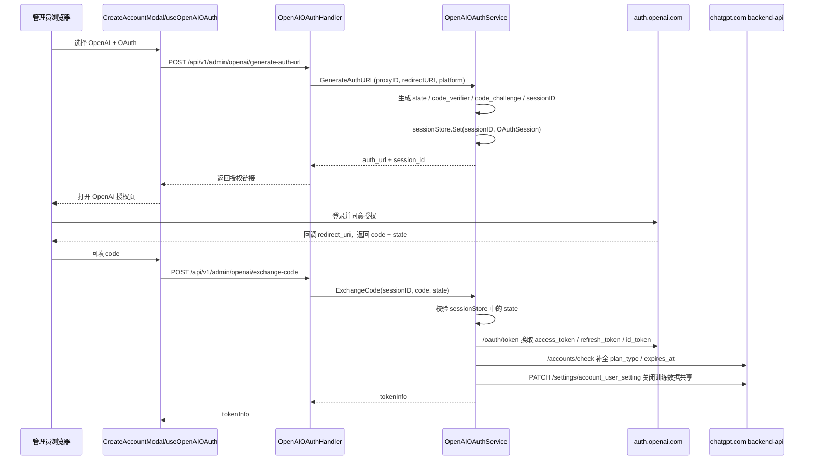
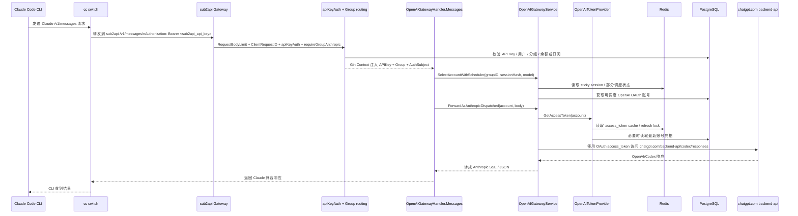

# OpenAI OAuth -> sub2api -> Claude Code 网关流转图

> 适用场景：`ChatGPT Team` 账号通过 `OpenAI OAuth` 接入 `sub2api`，再由 `sub2api` 的 API Key 导入 `cc switch`，最终供 `Claude Code CLI` 使用。
>
> 这里的“OAuth 转 API”不是把 `ChatGPT Team` 订阅余额变成 `platform.openai.com` 的 API credits，而是：
> 1. `sub2api` 持有 OpenAI OAuth 凭据，代表你的 ChatGPT 账号访问 `auth.openai.com` / `chatgpt.com`
> 2. 下游客户端持有的是 **sub2api 自己的 API Key**
> 3. `sub2api` 在中间做分组鉴权、账号调度、模型映射与协议转换

## 一、边界与节点

### 1.1 节点角色

| 节点 | 身份 | 说明 |
| --- | --- | --- |
| 管理员浏览器 | 调用方 | 打开后台、发起 OAuth、创建账号/分组 |
| `frontend/src/components/account/CreateAccountModal.vue` | 调用方 | OpenAI OAuth 表单、账号创建与开关配置 |
| `backend/internal/handler/admin/openai_oauth_handler.go` | 被调用方 | 管理端 OpenAI OAuth HTTP 入口 |
| `backend/internal/service/openai_oauth_service.go` | 被调用方 | PKCE、state 校验、code 换 token、refresh token |
| `auth.openai.com` | 被调用方 | OpenAI OAuth 授权与 token 交换 |
| `chatgpt.com/backend-api/*` | 被调用方 | 查询 Team/plan 信息，关闭训练数据共享 |
| `backend/internal/server/routes/gateway.go` | 被调用方 | 运行时网关入口 |
| `backend/internal/handler/openai_gateway_handler.go` | 被调用方 | OpenAI 兼容网关 Handler |
| `backend/internal/service/openai_gateway_service.go` | 被调用方 | 调度、取 token、转发、失败切换 |
| PostgreSQL | 被调用方 | 账号、分组、API Key、用量持久化 |
| Redis | 被调用方 | sticky session、token cache、部分调度状态 |
| `cc switch` | 调用方 | 保存 `sub2api` base URL + API Key |
| `Claude Code CLI` | 调用方 | 最终发起 Anthropic 兼容请求 |

### 1.2 最重要的边界事实

1. **上游是 OpenAI OAuth，不是 OpenAI API Key**
   - OpenAI OAuth 账号运行时通过 `GetAccessToken()` 获取 `access_token`
   - 对 OAuth 账号，直连路径优先走 `chatgpt.com/backend-api/codex/responses`

2. **下游是 sub2api API Key，不是 OpenAI 官方 Key**
   - 网关入口统一走 `apiKeyAuth`
   - `Claude Code CLI` / `cc switch` 只需要认识 `sub2api` 的域名和 Key

3. **Claude Code 主路径是 `/v1/messages`，不是 OpenAI `/v1/responses`**
   - `tkOpenAICompatMessagesPOST()` 会把 OpenAI 分组请求路由到 `OpenAIGatewayHandler.Messages()`

## 二、管理面配置链路

### 2.1 OpenAI OAuth 获取链



默认回调地址由 `backend/internal/pkg/openai/oauth.go` 提供，为 `http://localhost:1455/auth/callback`；管理端也可以显式传入自定义 `redirect_uri`。

### 2.2 代码级调用关系

```text
调用方: 管理员 UI
  -> 被调用方: useOpenAIOAuth.generateAuthUrl()
  -> 被调用方: POST /api/v1/admin/openai/generate-auth-url
  -> 被调用方: OpenAIOAuthHandler.GenerateAuthURL()
  -> 被调用方: OpenAIOAuthService.GenerateAuthURL()
      -> 被调用方: openai.GenerateState()
      -> 被调用方: openai.GenerateCodeVerifier()
      -> 被调用方: openai.GenerateCodeChallenge()
      -> 被调用方: openai.BuildAuthorizationURLForPlatform()
      -> 被调用方: sessionStore.Set()

调用方: 管理员 UI
  -> 被调用方: useOpenAIOAuth.exchangeAuthCode()
  -> 被调用方: POST /api/v1/admin/openai/exchange-code
  -> 被调用方: OpenAIOAuthHandler.ExchangeCode()
  -> 被调用方: OpenAIOAuthService.ExchangeCode()
      -> 被调用方: sessionStore.Get() + state 常量时间比较
      -> 被调用方: oauthClient.ExchangeCode() -> auth.openai.com/oauth/token
      -> 被调用方: openai.ParseIDToken()
      -> 被调用方: fetchChatGPTAccountInfo() -> chatgpt.com/backend-api/accounts/check/*
      -> 被调用方: disableOpenAITraining() -> chatgpt.com/backend-api/settings/*
      -> 被调用方: sessionStore.Delete()
```

### 2.3 OAuth 成功后如何落库

`CreateAccountModal.vue` 在拿到 `tokenInfo` 后会构造：

- `credentials`
  - `access_token`
  - `refresh_token`
  - `id_token`
  - `expires_at`
  - `email`
  - `chatgpt_account_id`
  - `chatgpt_user_id`
  - `organization_id`
  - `plan_type`
  - `client_id`
  - 可选 `model_mapping`

- `extra`
  - `privacy_mode`
  - `openai_oauth_responses_websockets_v2_mode`
  - `openai_oauth_responses_websockets_v2_enabled`
  - `openai_passthrough`
  - `codex_cli_only`

之后调用链为：

```text
调用方: 管理员 UI
  -> 被调用方: POST /api/v1/admin/accounts
  -> 被调用方: AdminService.CreateAccount()
      -> 被调用方: accountRepo.Create()
      -> 被调用方: accountRepo.BindGroups()
      -> 被调用方: EnsureOpenAIPrivacy() [异步 best-effort]
          -> 被调用方: disableOpenAITraining()
          -> 被调用方: accountRepo.UpdateExtra({"privacy_mode": mode})
```

### 2.4 分组与下游 API Key 绑定链

你的实际使用链不应把 OpenAI OAuth 直接暴露给客户端，而应再套一层 `sub2api` 分组和 API Key。

```text
调用方: 管理员 UI / API
  -> 被调用方: Create/Update Group
      -> group.platform = "openai"
      -> group.allow_messages_dispatch = true
      -> group.require_oauth_only = true
      -> group.require_privacy_set = true
      -> group.messages_dispatch_model_config = {...}

调用方: 管理员 / 用户
  -> 被调用方: 创建 sub2api API Key
      -> API Key 绑定到 openai 分组
      -> 后续 runtime 由 apiKeyAuth 注入 group 到 ctx

调用方: cc switch
  -> 被调用方: 保存 sub2api base_url + sub2api API Key
```

## 三、运行时调用链

### 3.1 最终外部链路

对 `Claude Code CLI` 最关键的实际链路是：



### 3.2 `/v1/messages` 代码主链

```text
调用方: Claude Code CLI
  -> 调用方: cc switch
  -> 被调用方: POST /v1/messages

被调用方: routes.RegisterGatewayRoutes()
  -> RequestBodyLimit
  -> ClientRequestID
  -> OpsErrorLogger
  -> InboundEndpointMiddleware
  -> apiKeyAuthWithSubscription()
      -> apiKeyService.GetByKey()
      -> subscriptionService.GetActiveSubscription() [如分组是订阅制]
      -> setGroupContext(c, apiKey.Group)
  -> requireGroupAnthropic
  -> tkOpenAICompatMessagesPOST()
      -> isOpenAICompatPlatform(group.Platform)
      -> OpenAIGatewayHandler.Messages()

被调用方: OpenAIGatewayHandler.Messages()
  -> 读取请求体，校验 model / stream
  -> Group.ResolveMessagesDispatchModel(requestedModel)
  -> gatewayService.ResolveChannelMappingAndRestrict()
  -> billingCacheService.CheckBillingEligibility()
  -> gatewayService.GenerateSessionHash()
  -> gatewayService.SelectAccountWithScheduler()
  -> gatewayService.ForwardAsAnthropicDispatched()

被调用方: OpenAIGatewayService.SelectAccountWithScheduler()
  -> getStickySessionAccountID() [Redis]
  -> scheduler.Select()
      -> listSchedulableAccounts()
      -> resolveOpenAICompatPlatform(ctx)
      -> filterAndRank()
          -> account.IsSchedulable()
          -> account.IsModelSupported()
          -> RequirePrivacySet -> account.IsPrivacySet()
          -> 负载/排队/错误率/TTFT 排序
  -> BindStickySession() [Redis]

被调用方: OpenAIGatewayService.ForwardAsAnthropicDispatched()
  -> ShouldDispatchToNewAPIBridge(account, "chat_completions")
      -> 对 openai OAuth 账号通常为 false
  -> ForwardAsAnthropic()
      -> Anthropic 请求转 OpenAI Responses 风格
      -> GetAccessToken()
          -> OpenAITokenProvider.GetAccessToken()
              -> Redis token cache
              -> 必要时 refresh token
      -> buildUpstreamRequest()
      -> httpUpstream.Do()
      -> OpenAI 响应再转回 Anthropic JSON / SSE
```

### 3.3 其他 OpenAI 兼容入口

| 下游入口 | 路由分发 | 主要上游 |
| --- | --- | --- |
| `/v1/messages` | `tkOpenAICompatMessagesPOST` | OpenAI OAuth 直连，或 `newapi bridge` |
| `/v1/responses` / `/responses` | `tkOpenAICompatResponsesPOST` | OpenAI Responses / Codex |
| `GET /v1/responses` | `OpenAIGatewayHandler.ResponsesWebSocket` | OpenAI Responses WS v2 |
| `/v1/chat/completions` | `tkOpenAICompatChatCompletionsPOST` | 先转 Responses 再转发 |
| `/v1/embeddings` | `tkOpenAICompatEmbeddingsHandler` | OpenAI v1 JSON |
| `/v1/images/generations` | `tkOpenAICompatImageGenerationsHandler` | OpenAI v1 JSON |

## 四、一致性与稳定性关键点

### 4.1 哪些状态是强依赖共享的

| 状态 | 存储位置 | 部署含义 |
| --- | --- | --- |
| OAuth `session_id -> state/code_verifier` | **进程内内存** `SessionStore` | `generate-auth-url` 与 `exchange-code` 必须命中同一实例 |
| `sessionHash -> accountID` sticky session | **Redis** `gateway_cache` | 多实例共享 Redis 时，HTTP 粘性调度可保持一致 |
| OpenAI access token cache / refresh lock | **Redis** | 多实例下可避免重复 refresh |
| `response_id -> accountID` (WS 续链) | Redis + 本地热缓存 | 跨实例可一定程度续链 |
| WS `session turn state` / `session conn` | **仅进程内内存** | WS 模式不适合跨区域双活乱切 |

### 4.2 对你场景最重要的代码事实

1. **OAuth 授权会话是内存态**
   - `openai.SessionStore` 不落 Redis
   - 所以管理端 OAuth 回调不能随意跨实例漂移

2. **HTTP 主链的一致性主要靠 Redis**
   - `BindStickySession()` / `GetSessionAccountID()` 走 Redis
   - token cache 与 refresh lock 也依赖 Redis

3. **WS mode 有本地进程状态**
   - `OpenAIWSStateStore` 的 `session turn state` 和 `session conn` 只保存在当前进程
   - 所以 OpenAI OAuth 若跑 WS mode，不适合跨区域双活或无粘性负载均衡

4. **`codex_cli_only` 会拒绝 Claude Code**
   - `Forward()` 中若账号开启 `codex_cli_only`
   - 非 Codex 官方客户端会直接返回 `This account only allows Codex official clients`

5. **`RequirePrivacySet` 会影响调度**
   - 分组若开启 `require_privacy_set`
   - 只有 `account.Extra["privacy_mode"] == "training_off"` 的 OpenAI OAuth 账号才会被调度

### 4.3 模型映射对 Claude Code 很关键

`/v1/messages` 下，分组会优先用 `ResolveMessagesDispatchModel()` 将 Claude 模型族映射到 OpenAI 侧模型：

- `opus` 默认映射到 `gpt-5.4`
- `sonnet` 默认映射到 `gpt-5.3-codex`
- `haiku` 默认映射到 `gpt-5.4-mini`
- 也可通过 `messages_dispatch_model_config.exact_model_mappings` 做精确映射

这意味着：

1. `Claude Code CLI` 发来的模型名仍可能是 `claude-*`
2. `sub2api` 需要在分组层把它稳定映射到你允许的 OpenAI 上游模型
3. 不建议把这层映射下放到客户端，应该由服务端统一治理

## 五、业务侧运行时配置

> 本节只覆盖与代码模块直接相关的"分组 / 账号 / 下游接入"配置。基础设施层（AWS 拓扑、ALB、ECS、RDS、Redis、CI/CD、DNS 切换、附录登记表）见 `docs/deploy/aws-us-openai-gateway-deployment.md`，不在此重复。

### 5.1 流程对部署的硬约束

下列约束直接来自第四节代码事实，必须在部署方案里落地（实现细节见 deploy.md）：

| 约束 | 来源 | deploy.md 实现位置 |
| --- | --- | --- |
| 管理端 OAuth 必须有实例粘性 | 4.2.1 SessionStore 是内存态 | deploy 5.3 |
| Redis 是关键运行时组件，不可降级 | 4.2.2 sticky / token cache 走 Redis | deploy 第七节 |
| WS mode 当前不作为主生产链路 | 4.2.3 WS 状态本地化 | deploy 第七节、十二节 |
| 客户端统一使用 `https://api.tokenkey.dev`，主路径固定为 `/v1/messages` | 1.2 边界事实 | deploy 第四节、九节 |

### 5.2 OpenAI 分组配置

- `platform = openai`
- `allow_messages_dispatch = true`
- `require_oauth_only = true`
- `require_privacy_set = true`
- `messages_dispatch_model_config` 明确写死给 Claude Code 使用的模型映射（参考 4.3）

### 5.3 OpenAI OAuth 账号配置

- `type = oauth`
- `proxy_id` 优先使用美国出口或美国机房直连
- `openai_passthrough = false`
- `openai_oauth_responses_websockets_v2_mode = off`
- `codex_cli_only = false`
- 为不同账号设置合理 `priority` / `concurrency`

### 5.4 下游接入

- `cc switch` 导入的是 **sub2api API Key**（不是 OpenAI 官方 Key）
- `base_url` 指向 `https://api.tokenkey.dev`
- `Claude Code CLI` 通过 `/v1/messages` 使用

### 5.5 业务侧上线动作

基础设施 Phase 由 deploy.md 第十一节负责；下面只是业务侧需要在基础设施就绪后做的事：

1. 用美国网络完成 OpenAI OAuth 授权，确认账号 `privacy_mode = training_off`
2. 创建 `platform = openai` 的专用分组，按 5.2 配置
3. 按 5.3 配置 OAuth 账号并绑定到分组
4. 为该分组签发 sub2api API Key
5. 按 5.4 在 `cc switch` 中接入

完整端到端验证（含基础设施部分）见 deploy.md "完成标志"。

## 六、关键文件索引

| 阶段 | 文件 | 核心函数/类型 |
| --- | --- | --- |
| OpenAI OAuth 授权入口 | `backend/internal/handler/admin/openai_oauth_handler.go` | `GenerateAuthURL`, `ExchangeCode`, `RefreshToken` |
| PKCE / state / token 交换 | `backend/internal/service/openai_oauth_service.go` | `GenerateAuthURL`, `ExchangeCode`, `RefreshAccountToken` |
| OpenAI OAuth 常量 | `backend/internal/pkg/openai/oauth.go` | `ClientID`, `DefaultRedirectURI`, `BuildAuthorizationURLForPlatform` |
| Team/隐私补全 | `backend/internal/service/openai_privacy_service.go` | `fetchChatGPTAccountInfo`, `disableOpenAITraining` |
| 账号创建后隐私补偿 | `backend/internal/service/admin_service.go` | `CreateAccount`, `EnsureOpenAIPrivacy` |
| 网关路由入口 | `backend/internal/server/routes/gateway.go` | `RegisterGatewayRoutes` |
| OpenAI 兼容路由分发 | `backend/internal/server/routes/gateway_tk_openai_compat_handlers.go` | `tkOpenAICompatMessagesPOST`, `tkOpenAICompatResponsesPOST` |
| API Key 鉴权 | `backend/internal/server/middleware/api_key_auth.go` | `apiKeyAuthWithSubscription` |
| `/v1/messages` Handler | `backend/internal/handler/openai_gateway_handler.go` | `Messages` |
| OpenAI 调度器 | `backend/internal/service/openai_account_scheduler.go` | `SelectAccountWithScheduler` |
| sticky session | `backend/internal/repository/gateway_cache.go` | `GetSessionAccountID`, `SetSessionAccountID` |
| OAuth token cache | `backend/internal/service/openai_token_provider.go` | `GetAccessToken` |
| OpenAI 运行时主服务 | `backend/internal/service/openai_gateway_service.go` | `GetAccessToken`, `BindStickySession`, `Forward` |
| `/v1/messages` 模型映射 | `backend/internal/service/openai_messages_dispatch.go` | `ResolveMessagesDispatchModel` |
| bridge 分发边界 | `backend/internal/service/openai_gateway_bridge_dispatch.go` | `ShouldDispatchToNewAPIBridge`, `ForwardAsResponsesDispatched` |
| Anthropic -> OpenAI 转发 | `backend/internal/service/openai_gateway_bridge_dispatch_tk_anthropic.go` | `ForwardAsAnthropicDispatched` |
| WS 状态存储 | `backend/internal/service/openai_ws_state_store.go` | `BindResponseAccount`, `BindSessionTurnState` |
