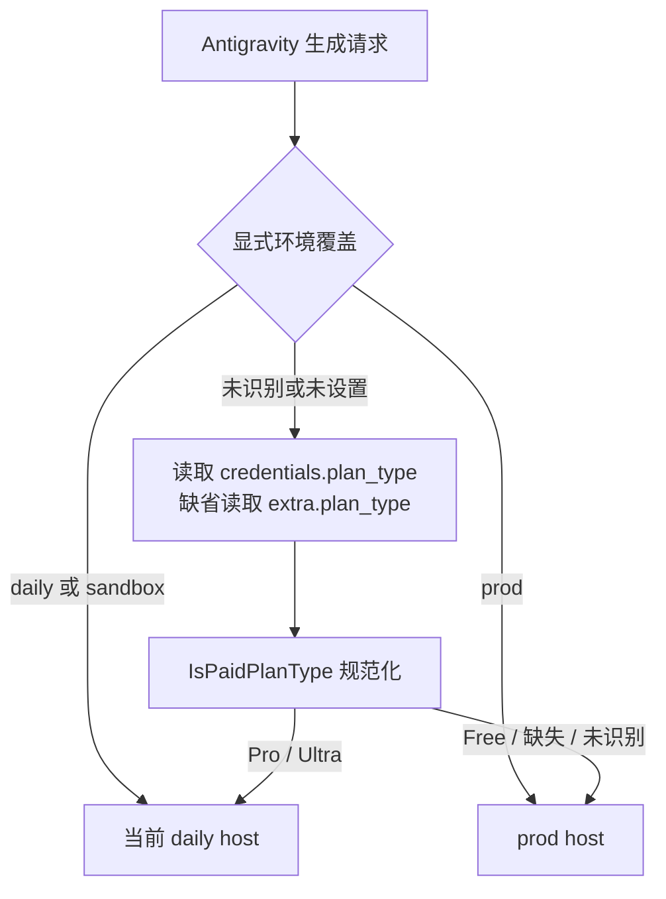

# TokenKey Antigravity daily / prod：历史、原则与社区证据

观察日期：2026-09-30。本地基线 `a38cf0ff830f8d9e607d77a8f32e11dccc27bf4e`。结论来自 Git 历史、GitHub PR / issue 正文及评论、当前源码，以及[本次 edge 直测](google-ai-pro-ultra-oauth-image-live-probe-20260930.md)。没有修改线上路由或配置。

## 结论：不应该再做“所有账号一起换端点”

**这段历史混合了三个变化：daily 域名本身变了、全局默认变了、选址从全局默认变成按账号权益。** 另外还有一条独立争论：是否自动跨 host fallback。把它们统称为“daily 又坏了、换回 prod”，容易丢失修复的适用条件。

TokenKey 当前明确规则由 [PR #1767](https://github.com/youxuanxue/sub2api/pull/1767) 确立：

1. 显式 `GATEWAY_ANTIGRAVITY_FORWARD_BASE_URL` 覆盖优先。
2. 无覆盖时，保存的 `credentials.plan_type`（缺省再看 `extra.plan_type`）经统一 owner 规范化；Pro / Ultra 选 **`daily-cloudcode-pa.googleapis.com`**。
3. Free、未知、缺失或未识别的档位保守选 **`cloudcode-pa.googleapis.com`**。这是现有默认策略，本次未实测免费账号。
4. 不从 `BaseURLs[0/1]` 的排序推断付费/免费选址；不恢复旧的 `daily-cloudcode-pa.sandbox.googleapis.com`。
5. 当前生成 retry loop 使用一个已选定的 URL。虽然仍有 URL fallback 相关代码和注释，**不能据此宣称运行时已经自动在 prod/daily 之间切换**。

今天的同账号对照再次支持付费账号选 daily：Ultra 同为 `generateContent`，prod 429、daily 200 且返回可解码图片；Pro daily 的非流式和流式都成功。它不证明所有 Google OAuth 凭据都该改成 daily，也不证明 daily 的所有 429 都可通过换 host 解决。

## 1. 三个地址必须写全

| 名称 | 完整 host | 在这段历史中的角色 |
|---|---|---|
| prod | `cloudcode-pa.googleapis.com` | 项目/权益发现常见入口；当前 TokenKey 免费/未知档位生成默认入口 |
| 当前 daily | `daily-cloudcode-pa.googleapis.com` | 官方客户端与社区观察到的个人付费推理入口；本次 Pro / Ultra 图片成功 |
| 旧 daily / sandbox | `daily-cloudcode-pa.sandbox.googleapis.com` | 旧常量与旧优先顺序曾指向它；历史出现版本提示、401 或特定账号可用等不同结果 |

`GATEWAY_ANTIGRAVITY_FORWARD_BASE_URL=sandbox` **目前只是兼容关键字，会选当前 daily host**，不是将请求发往旧 sandbox 域名。配置值应是 `daily` / `prod` 等已支持关键字，不能填完整 URL；本地 resolver 对其他值会继续走账号默认策略。

## 2. Git / PR 时间线

前几项为继承的上游历史；表中同时区分上游合并和进入 TokenKey 主线，避免把提交日期当作部署日期。

| 时间 | 变更与来源 | 原因、证据及后续含义 |
|---|---|---|
| 2026-01-09 | 上游提交 [2d83941aa](https://github.com/Wei-Shaw/sub2api/commit/2d83941aa)：sandbox → daily → prod fallback | 当时同时保留三个 host，目标是应对不同入口可用性；不是当前二选一的按账号策略 |
| 2026-01-17 | 上游提交 [cc0fca35e](https://github.com/Wei-Shaw/sub2api/commit/cc0fca35e)：同步 Antigravity-Manager | 列表收成 prod 优先、旧 daily sandbox 备用；发现/登录与转发的选择逐渐分离 |
| 2026-01-28 | 上游提交 [5b787334c](https://github.com/Wei-Shaw/sub2api/commit/5b787334c)：转发优先 daily | `ForwardBaseURLs()` 改转发优先顺序，不能只看全局 `BaseURLs` 第一项推断实际转发 host |
| 2026-02-10 | 上游 [PR #543](https://github.com/Wei-Shaw/sub2api/pull/543)，已合并 | 作者明确说自动切换会误判，把转发/测试改成**单 URL**，默认 daily、环境变量可选 prod；不是“增加更积极 fallback” |
| 2026-05-08 | 上游 [PR #2300](https://github.com/Wei-Shaw/sub2api/pull/2300)，本次查询仍 open | 提议去掉 `.sandbox`，报告旧 host 返回版本失效文本而非真实推理。该 PR 未合并，不能把提案当成当时已发布修复 |
| 2026-07-07 上游合并；07-09 TokenKey 引入 | 上游 [PR #3708](https://github.com/Wei-Shaw/sub2api/pull/3708)，经 TokenKey [PR #1277](https://github.com/youxuanxue/sub2api/pull/1277) 引入 | 默认从旧 daily/sandbox 改为 prod。正文记录：新授权 token 在两条路径表现不同；发往旧 sandbox 导致 401/502 和账号被停，刷新 token 无济于事。它针对当时的 host/凭据组合，不能扩大成“付费账号永远必须走 prod” |
| 2026-08-13/14 提出；08-21 上游合并 | 上游 [issue #5611](https://github.com/Wei-Shaw/sub2api/issues/5611)、[PR #5612](https://github.com/Wei-Shaw/sub2api/pull/5612)、[PR #5625](https://github.com/Wei-Shaw/sub2api/pull/5625) | Pro `paidTier` 有权益、prod 全模型 429、daily 正常。#5612 加入付费档选址；#5625 单独改正 daily host。这是两项修复，不能只 cherry-pick 其中一项就认为完整 |
| 2026-08-21 TokenKey 合并 | TokenKey [PR #1767](https://github.com/youxuanxue/sub2api/pull/1767)，提交 `02885cc50` | 同时落地官方 daily host、Pro/Ultra daily / 免费 prod、named URL owner、统一 `IsPaidPlanType`，并加测试与 sentinel；解决数组重排把免费/付费流量颠倒的风险 |
| 2026-08-23 TokenKey 合并 | TokenKey [PR #1775](https://github.com/youxuanxue/sub2api/pull/1775) | 上游 #5612/#5625 的提交此时进入 fork 祖先链；**不是又把 #1767 的策略撤销一次** |
| 2026-09-18（北京时间） | TokenKey [PR #2205](https://github.com/youxuanxue/sub2api/pull/2205) | 修后台测试只读、图片 modalities 与图片预览。PR 明确“对外网关转发端点未改，付费仍走 daily”；属于测试语义修复，不是选址翻转 |
| 2026-09-30 | 本次 Pro / Ultra edge 直测 | 正式 daily 生成成功、prod 返回 429；再次验证付费选址方向。没有修改线上设置，也没有重新引入全局开关 |

因此，你记得的“换来换去”有真实 Git 依据；其中一部分是旧域名和新域名被同名混淆，一部分是早期全局默认无法覆盖不同档位，还有一部分只是上游合并或测试路径改动，并非再次改变当前生成策略。

## 3. 当前实现的单一决策路径

实现证据：

- [resolver 与单 URL retry loop](../../backend/internal/service/antigravity_gateway_retry.go)：显式覆盖与账号决策；`availableURLs := []string{baseURL}`。
- [域名 owner](../../backend/internal/pkg/antigravity/oauth.go)：`ProdBaseURL()`、`DailyBaseURL()`；不从动态排序取身份语义。
- [套餐 owner](../../backend/internal/pkg/antigravity/client.go)：`GetTier()` 优先 `paidTier`，其次 `currentTier`；`TierIDToPlanType()` / `IsPaidPlanType()` 规范化。
- [OAuth 服务](../../backend/internal/service/antigravity_oauth_service.go)与[前端凭据 builder](../../frontend/src/composables/useAntigravityOAuth.ts)：当前会保留 `plan_type`。本次实测账号已确认 Google 返回的真实 paidTier。
- [选择规则测试](../../backend/internal/service/antigravity_gateway_tk_daily_test.go)、[sentinel](../../scripts/sentinels/antigravity.json)：已有防回退约束；本次只读检查，没有声称重新运行了这些 Go 测试。

`loadCodeAssist` / `fetchAvailableModels` 的成功，不代表同 host 的 `generateContent` 可用；它们是不同 action。配额发现、隐私请求、模型生成也不应因同属 Antigravity 就机械复用同一个全局首选顺序。

## 4. 社区经验：支持条件路由，没有“所有 429 都换 daily”的共识

| 来源及状态（2026-09-30 查询） | 有用经验 | 证据强度 / 使用边界 |
|---|---|---|
| Sub2API [#5611](https://github.com/Wei-Shaw/sub2api/issues/5611)，closed；#5612/#5625 已合并 | 同 token / project / UA 对照 prod 429、daily 200；多条评论独立复现；`currentTier=free-tier` 与 `paidTier=g1-pro-tier` 可同时出现 | 与今天的 Pro / Ultra 生图观察一致；作者对 Google 内部档位机制的解释仍属于逆向诊断，不是官方 API 保证 |
| [#5611 评论](https://github.com/Wei-Shaw/sub2api/issues/5611#issuecomment-5290076462) | 环境变量应填 `daily`，不是完整 URL；另有旧模型 alias 对新 wire ID 的问题 | 选址与模型 ID 是两层问题；换 host 之后出现 400/404 不等于 daily 又坏了 |
| Sub2API [#5933](https://github.com/Wei-Shaw/sub2api/issues/5933) / [PR #5937](https://github.com/Wei-Shaw/sub2api/pull/5937)，仍 open | 提议恢复有序 fallback，区分 URL/节点级 429 与账号/模型额度 429 | 这是未合并方案，不是现有 TokenKey 行为；其评论另建议首选顺序与 paidTier 合并。不能把泛化 429 当可靠的跨 host 重试信号 |
| Sub2API [#6820](https://github.com/Wei-Shaw/sub2api/issues/6820)，closed | OAuth 创建链丢失 plan_type，使已有付费 resolver 仍选 prod；后台 refresh 可能掩盖创建时遗漏 | “代码里已有付费策略”还不够，需要登录/导入/重授权/刷新都保留档位；当前本地代码已能看到该字段 |
| Sub2API [#7255](https://github.com/Wei-Shaw/sub2api/issues/7255)，closed | 有人在 daily 也遇到 429，评论猜测“端点又改了”，后称 0.26 已解决 | 缺少受控 A/B 与具体修复定位；不能拿评论猜测证明 Google 再次迁移了端点 |
| Sub2API [PR #7295](https://github.com/Wei-Shaw/sub2api/pull/7295)，仍 open | 提议用 `retrieveUserQuotaSummary` 的 5h/weekly 桶，并让配额查询 daily 优先 | 支持“模型 quotaInfo 不是完整订阅额度”的诊断方向；不是已合并能力，更不证明面板 100% 就可无限生成 |
| CLIProxyAPI [PR #2670](https://github.com/router-for-me/CLIProxyAPI/pull/2670)，04-10 已合并 | 当时曾把 prod 提到 fallback 第一位 | 历史策略；不能套用为今天 CPA 的默认配置。固定版本当前已默认 consumer 推理 daily，loadCodeAssist 默认 prod |
| CLIProxyAPI [#4696](https://github.com/router-for-me/CLIProxyAPI/issues/4696)，closed | 报告同账号、同 endpoint，system identity 文本变化导致 200/429；其他用户有类似反馈 | 说明 429 可能与 payload 有关；本文没有复测该特定字符串，也不将所有 429 归因于指纹 |
| CLIProxyAPI [#6184](https://github.com/router-for-me/CLIProxyAPI/issues/6184)，closed | 维护者解释：用户自定义 `headers.User-Agent` 会覆盖自动版本管理，旧值可能造成模型 404 | UA、模型变体、请求构造是独立检查项；IDE 的 UA 版本不能直接替换 TokenKey 所选的 CLI 指纹 owner |

CPA 当前源码对照：[resolveAntigravityRequestBaseURL / antigravityLoadCodeAssistBaseURL](https://github.com/router-for-me/CLIProxyAPI/blob/a270e7b9e57aaecd8f82555f44c2108518ad2330/internal/runtime/executor/antigravity_executor_request.go)。该版本 consumer 生成默认 daily，enterprise/GCP 可显式配置 base_url；注释明确不做跨档位 fallback。这与 TokenKey“已识别付费 daily、未知保守 prod”的默认策略不完全相同，不宜宣称社区已经统一所有账号行为。

## 5. 建议坚持的原则

- **把选址视为账号/授权产品/action 的兼容契约。** 新结论应写清真实 hostname、paidTier、模型 wire ID、action、指纹和时间，不再只写“daily 有效”。
- **单变量证明后再改默认。** 同账号、尽可能同 token、相同 body 与 UA，仅换 host；随后验证真实输出。发现接口 200、模型列表、空内容 200 都不能代替生成成功。
- **先核档位传递和实际命中，再处理配额。** paidTier → plan_type → resolver 的链路断了，应修断点；不因一个账号误路由而把整个 fleet 强制 daily。
- **保留失败类别。** 401、URL/节点容量、账号配额、模型不可用、payload 拒绝、内容阻断与未知结果分别处理。不能看见 429 就刷新 token、换出口、换 endpoint 或停整号。
- **跨 host fallback 是单独的实现决策。** 若将来需要，必须定义可重试错误及生成副作用边界；图片请求未知结果不能自动重放。本次不修改当前单 URL 策略。
- **防漂移已具备代码约束，继续复用 owner。** 上游合并后应检验 named host、paid-tier 判断、plan_type 保留和测试/实际调用一致性，不再复制第二套列表或数组下标逻辑。
