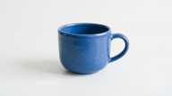
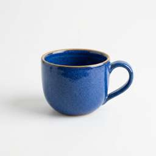

# Antigravity OAuth 与 Gemini Web 生图：参数和实测对比

日期：2026-09-30。扩展参数测试窗口 **02:16–02:25 UTC / 10:16–10:25 Asia/Shanghai**。延续[Pro / Ultra 直测](google-ai-pro-ultra-oauth-image-live-probe-20260930.md)，对应的[端点历史与社区经验](antigravity-endpoint-history-20260930.md)另列。

## 结论与推荐

**需要 API 级分辨率选择、超宽比例和参考图编辑时，优先 Antigravity OAuth 的原生 Gemini 路径；只需要五种常见比例、约 2K 原图的单轮文本生图时，现有 Gemini Web Worker 也已实测可用。**

- Antigravity：已验证 1K、2K、4K，五种常见比例加 21:9，以及参考图改色；但 `candidateCount=2` 被 Google 明确拒绝。
- Gemini Web：五种契约比例全部成功，原图分别落在约 2K 档；不提供 imageSize 选择，超白名单比例、参考图和多候选参数在 Worker 层拒绝。
- 两条通道不能因公开模型别名相同就视为同一能力。Web 的 `gemini-web-pro-image` 是“Web Pro selector + image mode”的内部名称，**没有直接证明它就是 Gemini API 的某个 Pro Image 型号**。

## 1. 对比口径

| 项目 | Antigravity OAuth | Gemini Web |
|---|---|---|
| 本次 edge / 账号 | us5 / #21 `anti-109`；Google `paidTier=g1-pro-tier` 已在上一轮确认 | us5 / #28 `gemini-web-504`；可用 Web 会话；本次未独立确认其 Google AI 订阅等级 |
| 凭据 | access / refresh token；Google project；凭据留在 edge | 浏览器 Cookie + user_agent + 会话状态；仍由现有 Worker / 数据库生命周期管理 |
| 执行路径 | edge 直接 HTTPS 调用 daily Cloud Code，无公网网关和调度 | edge 直接调用已部署 Worker 的原生 HTTP 接口；Worker 按现有契约访问 Google Web |
| 模型 | `gemini-3.1-flash-image` | `gemini-web-pro-image` → Web 页面模型类别 `Pro` 加 image mode |
| 生成入口 | `https://daily-cloudcode-pa.googleapis.com/v1internal:generateContent` | Worker `/v1beta/models/gemini-web-pro-image:generateContent`；其 Google 上游为 `gemini.google.com/.../BardFrontendService/StreamGenerate` |
| 图片取得 | 生成响应 `inlineData` | 解析图片引用，再走原图授权 RPC 和下载；无预览图放大或预览兜底 |
| 本轮版本 | 应用 `1.8.266`；临时直测脚本不经过应用转换器 | Worker 镜像 `71a7e02f559a` |

两个账号不是受控的同一 Google 用户；所以结果用于比较当前通道的参数和输出行为，不是订阅档位或模型画质的公平跑分。扩展参数主要验证 Pro；Ultra 只沿用上一轮 1K 成功证据，未把所有参数矩阵再跑一遍。

生成请求串行执行。除参考图编辑外，提示词统一为“白底蓝色陶瓷杯、极简产品摄影、无文字”。每个成功结果均 Base64 解码，再用 Pillow 完整解码，记录真实像素、MIME 和 SHA-256。没有改线上分组、映射、调度、会话保护开关或部署。

us5 的 Web #27 在发现时处于 `generation_pending=true`，本轮没有使用它或清除状态；选择了正常的 #28。正常生成会更新 #28 的 Cookie / runtime / 租约，这属于 Worker 原有生命周期。

## 2. 五种共同 ratio 的真实输出

Antigravity 列显式指定 `imageSize=1K`；Web 列只传 aspectRatio，**没有传 2K，也没有在本地放大**。

| aspectRatio | Antigravity：1K | Gemini Web：原图 | 观察 |
|---|---|---|---|
| `1:1` | 1024×1024（上一轮同账号） | 2048×2048 | Web 本样本边长为 2 倍 |
| `16:9` | 1376×768 | 2752×1536 | 两边都遵循横向构图 |
| `9:16` | 768×1376 | 1536×2752 | 两边都遵循竖向构图 |
| `3:4` | 896×1200 | 1792×2400 | Web 与 AG 显式 2K 的同 ratio 输出尺寸一致 |
| `4:3` | 1200×896 | 2400×1792 | Web 本样本宽高均为 2 倍 |

这些 ratio 是模型支持的比例档位，像素会按模型尺寸网格对齐，不能承诺数学上完全精确的分数比。`1K` 也不是“最长边恒为 1024”；如 16:9 的 1K 实际为 1376×768。

| Antigravity 16:9 / 1K 缩略图 | Gemini Web 16:9 原图的缩略图 |
|---|---|
|  |  |

缩略图仅展示内容与构图，不用于比较 1K / 2K 画质；上表尺寸来自原始图片完整解码。

## 3. 分辨率、特殊比例、参考图与数量

| 项目 | Antigravity 本轮实测 | 当前 Gemini Web Worker |
|---|---|---|
| 1K | 可显式指定；共同 ratio 均成功 | 无 imageSize 参数；不要把不传档位理解为 1K |
| 2K | `3:4 + 2K` → **1792×2400**，22.610 s | 相同 ratio、不传档位 → **1792×2400**，29.812 s；显式加 `imageSize=2K` 反而 400 |
| 4K | `1:1 + 4K` → **4096×4096**，32.820 s | 当前 schema 不允许 imageSize；本轮未绕过契约探网页内部 4K 选项 |
| 21:9 | `21:9 + 1K` → **1584×672**，10.858 s | HTTP 400：`Unsupported imageConfig.aspectRatio`，在 Google 生成前拒绝 |
| 参考图改色 | `inlineData` 输入先前蓝杯 JPEG，8.495 s 返回 1024×1024 红杯；已视觉核验 | HTTP 400：`Only text input parts are supported`；目前仅接文本 parts |
| `candidateCount=2` | Google HTTP 400：`Multiple candidates is not enabled for this model` | Worker HTTP 400：`Unsupported generationConfig field` |
| `temperature=0.5` | 原生路径可携带 sampling 字段，但本轮未验证其图像效果或上游接受程度 | 实测 Worker HTTP 400：`Unsupported generationConfig field` |

**`n → candidateCount` 能写入请求，不等于该图片模型允许批量。** 上一份 OmniRoute 源码对比里的映射能力，不能升级成“同账号已支持 n 张”。当前该 AG 模型如需多张，应另行设计多个独立请求的数量、成本和重试控制。

Web 的上述五类负向请求均在约 20–24 ms 返回 400，前后 runtime 版本一致，`generation_pending` 保持 false；结合校验在生成前执行的源码，确认没有把不支持参数静默删掉再发起生图。

AG 1K 已覆盖上表五种共同 ratio；2K 只测 3:4、4K 只测 1:1。不要将这些结果写成“所有 ratio × 所有分辨率组合已验证”。其他比例（例如 2:3、3:2、4:5 等）本次未测，也不据此断言不支持。

参考图编辑前后：

| 输入：上一轮原始蓝杯 | AG 输出：红杯 |
|---|---|
|  |  |

这个样本验证了单次“参考图 + 文本”编辑；不是多轮会话编辑、mask 局部编辑或多参考图一致性的完整验收。

## 4. 请求契约差异

| 参数 / 行为 | Antigravity 原生 Gemini | 当前 TokenKey Gemini Web |
|---|---|---|
| body | Gemini `contents` / `generationConfig` 放入 v1internal wrapper | 顶层严格限制为 `contents` / `generationConfig` |
| 文本输入 | 本次一个 user part | 一个 user turn；可有多个纯 text part，拼接为提示词；限制 1–32000 字符 |
| `responseModalities` | 本次验证 `['TEXT','IMAGE']`；纯 IMAGE 未补测 | 契约接受含 IMAGE 的图片请求；IMAGE-only 也在 schema 范围内，本轮正向均用 TEXT+IMAGE |
| `imageConfig.aspectRatio` | 本轮六种档位已生成成功；不是硬编码成 Worker 的五项白名单 | 仅 `1:1、9:16、3:4、4:3、16:9`；映射到网页 RPC 的比例字符串和 enum 两处字段 |
| `imageConfig.imageSize` | 1K / 2K / 4K 分别有成功证据 | 额外字段即拒绝；原图尺寸由网页生成/下载决定 |
| imageConfig 缺省 / null | 本轮未作这组对照 | 源码明确均沿用默认图片 RPC；空对象、错误类型或额外字段拒绝；本轮未重新生成缺省/null 样本 |
| inlineData 输入 | 参考 JPEG 编辑已通过 | Worker 拒绝；不是读取图片后忽略它 |
| system / tools / 多轮历史 | 属原生协议更大能力面，仍受具体模型限制；本轮未做工具和多轮图像验证 | 当前单轮通道拒绝，不能压平历史或删掉 system 后伪装兼容 |
| token 上限 | 图像模型与文本预算关系未在本轮验证 | Worker 严格契约不接；统一网关另有经批准的输出预算 best-effort Plan，不能承诺实际生效 |
| 流式 | 上一轮 daily `streamGenerateContent` 返回分段 SSE，完整聚合后可解码图片；不等于图片逐像素预览 | 先完成生成和原图下载，再返回一条 SSE，是缓冲流；本轮采用非流式 |
| 图片结果 | `inlineData`，本轮实际为 JPEG | 原图下载后也包装成 `inlineData`，本轮实际为 JPEG |
| 图片 MIME / 透明背景 / quality | 未验证显式控制字段；不能把 OpenAI Images 的参数名直接照搬 | 契约未开放这些控制 |
| usage | Google 返回 `usageMetadata`，本轮记录 prompt/candidates/total tokens | Worker 响应本轮没有 Google token usage；网关估算/图片计量是另一层，不能冒充官方 usage |
| 并发与失败 | 本轮串行，不推断账号最大并发；不自动重放失败生图 | 每 Worker 图片操作并发上限 1，账号有 lease/CAS；未知生成结果保留 pending，禁止自动重试 |

### 原生调用最小差异

AG 的 request 内部：

```json
{
  "contents": [{"role": "user", "parts": [{"text": "Generate a blue ceramic cup on white background."}]}],
  "generationConfig": {
    "responseModalities": ["TEXT", "IMAGE"],
    "imageConfig": {"aspectRatio": "3:4", "imageSize": "2K"}
  }
}
```

Web Worker：

```json
{
  "contents": [{"role": "user", "parts": [{"text": "Generate a blue ceramic cup on white background."}]}],
  "generationConfig": {
    "responseModalities": ["TEXT", "IMAGE"],
    "imageConfig": {"aspectRatio": "3:4"}
  }
}
```

两者本次可以输出相同尺寸，但参数契约不同。给 Web 发送第一段并静默删掉 imageSize，会掩盖调用方意图；现有 Worker 选择明确拒绝。

## 5. 不要把 Worker 限制写成 Gemini 网页产品限制

Google 的[Gemini Apps 图片帮助](https://support.google.com/gemini/answer/14286560?hl=en)明确描述：上传一张图做编辑、上传多张参考图生成新图、对已生成图片继续修改；当前文档还区分 Nano Banana 2、Lite 与付费的 Pro 重做功能。

因此，**Web 图片编辑能力在产品层面存在；当前 TokenKey Worker 没实现并开放这条契约。** 新增参考图、会话编辑或更宽比例需要单独捕获网页请求、设计生命周期和图片上传/下载处理，不能只在 allowlist 加字段。

同样，Worker 的 `Pro` selector 不等于固定的 `gemini-3-pro-image` wire ID。当前官方帮助描述 Flash / Pro 下普通图片请求可选择 Nano Banana 2，Pro 重做另有流程；本轮没有抓取足以证明具体底层 image model 的响应身份，所以不以网关别名给它下结论。

## 6. 选型与后续边界

- **默认可控图片 API：Antigravity。** 选已确认订阅档位的账号、daily host、原生 Gemini；保留比例与分辨率参数，按真实图片计数。
- **Web 保留为独立、受限供应源。** 对纯文本 + 五种比例的请求有实测价值；输出可达约 2K，但不能宣称调用方能够指定 2K/4K。
- **能力差异交给现有 Plan。** 带 imageSize、参考图或不支持比例的请求，应排除 Web 候选；不能因为两个账号映射同一个 public model 就互相无损替代。
- **图片批量不承诺。** 本次 AG 直接拒绝多候选，Web 也不接该参数；需要多图时另行设计，不沿用普通文本 candidateCount 预期。
- **本参数对比轮次是 raw upstream / Worker 探测。** 随后的[公网全栈验证](antigravity-fullstack-validation-20260930.md)已补齐四种入口、Universal Key、实际选号与计费证据，并发现默认尺寸缺口；本地默认 2K 修复待部署。
- 未完成的扩展：所有 ratio×size 笛卡尔积、Ultra 的完整参数矩阵、长时额度与稳定性、多图输入、多轮编辑、mask、输出格式和透明背景。

## 7. 源码与证据

- [本轮脱敏逐请求证据](assets/gemini-channel-compare-20260930/evidence.json)：时间、模型、参数、HTTP、耗时、usage、完整解码尺寸/哈希、SSM CommandId，以及 Web runtime 状态。不含 Cookie、OAuth token、真实 project 和图片 Base64。
- [上一轮 1K 与流式证据](google-ai-pro-ultra-oauth-image-live-probe-20260930.md)：同一 Pro 账号的 1:1 基线与独立 Ultra 样本。
- [Worker 请求/生成/原图下载 owner](../../ops/gemini-web/worker.py)、[契约用例](../../ops/gemini-web/request_contract_cases.json)、[Web 通道批准边界](../approved/gemini-web-channel.md)。本次未修改这些实现。
- [统一 candidate / Plan 契约](../approved/candidate-eligibility-ssot.md)：保持授权范围、能力准入与实际账号执行一致。
