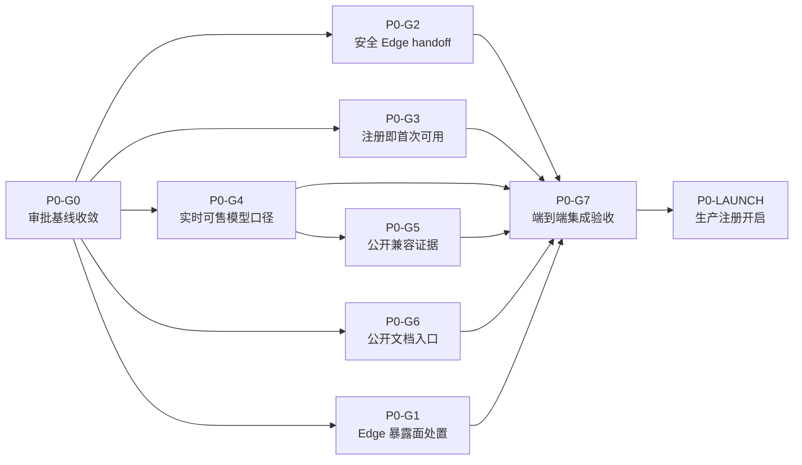

# P0：修复转化与信任 — Goal 分拆

## 1. 乔布斯的产品裁决

这个 P0 不是“五个功能”，而是一条用户承诺：

> 用户不需要相信营销文案；他可以安全进入 TokenKey，看见真实可服务的产品，确认自己的
> 客户端能够接入，并在没有人工协助和信用卡的情况下完成第一次调用。

因此，Goal 按**用户结果与独立发布/回滚边界**拆分，不按前端、后端、运维等技术层拆分。
每个 Goal 只有一个 owner、一个主结果和一组可运行的完成证据。

本文件与上述 hash 锁定的竞品报告是重新启动 P0 的唯一输入。该报告包含登录后竞品证据，
属于私有外部研究工件，特意不进入仓库或 PR；SHA-256 只用于锁定审阅版本，本文件不得复制其
凭据、登录后截图或私有证据。此前生成的
`docs/approved/p0-conversion-trust.md` 与 US-039～US-043 的旧草稿内容已退出事实源；后续不得从
其内容复制设计结论。`P0-G0` 应从用户承诺、当前代码和实时只读证据重新推导最小设计与 Story。
新建 Story 使用当时 main 的下一可用 ID；即使 ID 与被清理的未提交旧草稿重合，内容也必须重新推导。

以下事情明确不属于本 P0：

- 不扩张模型数量，不与聚合平台进行 SKU 数量竞赛；
- 不建设实时 SLA/容量状态页；兼容证据不冒充瞬时健康状态；
- 不把全站登录迁移到 HttpOnly Cookie；
- 不建设组织、项目、预算、企业采购或智能路由；
- 不开启无人值守全量或付费模型探测；
- 不以本 P0 的代码完成自动授权生产注册开启。

## 2. Goal 全景与依赖



- `P0-G0` 是所有实现和生产写操作 Goal 的设计门禁。
- `P0-G1` 可先做只读盘点；任何生产吊销、轮换或历史清理必须等待精确目标清单和人工批准。
- `P0-G2`、`P0-G3`、`P0-G4`、`P0-G6` 在基线获批后可并行。
- `P0-G5` 可提前搭骨架，但绿色 verdict 的候选集合必须依赖 `P0-G4` 的实时可售目录契约。
- `P0-G7` 是跨 Goal 验收，不是把所有功能重新捆成一个部署。
- `P0-LAUNCH` 是独立生产决策，不属于 P0 代码准备的完成条件；`P0-G3` 完成只代表
  “可以开”，不代表“已经开”。

| Goal | 唯一结果 | 依赖 | 完成形态 |
| --- | --- | --- | --- |
| `P0-G0` | 可执行、无矛盾的审批基线 | 无 | 人工批准的设计与 Story |
| `P0-G1` | 历史 Edge 暴露被精确处置 | 只读盘点无依赖；写操作依赖 G0 与人工批准 | incident evidence |
| `P0-G2` | Edge 管理跳转不再跨域暴露凭据 | G0 | 独立安全发布 |
| `P0-G3` | 承诺注册就能完成首次调用 | G0 | 代码与 staging ready，生产开关不变 |
| `P0-G4` | 所有模型数量来自可售服务投影 | G0 | 独立公开契约发布 |
| `P0-G5` | 用户看见可信的兼容证据 | G0、G4 | 独立证据/API/UI 发布 |
| `P0-G6` | 用户无需登录即可找到 canonical 文档 | G0 | 独立文档发布 |
| `P0-G7` | 完整首次成功旅程有真实 UI 证据 | G1～G6 | P0 go/no-go |
| `P0-LAUNCH` | 经独立批准开启生产邮箱注册 | G7=GO、人工批准 | 受控生产变更 |

## 3. 军团协作契约

### 3.1 每个 Goal 的工作方式

- 一个 Goal 对应一个独立任务、一个用户意图和一个主要 PR；生产处置记录不混入功能 PR。
- Goal owner 负责产品、前后端、测试和运维证据的端到端结果，不能把“我的模块已完成”当成完成。
- 公共契约由 `P0-G0` 锁定；实现 Goal 发现契约错误时，回到审批基线修订，不私自发明第二套语义。
- 每个功能 Goal 至少包含核心正向、核心负向、回归测试；有 Web 体验时必须有真实 Playwright UI 验收。
- 高风险生产动作到达人工门禁时暂停；Goal 模式的持续推进不构成生产授权。

### 3.2 唯一 owner

| 用户问题 | 唯一 owner | 其他 Goal 只能做什么 |
| --- | --- | --- |
| Edge 管理身份如何安全交接 | `P0-G2` handoff 协议 | `P0-G1` 只处置历史暴露 |
| 现在能否邮箱注册、送什么 | `P0-G3` Effective Registration Offer | 首页和文档只消费结果 |
| 注册成功后拥有什么 | `P0-G3` 原子 provisioning 事务 | Quickstart 只展示已提交资产 |
| 有多少当前可售模型 | `P0-G4` public pricing 最终投影 | 首页、模型页、文档只渲染 |
| 某客户端组合是否有证据 | `P0-G5` versioned evidence snapshot | 文档只链接和解释 |
| 接入内容写在哪里 | `P0-G6` versioned docs content model | 页面入口只引用 canonical route |
| 整条首次成功旅程是否成立 | `P0-G7` 跨 Goal E2E | 不接管各领域 SSOT |

## 4. P0-G0：收敛并审批可执行基线

### 可直接用于 Goal 模式的 Objective

> 以本 Goal 文档、hash 锁定的竞品报告、当前代码和实时只读证据为唯一输入，从零创建最小
> `docs/approved/` 设计基线和必要 Story；不得复用已退出事实源的旧设计结论。新基线必须
> 关闭 Edge handoff 授权边界、PKCE 窗口所有权、注册 Effective Offer、原子事务 owner、
> 并发锁、公开限制码、文档内容 SSOT 与发布解耦问题。完成文档渲染和 Story 一致性检查后
> 停在人工审批门禁，不修改生产行为，不把 `approved_by: pending` 自行改为已批准。

### 必须完成

- Edge 子窗口同步打开并在本地持有 PKCE verifier；prod 只接触 challenge 和单次授权码。
- handoff 使用独立、最小权限、可轮换的 control credential，不复用普通 mirror/read API key。
- 单次授权码的重试语义可实现；只存 code hash 时不承诺重放同一明文响应。
- 后端拥有唯一 `EffectiveRegistrationOffer`；它覆盖 backend mode、注册、赠额、trial key
  provisioning readiness 和必要的风控/邮件就绪状态。
- “承诺邮箱试用”是全有或全无：成功必须同时拥有赠额、恰好一把 trial key 和 Quickstart。
- 注册事务只有一个 owner，使用当前 Ent 可支持的 transaction-bound repository；不得假设
  能取得不存在的公开 `*sql.Tx`。
- 注册请求不能被全局独占锁串行化；设置变更与注册提交有可证明的顺序。
- 兼容限制码只表达用户影响和替代路径，不暴露内部 pool、账号、探测授权或 Edge 拓扑。
- 公共文档和登录后 Quickstart 使用同一内容源；发布计划拆成可独立回滚的安全、转化和证据通道。
- Mermaid、Markdown、链接和 Story 引用可机械验证。

### Done 证据

- 设计文档中不存在已知 P0 矛盾或不可实现假设。
- 新生成的必要 Story 与设计的流程、状态机、AC、测试命名一致。
- 文档渲染成功，Story/contract/preflight 检查通过。
- 人工明确批准设计；批准前所有实现 Goal 保持在设计/只读准备阶段。

### 本轮重新推导的审批工件

- Pending baseline：`docs/approved/p0-conversion-trust.md`。
- Ready Stories：US-041～US-046。
- 这些工件是 G0 的输出，不会反向改变本文件、锁定报告、当前代码和只读证据构成的输入集合。

## 5. P0-G1：处置 Edge 历史凭据暴露面

### 可直接用于 Goal 模式的 Objective

> 在不打印、复制或扩大任何秘密的前提下，完成 TokenKey Edge handoff 历史凭据暴露面的
> 精确 containment：验证每个目标 Edge 的 break-glass 登录，生成受影响管理员 session
> family 的脱敏 dry-run，审计 retained 访问/应用/错误日志和经操作者明确同意的本机浏览器
> 历史；经人工批准后逐 Edge 吊销或轮换受影响刷新凭据，对账 token version、Redis cleanup
> 与登录 smoke，并形成可审计 incident record。不得扩大到无关用户，不得静默清理浏览器
> 历史，不得把“日志未命中”解释为“从未暴露”。

### 产品结果

历史风险被实际关闭，而不是仅由新代码掩盖；管理员仍保有可恢复的 Edge 登录路径。

### 范围

- 只读 inventory、日志 secret-pattern 聚合扫描、浏览器历史本机审计说明；
- break-glass 验证和精确 revocation/rotation dry-run；
- 人工批准后的逐目标处置、对账与 smoke；
- 新 handoff session family 的可追踪吊销标签由 `P0-G2` 负责，不阻塞历史 containment。

### Done 证据

- 每个目标都有“为什么在范围内”的可解释来源，没有模糊的全用户吊销。
- 所有批准目标均完成即时失效边界和 refresh cache 清理；失败项明确列出并继续处置。
- 每个 Edge 处置后，手动登录、权限和新 handoff smoke 均通过。
- incident record 只含 ID、时间窗、数量、原因码和处置结果，secret-pattern 命中为零。

### 人工门禁

任何生产吊销、轮换、浏览器历史清理前，必须展示精确目标、影响和恢复路径并取得批准。

## 6. P0-G2：交付安全、干净的 Edge handoff

### 可直接用于 Goal 模式的 Objective

> 用短时、单次、PKCE S256 绑定的授权码完整替换 TokenKey Edge 管理 handoff：同步打开
> clean Edge 子窗口，由子窗口本地生成并持有 verifier，只把 challenge 交给 prod；使用独立
> 最小权限 handoff control credential mint 绑定 source、audience、TTL 和窗口实例的 code，
> prod 只把 code 通过 exact-origin 一次性通道发回子窗口，Edge 同源 exchange 后创建正常
> 会话。完成共享存储原子消费、重放/错源/错 audience/弹窗失败、APM/日志/浏览器工件安全
> 测试、fleet capability gate、legacy 路径下线及不可恢复旧 token URL 的回滚方案；生产切换
> 和 legacy shutdown 到达门禁时等待明确批准。

### 不变量

- access/refresh token 永不离开 Edge 同源 exchange 响应。
- URL、history、Referer、日志、APM、截图和可保留 trace 不含 code、verifier 或 token。
- prod 后端与 prod SPA 都拿不到 verifier；prod 只持有 challenge 和短时 code。
- 签名 mint、code record、refresh family 和 Edge audit event 都绑定稳定的非秘密 prod
  发起管理员 ID、prod request ID 与 attempt ID；这些字段只用于归因，不决定 Edge 权限。
- 错 verifier、错来源、错 audience、过期和重放均 fail closed；错误尝试不能抢先消费合法 code。
- popup blocked 或 capability 不足时提供手动登录，不恢复旧路径。

### Done 证据

- Go/Redis 集成测试证明 TTL、绑定校验和并发单消费。
- prod 与 Edge 的审计证据能用 request/attempt ID 关联到同一发起管理员，且无用户 PII 或秘密。
- 真实双 origin Playwright 从 prod UI 到 Edge accounts 成功，并验证地址栏、history、
  Referer、console 和允许保留工件无秘密。
- 所有 deployable Edge capability 通过后才允许 prod switch。
- legacy route 最终为 404/410，legacy 调用归零，源码不再包含 token URL builder。
- 正常 Edge login、refresh rotation 和管理员权限回归通过。

## 7. P0-G3：让“可以注册”严格等于“已经可以首次调用”

### 可直接用于 Goal 模式的 Objective

> 建立后端唯一的 Effective Registration Offer，并让首页、价格页、登录页和注册页只消费
> 该结果；当 offer 不可用或读取失败时不承诺邮箱试用、赠额或 trial key。当 offer 可用时，
> 把用户、signup bonus ledger、恰好一把可用 trial key 和幂等成功标记放进一个可恢复的
> PostgreSQL 原子事务，提交后签发登录会话并进入共享内容源驱动的 Quickstart；覆盖验证码
> claim、并发同邮箱、丢响应重试、设置 revision、邀请/推广回归和非付费首次调用。完成代码、
> staging 开关双态演练和 Playwright E2E，但保持生产 `registration_enabled` 现值，等待独立
> 上线批准。

### 产品契约

```text
registration promise visible
IFF
backend EffectiveRegistrationOffer.available
```

```text
successful email registration
= user
+ signup bonus journal
+ exactly one active trial key
+ recoverable idempotency result
+ login session
+ Quickstart destination
```

不再支持“公开承诺完整试用，但实际只创建账号”或“账号成功、key best-effort”的半状态。

### Done 证据

- Effective Offer 由后端计算并带 revision；各页面不重复拼装 feature flags。
- 任一 user/ledger/key/idempotency 故障注入均完全回滚；事务内无远程调用。
- 同一幂等请求可恢复且不重复资产；不同 payload 冲突，同邮箱并发只有一个成功。
- 管理员关闭承诺后，新事务不再使用旧 revision 提交；正常并发注册不被全局独占锁串行。
- invitation、promo、OAuth/login、已有用户和注册关闭行为无回归。
- Playwright 完成“邮箱验证 → 注册 → Quickstart → trial key 非付费 canary 200”。
- 生产开关未被本 Goal 修改。

## 8. P0-G4：让所有模型数量只回答一个问题

### 可直接用于 Goal 模式的 Objective

> 以 public pricing 的 served × priced × displayed 最终投影作为“当前可售＝当前可服务”的
> 唯一事实源，从同一 cached response 派生公开 catalog summary；让首页、模型页和价格页
> 只渲染实时去重模型数与目录更新时间，删除中英文静态 `119`、`200+` 及任何第二份模型
> 列表。目录失败时隐藏数字并引导浏览实时目录，不回退陈旧营销常量；兼容证据覆盖数如需
> 展示必须使用不同标签。完成结构漂移门禁、API 契约、组件测试和页面一致性验证。

### 产品裁决

- “当前可售”不是“此刻一定有空闲账号容量”，但它就是服务、定价、展示 SSOT 共同承诺
  可以提供的产品。
- 瞬时容量、错误率和延迟属于运行状态，不能让产品目录数量抖动。
- 在存在可审计、实时的兼容渠道数量 owner 前，不展示 `200+`。

### Done 证据

- `catalog-summary.count == unique(public-pricing.model_id)` 在同一快照时点恒等。
- summary 与 pricing 共用 owner、cache 和更新时间，不读取 raw price 或营销常量。
- 首页、模型页、价格页对同一 fixture 渲染相同数量。
- failure、空目录、重复 ID、refresh/stale cache 均有行为测试。
- serving、pricing、display drift gate 全部通过。

## 9. P0-G5：把内部 probe 变成用户可相信的兼容证据

### 可直接用于 Goal 模式的 Objective

> 基于 P0-G4 的实时可售目录和现有 endpoint probe 语义，构建脱敏、版本化、可验证来源和
> freshness-aware 的 compatibility evidence snapshot、公开 API 与用户页面；用户先选择
> 客户端并看到推荐协议/传输/模型，再按 client version、protocol、transport、model 和状态
> 深入筛选。只有精确且未过期的 live 2xx + shape + client contract 证据可标为实测通过；
> route-open、未授权、过期或版本漂移均降为待验证。公开限制只说明用户影响和替代路径，
> 不暴露账号池、Edge、探测授权或原始日志；默认流程不得产生付费调用，绿色状态发布必须
> 经过显式 gate。

### 用户状态

| 状态 | 用户含义 |
| --- | --- |
| `verified` | 这个明确版本组合已真实通过 |
| `compatible` | 协议与模型证据成立，但未覆盖精确客户端版本 |
| `limited` | 可用但有明确用户影响和替代路径 |
| `unknown` | 没有足够的新鲜证据，不猜 |

### Done 证据

- snapshot schema、digest、source commit、gateway/client contract fingerprint 和目录时间可验证。
- 当前目录下架项消失，新项默认 unknown；证据过期或实现变化无需人工改文案即可降级。
- secret scanner 对 snapshot、API、页面和测试工件无内部标识或秘密命中。
- 默认测试/构建的付费媒体网络调用数为零。
- 页面在桌面与移动端都能快速回答“我的客户端该怎么接”，而不是先展示不可读的笛卡尔积。
- 缺失、损坏、整体过期时 fail closed，不展示旧绿色缓存。

## 10. P0-G6：建立公开、统一、可持续维护的接入文档

### 可直接用于 Goal 模式的 Objective

> 建立一个版本化 docs content model 作为公开 Quickstart、登录后个性化 Quickstart、SDK、
> 客户端、错误码和媒体任务内容的唯一来源；在普通 frontend mode 下提供无需登录的稳定
> `/docs*` 路由，并让首页、模型页和登录页始终有可见、可键盘访问的文档入口。登录后页面
> 只向同一内容注入用户 key/base URL，错误码尽量从 canonical registry 生成；保留旧深链
> 兼容，完成中英文、移动端、深链刷新、链接、可访问性和 secret scan。backend mode 保持
> 默认拒绝，TokenKey 生产是否显式公开文档作为独立发布配置记录。

### 内容下限

- Quickstart：最短 200 路径、base URL、环境变量、curl 和下一步；
- SDK：OpenAI、Anthropic、通用 HTTP、streaming 和 timeout；
- 客户端：Claude Code、Codex、Cursor/Cline 等，并链接兼容证据；
- 错误码：HTTP status、稳定 code、能否重试、用户修复动作；
- 媒体任务：图片、视频、批处理、轮询/回调、计费与幂等注意。

### Done 证据

- 同一示例或错误解释只有一个内容 owner，公开与登录后页面不复制维护。
- 首页、模型页、登录页三处入口在注册关闭时仍有价值。
- 未登录 Playwright 覆盖中英文、桌面/移动端、深链刷新和旧 alias。
- backend mode 缺失/false/读取失败均拒绝，只在专用设置 true 时放开 docs/compatibility，
  不扩大其他 public route。
- 文档源码、示例、截图和 trace 不含真实 key、token、内部 host 或用户数据。

## 11. P0-G7：证明完整首次成功旅程，而不是证明页面存在

### 可直接用于 Goal 模式的 Objective

> 在 P0-G1～P0-G6 各自通过后，完成 P0 转化与信任的跨 Goal 集成验收：从未登录用户的首页
> 出发，验证注册关闭时无虚假承诺且可进入公开文档/目录/兼容证据；在 staging 开启完整
> offer 时，通过真实 UI 完成邮箱注册、原子获得赠额和 trial key、进入 Quickstart 并成功
> 发起非付费请求；同时验证管理员从 prod 安全进入 Edge、所有公开数量与证据同源、各功能
> 失败时 fail closed、各发布通道可以独立回滚。产出可复现的 release evidence 和 go/no-go
> 结论；发现缺陷退回对应 owner，不在集成层创建第二套业务逻辑。

### 核心旅程

1. 注册关闭：访客看见真实状态，仍可查看目录、兼容证据和文档。
2. 注册开启演练：邮箱验证 → 原子开户 → Quickstart → trial key 首次成功。
3. 管理员旅程：prod → clean Edge window → 安全会话 → Edge accounts。
4. 评估旅程：当前可售数量 → 目标模型 → 客户端兼容证据 → canonical 文档。

### Done 证据

- Playwright 走真实 UI，不以 API-only 测试冒充 E2E。
- security scan、contract、unit/integration、frontend、link/accessibility 和 preflight 全部通过。
- 安全、注册、目录、兼容、文档分别有独立 rollout、观测和回滚证据。
- 首次调用不需要人工介入或信用卡；记录从首页到首次成功的步骤和耗时基线，为后续生产
  目标建立 telemetry，而不是用自动化测试运行时冒充用户指标。
- 输出明确 `GO` 或 `NO-GO`；任一安全/原子性/虚假承诺问题都必须是 `NO-GO`。

## 12. P0-LAUNCH：在独立批准后开启生产邮箱注册

这是 P0 准备完成后的独立生产 Goal，不是 `P0-G0`～`P0-G7` 的完成条件。

### 可直接用于 Goal 模式的 Objective

> 仅在 P0-G7 给出 GO 且负责人明确批准生产开启后，按受控 rollout 打开 TokenKey
> `registration_enabled`：先记录 Effective Registration Offer revision、赠额、trial key
> 配置和回滚条件，再进行小流量/短观察窗验证，持续观察注册 provisioning、幂等恢复、
> trial key 首次调用、错误原因和异常获客；发现半状态、安全问题或错误率超过批准门槛时
> 立即关闭注册承诺和入口，但不删除已经原子成功的用户资产。输出上线与回滚证据，不顺带
> 修改赠额、价格、付费 probe 或其他商业策略。

### 前置条件

- `P0-G7` 为 `GO`；
- 生产公开文档、目录和兼容入口可用；
- 注册关闭与重新开启均已在 staging 演练；
- 告警、值守 owner、回滚命令和观察窗口已获批准；
- 负责人明确批准“开启生产注册”，而不只是批准代码或设计。

### Done 证据

- 首页、login、register 与 public settings 在同一 offer revision 上一致。
- 成功注册全部具备 user、赠额、trial key、Quickstart 和首次调用证据，无半状态。
- 关闭开关可立即停止新承诺和新提交，不破坏已成功用户。
- 上线记录包含时间、revision、指标、异常、回滚判断和最终结论，不包含秘密或用户隐私。

## 13. 推荐推进顺序

### 立即开始

- 启动 `P0-G0`，从唯一输入重新创建并审批最小设计基线。
- `P0-G1` 只做 break-glass 与暴露范围的只读盘点，不执行生产写操作。

### 基线批准后并行

- 安全小队：`P0-G2`
- 转化小队：`P0-G3`
- 目录小队：`P0-G4`
- 文档小队：`P0-G6`
- 证据小队：在 `P0-G4` 契约锁定后完成 `P0-G5`

### 收口

- `P0-G7` 做完整体验和独立回滚验收。
- `P0-LAUNCH` 等待单独的人类生产批准。

## 14. 总 P0 完成定义

P0 只有在以下事实同时成立时才完成：

- 历史 Edge 暴露目标已精确处置，新 handoff 不再让会话凭据进入跨域链路或 URL；
- 所有注册承诺来自一个后端 Effective Offer，生产开关状态与公开页面一致；
- 每个成功邮箱注册原子获得赠额和恰好一把 trial key，并能从 Quickstart 完成首次调用；
- 所有公开模型数量来自当前可售服务投影，不存在静态数字冲突；
- 用户可以看到新鲜、脱敏、不夸大的客户端兼容证据；
- 用户无需登录即可从首页、模型页和登录页发现 canonical 接入文档；
- 失败时系统隐藏承诺或显示未知，不猜、不沿用旧绿色、不恢复不安全回滚；
- 每个发布通道都能独立观测和回滚，生产注册开启保留独立人工决策。
